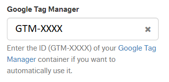

## General

Use sentence case capitalization for documentation, including headings and all UI elements. This means capitalizing only the first letter of the first word in a sentence or phrase, except for proper nouns and acronyms.

| Do ✅ | Don't ❌ |
| --------- | ------------ |
| • Create account   • Try new experience   • Getting started with Ad Network   • Starting the integration with Catalog   • Merchant ID   • Copy URL to clipboard   • Activate seller   • Deactivate seller   | • Create account   • Try New Experience   • Getting started with Ad Network   • Starting the integration with Catalog   • Merchant id   • Copy url to clipboard   • Activate Seller   • Deactivate Seller |

## Proper nouns

Capitalize all proper or trademarked nouns, including names of **products**, **features, modules, pages,** **people, places, nationalities, names of languages, months, days of the week,** and **holidays**. If the noun has more than one word, use title case.

| Do ✅ | Don't ❌ |
| --------- | ------------ |
| • Black Friday will be on November 24   • Intelligent Search determines the relevance of each product by combining weights.   • Contact the VTEX Support team.   • Contact the Support team \- Short alternative option for \*VTEX Support team\*.   • Requesting a trade policy for the Brazilian market.   • Personal Shopper is available in the following languages: English, Spanish, Portuguese, French, and German.   • Export to Excel   • Install Intelligent Search   • VTEX App Store | • Black friday will be on november 24   • Intelligent search determines the relevance of each product by combining weights.   • Contact the support team.   • Requesting a trade policy for the brazilian market.   • Personal Shopper is available in the following languages: english, spanish, portuguese, french, and german.   • Export to excel   • Install intelligent search   • VTEX app store |

Respect the capitalization of company names as used in their copy material (not their logo), whether it’s all caps, a capital letter in between, or all lowercase.

| Do ✅ | Don't ❌ |
| --------- | ------------ |
| • VTEX   • VTEX   • SAP   • ServiceNow | • Vtex   • vtex   • Sap   • Servicenow |

If an official name begins with a lowercase letter, use it in lowercase even at the start of a sentence. If possible, rewrite the sentence to avoid a lowercase word at the beginning.

| Do ✅ | Don't ❌ |
| --------- | ------------ |
| • To configure the easypay affiliation, follow the steps below:   • Checkout customization for easypay   • VTEX is the highest-ranked “Leader” | • To configure the Easypay affiliation, follow the steps below:   • easypay checkout customization   • Vtex is the highest-ranked “Leader” |

### Letters following slashes

When a slash joins words, capitalize the word after the slash if the word before the slash is capitalized.

| Do ✅ | Don't ❌ |
| --------- | ------------ |
| • Items/Units   • Note/Sales associate code   • Package/Order number | • Items/units   • Note/sales associate code   • Package/order number |

### File formats

Capitalize file formats.

| Do ✅ | Don't ❌ |
| --------- | ------------ |
| • Export to CSV | • Export to csv |

### Endpoints and APIs

Capitalize the first word of labels and terms in APIs unless they're always lowercase.

| Do ✅ | Don't ❌ |
| --------- | ------------ |
| • Create or update promotion endpoint   • The Conversions API | • Create Or Update Promotion endpoint   • The conversions API |

## Acronyms

Most acronyms are fully capitalized, but not all. Follow the standard form used in the industry. Capitalize all words in the spelled-out form of an acronym. The names of many protocols and specifications are considered proper nouns and are capitalized when spelled out.

| Do ✅ | Don't ❌ |
| --------- | ------------ |
| • Renew the API token before the duration ends.   • This option involves using a third-party platform, known as Platform as a Service (PaaS).   • How does VTEX ensure compliance with the General Data Protection Regulation (GDPR)?  •  Multiple redirects are possible in a single URL.   • A user ID screen is displayed so that the customer can continue trying to purchase.  | • Renew the api token before the duration ends.   • This option involves using a third-party platform, known as platform as a service (PAAS).   • How does VTEX ensure compliance with the general data protection regulation (GDPR)?   • Multiple redirects are possible in a single url.   • A user id screen is displayed so that the customer can continue trying to purchase. |

## Colons

Capitalize the first letter after a colon.

| Do ✅ | Don't ❌ |
| --------- | ------------ |
| • Autocomplete: Provides search and product suggestions based on the shopper's context. | • Autocomplete: provides search and product suggestions based on the shopper's context. |

## User interfaces

Actions and nouns listed in action and content labels (including dropdown menus and filters) should be capitalized.

| Do ✅ | Don't ❌ |
| --------- | ------------ |
| • Edit   • Export file   • Import file | • edit   • export file   • import file |

| Do ✅ | Don't ❌ |
| --------- | ------------ |
| Filter by status:   • Confirmed   • Expired   • Handled | Filter by status:   • confirmed   • expired   • handled |

## Documentation

## User Interface elements

Follow the capitalization used on the UI including labels, buttons, and VTEX Admin module names. This also applies to UI from other platforms.

| Do ✅ | Don't ❌ |
| --------- | ------------ |
| • In the **Google Tag Manager** field, enter the store identification code in **GTM-XXXX** format, as shown in the image below.  | • In the **Google tag manager** field, enter the store identification code in **gtm-XXXX** format, as shown in the image below. |

## Technical references and developer fields

Use camel case for placeholders and developer fields. This means capitalizing the first letter of each word, except for the first letter of the entire compound word.

| Do ✅ | Don't ❌ |
| --------- | ------------ |
| • The file name should follow the pattern *{storeName}-favicon.ico*. | • The file name should follow the pattern *{storename}-favicon.ico*. |

##  Lists

Always capitalize the first letter in a bullet or numbered list.

### Bullet list

| Do ✅ | Don't ❌ |
| --------- | ------------ |
| Search Console provides easy and free access to the following information:   1. Top search terms   2. Top URLs viewed  | Search Console provides easy and free access to the following information:   • top search terms   • top URLs viewed |

### Numbered list

| Do ✅ | Don't ❌ |
| --------- | ------------ |
| On the \*\*Projects\*\* page, click \`Create new\`.   In the \*\*New project\*\* page, complete the fields.   After setting each field of the page, click \`Create\`.  | on the \*\*Projects\*\* page, click \`Create new\`.   in the \*\*New project\*\* page, complete the fields.   after setting each field of the page, click \`Create\`. |
