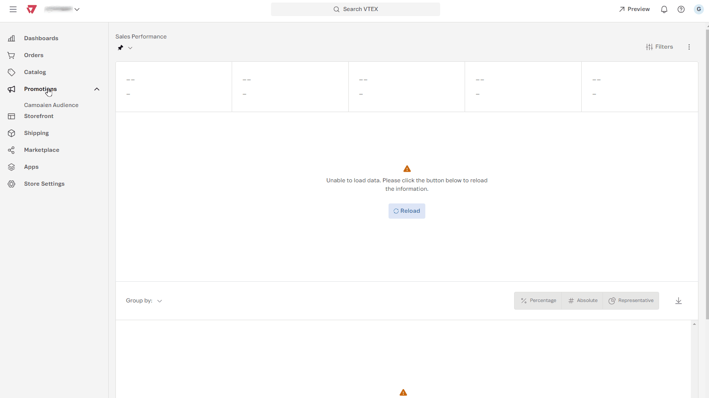
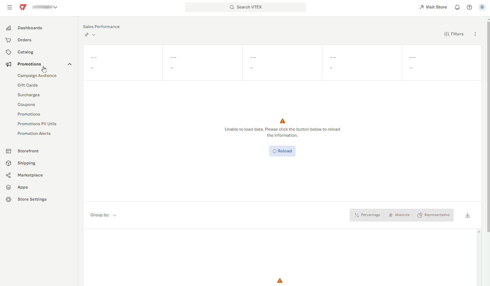

VTEX offers different promotion types. The **Regular Promotion** is the default promotion configured in VTEX accounts.
To apply more specific rules, you can configure other types of promotions to meet different scenarios. See the available promotions below:

-  [Buy Together](#buy-together)
-  [More for Less](#more-for-less)
-  [Progressive Discount](#progressive-discount)
-  [Buy One Get One](#buy-one-get-one)
-  [Usage restrictions](#usage-restrictions)

## Buy Together

The **Buy Together** promotion offers discounts when a customer adds two or more products to the cart.  
This promotion can apply the discount to both products or only one, depending on the configured conditions.

The setup screen has two SKU lists, which you can add manually or import via spreadsheet. Each list has its own fields to define the **discount percentage** and the **minimum quantity** required.

- **List 1:** Include the main products and set the discount percentage.
- **List 2:** Add complementary products and set the discount that will apply to them.

> ℹ️ Add different SKUs in List 1 and List 2.

**Examples:**
- Buy a pair of pants and get **10% off** a belt. 
- Buy a pair of sneakers and a pair of socks and get **15% off**.

For more information, check [Creating a Buy Together promotion](https://help.vtex.com/docs/tutorials/buy-together).

## More for Less

The **More for Less** promotion applies discounts when a customer adds multiple units of the same product to the cart. 
**Example:** "Buy 3, pay for 2".

When configuring this promotion, define the participating **SKUs** or **collections**, the number of products the customer must buy, and the number of products that will get the discount.

The screen displays the following fields:

- **The customer buys [X] of the following products:** Minimum quantity required. 
- **SKUs:** Add up to 100 SKUs manually or via spreadsheet. 
- **Collections:** Select a product collection to simplify applying the promotion. 
- **The customer gets [Y] of the products with:** Set the number of items that will get the discount. 
- **Discount of:** Select the type of discount (**percentage** or **fixed amount**) and enter the amount.

### Advanced settings

Advanced settings define how the discount will be applied to the selected products. See how to complete the fields and choose the options that best suit your promotion rules:

- **How the discount will be applied**
    - **Any item:** The discount applies to any product within the configured criteria, even if they aren't identical.
    - **Only identical items:** The discount applies only when the items are identical (same SKU).
- **Cheapest products:** The discount applies to the lowest-priced products.
**Most expensive products:** The discount applies to the highest-priced products.

For more information, see [Creating a More for Less promotion](https://help.vtex.com/docs/tutorials/creating-a-more-for-less-promotion).

## Progressive Discount

The **Progressive Discount** promotion offers increasing percentage discounts as a customer adds eligible products to the cart.

**Example:** Buy 10 lbs of pet food and get **5%** off. Add 10 more pounds and get **10%** off.

When configuring this promotion, set the participating **SKUs** or **collections** and define quantity ranges with their corresponding discount percentages.

- **SKUs:** Select the specific products that will get a progressive discount. 
- **Collections:** Select product collections to apply the rule to as a group. 
- **Only consider identical items:** This option limits the discount to identical products, considering only the quantity of a single SKU in the cart. Different SKUs, even within the same collection, aren't eligible.
- **Add range:** Click `+` to create new quantity and discount levels (up to 10 ranges).

For more information, see [How the progressive discount works](https://help.vtex.com/docs/tutorials/progressive-discount).

## Buy One Get One
The **Buy One Get One** promotion offers free shipping, a gift, or the option of setting a **maximum price per item** whenever a customer adds the eligible products to the cart, depending on the configured rules.

**Examples:**
-  Buy a TV and get free shipping. 
-  Buy a video game console and get a free game.

The configuration screen allows you to set the purchase conditions and the benefit granted.

- **Customer buys:**

    - **SKUs:** Enter the name or ID of the participating products. 
    - **Collections:** Add the eligible collections.
    - **Minimum quantity:** Set the number of required items.
    - **Only consider identical items:** If enabled, the promotion will only apply when the products are identical.

- **Choose the benefit the customer gets:**

    - **Free shipping:**
        - All shipping options. 
        - Cheapest shipping option only.
        - Specific shipping type.

    - **Gift:** 
        - Select the SKUs for the gift.
        - Set the maximum number of gifts.
        - Choose between **a gift per cart** or **a gift per eligible item**. 
        - **Maximum price:** Limits the price of products that can trigger the promotion.

> ⚠️ A Buy One Get One promotion allows you to configure up to 100 different SKUs simultaneously.

For more information, see [How the Buy One Get One (BoGo) promotion works](https://help.vtex.com/docs/tutorials/buy-one-get-one).

## Campaign Promotion

The **Campaign Promotion** lets you create promotions targeted to specific audiences, offering benefits like **free shipping**, **gifts**, and **promotional price tables**.

This type of promotion is linked to a [campaign audience](https://help.vtex.com/en/docs/tutorials/criar-audiencia-de-campanhas), which defines the target audience eligible for the offer.

> ❗Campaign audiences and their promotions are only valid for the main store account. Seller accounts don't support this feature.

For more information, see [Creating a campaign promotion](https://help.vtex.com/docs/tutorials/campaign-promotion).

## Usage restrictions

The Restrictions section is available for all types of promotions. See below the restrictions you can apply and what each one means.

- **Limit the use of in-store promotions:** Set a maximum number of times the promotion can be used across the store.  

- **Limit promotion usage per customer:** Restrict the number of times each customer can use the promotion.  

- **Limit the maximum number of eligible items:** Restrict the maximum number of items per order that can get the discount. The behavior of this setting varies depending on the option selected in the [Buy One Get One](#buy-one-get-one) promotion.  

- For **Fixed amount discount**, **Fixed amount discount: formula** and **Maximum price per item**, the limit applies to the total items in the cart.

 - For **Percentage discount**, you can choose whether the limit applies per cart, per product, or per SKU. For more information on these discounts, see [Regular Promotion](https://help.vtex.com/docs/tutorials/regular-promotion).

 The table below shows the restrictions that apply to each promotion type:

 | Promotion type | Limit use in the store | Limit use per customer | Limit eligible items |
| :---- | :---: | :---: | :---: |
| **Regular** | Yes | Yes | No |
| **Buy Together** | Yes | Yes | No |
| **More for Less** | Yes | Yes | Yes |
| **Progressive Discount** | Yes | Yes | Yes |
| **Buy One Get One** | Yes | Yes | No |
| **Campaign** | Yes | Yes | No |