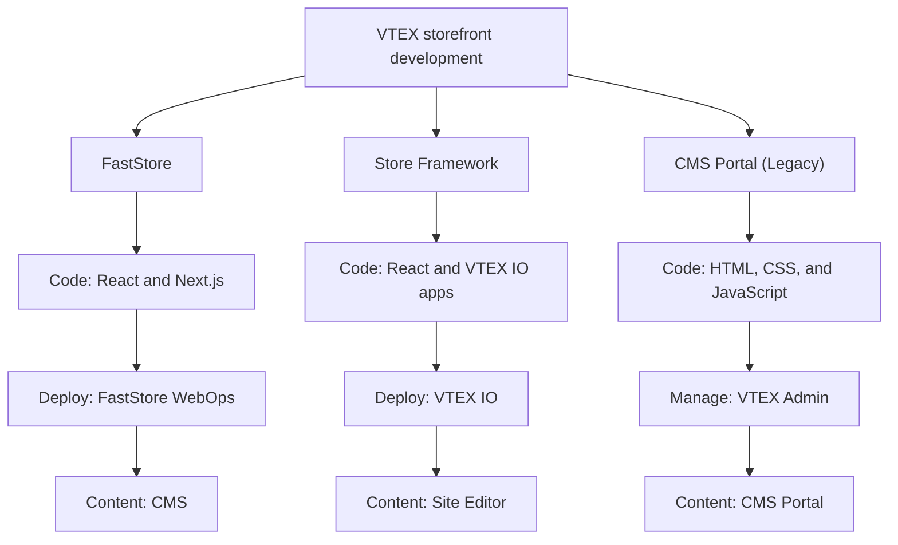

Store development involves building and maintaining the customer-facing experience of an ecommerce store, commonly called the storefront.

The storefront displays commerce data and allows customers to browse products, manage their accounts, and place orders. It communicates with backend services responsible for capabilities such as catalog, pricing, promotions, checkout, logistics, and orders.

On VTEX, you can develop a storefront using [FastStore](https://developers.vtex.com/docs/guides/faststore), [Store Framework](https://developers.vtex.com/docs/guides/store-framework), or [CMS Portal (Legacy)](https://help.vtex.com/docs/tracks/legacy-cms-portal).

## Storefront solutions

Each storefront solution has a different development, deployment, and content-management model:

| Solution | Main technologies | Development and deployment |
| --- | --- | --- |
| [FastStore](https://developers.vtex.com/docs/guides/faststore) | Next.js, React, TypeScript, Node.js, and GraphQL | Developed in GitHub and deployed through FastStore WebOps |
| [Store Framework](https://developers.vtex.com/docs/guides/store-framework) | VTEX IO apps, React, TypeScript, Node.js, and GraphQL | Developed and deployed through VTEX IO |
| [CMS Portal (Legacy) - No longer available to newly created VTEX stores.](https://help.vtex.com/docs/tracks/legacy-cms-portal) | HTML, CSS, and JavaScript | Developed and managed through the VTEX Admin |

To compare the three solutions in more detail, see [Getting started with storefront solutions](https://developers.vtex.com/docs/guides/getting-started-with-storefront-solutions).

### FastStore

[FastStore](https://developers.vtex.com/docs/guides/faststore) is a toolkit for developing high-performance storefronts with [React](https://react.dev/) and [Next.js](https://nextjs.org/). It follows a [Jamstack](https://jamstack.org/) architecture in which pages can be pre-rendered and delivered through a content delivery network (CDN), while APIs provide dynamic commerce data and functionality.

For FastStore storefronts, developers maintain the source code in GitHub and deploy the storefront through [FastStore WebOps](https://developers.vtex.com/docs/guides/faststore/webops-dashboard). Business users manage storefront content with [CMS](https://help.vtex.com/docs/tutorials/cms-overview).

FastStore has multiple major versions with different support levels. FastStore v4 is the current version recommended for new storefront implementations. For more information, see [FastStore versions and support levels](https://developers.vtex.com/docs/guides/faststore/getting-started-faststore-versions-and-support-levels).

### Store Framework

[Store Framework](https://developers.vtex.com/docs/guides/store-framework) is a frontend development framework based on React and the VTEX IO Development Platform. Developers build storefronts by composing native and custom VTEX IO apps in a store theme.

Because Store Framework runs on VTEX IO, developers can use capabilities such as development and production workspaces, A/B testing, and managed cloud infrastructure. Business users manage storefront content through the [Site Editor](https://help.vtex.com/docs/tutorials/site-editor-overview).

### CMS Portal (Legacy)

[CMS Portal (Legacy)](https://help.vtex.com/docs/tracks/legacy-cms-portal) is VTEX's original storefront development and content-management solution. Developers create HTML templates and use CSS, JavaScript, and VTEX native controls to render commerce data, with code managed directly through the VTEX Admin.

> ⚠️ CMS Portal (Legacy) is no longer available to newly created VTEX stores. For guidance on migrating an existing storefront to FastStore, contact [VTEX Support Team](https://help.vtex.com/support).

## Backend development and integrations

The storefront communicates with backend services that provide the data and functionality required by the ecommerce operation. Developers can extend these capabilities by creating backend apps and integrations with VTEX IO and VTEX APIs.

### VTEX IO

[VTEX IO](https://developers.vtex.com/docs/guides/vtex-io-documentation-what-is-vtex-io) is a cloud-based development platform for building frontend and backend applications. It provides managed infrastructure and development tools so teams can focus on implementing business requirements.

VTEX IO supports the development of:

- Store Framework storefronts.
- Custom apps for the VTEX Admin.
- Backend services and integrations.

### VTEX APIs

The [VTEX APIs](https://developers.vtex.com/docs/api-reference) expose commerce capabilities such as catalog, pricing, promotions, checkout, logistics, and orders.

All three storefront solutions rely on underlying VTEX commerce services. However, how a storefront accesses those services depends on the selected technology. For example, FastStore can consume commerce data through its API layer, Store Framework uses VTEX IO apps, and CMS Portal can render data through VTEX native controls.

## VTEX Admin

The VTEX Admin is the interface where business users manage commerce data and settings, including products, orders, promotions, logistics, and storefront content.

The storefront features available in the VTEX Admin depend on the selected technology:

- FastStore uses CMS for storefront content.
- Store Framework uses Site Editor.
- CMS Portal storefronts use the CMS Portal layout and template features.

## Next steps

- [Storefront Development](https://developers.vtex.com/docs/storefront-development): Explore the complete developer documentation for VTEX storefront solutions.
- [Getting started with storefront solutions](https://developers.vtex.com/docs/guides/getting-started-with-storefront-solutions): Compare the capabilities and development experience of each solution.
- [Frontend implementation](https://help.vtex.com/docs/tracks/frontend-implementation): Learn about the steps involved in implementing a storefront project.
