The B2B Buyer Portal is the VTEX solution for business-to-business commerce operations. It allows buying companies to configure organizational structures, custom commercial rules, approval policies, and budget control to make corporate purchases in VTEX stores.

This guide presents the portal architecture, key concepts, configuration prerequisites, and practical implementation examples.

## Before you begin

To configure the B2B Buyer Portal, you need to:

- Be familiar with the [B2B APIs](https://developers.vtex.com/docs/guides/vtex-b2b-suite) (Contracts, Users, Units, Scopes, Buying Policies, Session, and Checkout).
- Confirm that the Seller is configured as B2B.
- Verify that the B2B login flow and checkout are prepared to receive `b2bContext`.

> ℹ️ Depending on the scenario, you may need to integrate external systems such as ERP (for budgets and user synchronization), identity systems (for federated authentication via VTEX ID), or WMS/OMS (for addresses and distribution centers).

## B2B Buyer Portal architecture

The diagram below illustrates the B2B Buyer Portal architecture and how components connect:

### Main systems

| System                           | Description                                                                                     |
| -------------------------------- | ----------------------------------------------------------------------------------------------- |
| **Master Data v1**         | Stores contracts in the CL Table and addresses in the AD Table.                                 |
| **Organization Unit (OU)** | Manages the organization's hierarchical structure, integrated with VTEX ID and License Manager. |
| **OU Scoping Filter**      | Filters commercial resources available for each organizational unit.                            |
| **Buying Policies**        | Defines approval policies validated during order creation.                                      |
| **Budgets**                | Controls budget limits applicable to Users, Addresses, or Custom fields.                        |
| **Custom Fields**          | Allows creating custom fields for orders, items, or addresses.                                  |

## Concepts

The following sections describe the main components of the B2B Buyer Portal.

### Contracts

Contracts represent commercial agreements between the merchant and a buying company. They are stored in the **CL Table** of Master Data v1 and define:

- Commercial rules: price tables and allowed collections.
- Operational rules: checkout limits and internal policies.
- Restrictions: configured via the `restrictions` object.

The contract is the central point of B2B configuration, linked to the buyer's root organizational unit. Through it, you configure the **OU Scoping Filter** to determine available resources.

### Organization Units

Organization Units (OUs) represent the buying company's hierarchical structure. They can correspond to branches, departments, cost centers, or specific cells.

Each Unit has:

- Multi-level hierarchical structure.
- Its own administrators.
- Direct connection to Contracts, Budgets, and Contact Information.

Users belong exclusively to one Unit and inherit the scopes configured in it.

### Users

Users are individuals from the buying organization who interact with the B2B Buyer Portal. Each User has:

| Attribute         | Description                                                   |
| ----------------- | ------------------------------------------------------------- |
| Email             | Unique identifier for the User.                               |
| Organization Unit | Unit to which the User belongs.                               |
| Roles             | Functions that grant Permissions, managed in License Manager. |
| Scopes            | Inherited from the Unit, define accessible resources.         |
| Shopper Data      | Personal data stored in Master Data.                          |

Users can have roles such as buyer, approver, manager, or administrator.

### Roles and Permissions

Access control follows the hierarchy:

1. **Users** have **Roles**.
2. **Roles** have **Permissions**.

Roles and Permissions are managed via [License Manager](https://help.vtex.com/docs/tutorials/license-manager-resources) and allow controlling who approves orders, manages Users, creates budgets, or has administrative access.

### OU Scoping Filter

The OU Scoping Filter is the central mechanism that defines which commercial resources are available for each Organization Unit. Filtered resources include:

| Resource                  | Description                          |
| ------------------------- | ------------------------------------ |
| **Credit Cards**    | Available credit cards.              |
| **Assortments**     | Product collections and assortments. |
| **Price Tables**    | Applicable price tables.             |
| **Payment Methods** | Allowed payment methods.             |
| **Addresses**       | Available shipping addresses.        |

The scope can have three states:

| State                               | Behavior                            |
| ----------------------------------- | ----------------------------------- |
| **Has scope** (with IDs)      | Access restricted to specified IDs. |
| **Empty scope** (`ids: []`) | No access to the resource.          |
| **Null scope** (not defined)  | Full access to the resource.        |

### Buying Policies

Buying Policies are authorization rules that automatically control order approval. They evaluate order fields (Order Fields) such as `budget`, `userId`, `addressId`, `customData`, and `productId`.

Evaluation occurs in two stages:

1. **Unit hierarchy**: from the deepest Unit to the root.
2. **Rule priority** within each Unit:

| Priority | Action   | Result                   |
| -------- | -------- | ------------------------ |
| 1        | Bypass   | Automatic approval.      |
| 2        | Deny     | Automatic rejection.     |
| 3        | Workflow | Pending manual approval. |

Evaluation stops as soon as an expression is satisfied.

### Budgets and Allocations

Budgets are financial control tools that define spending limits. They can be applied to:

- Specific Users
- Addresses
- Custom fields (PO Number, Cost Center, Release, Location)

Each Budget can contain **Allocations**, which are subdivisions of the budget. Transactions include purchases, reservations, refunds, and threshold notifications.

> ℹ️ Budgets can be configured for automatic renewal, facilitating monthly or periodic budget control.

### Addresses

Addresses are stored in the **AD Table** of Master Data v1 and have a bidirectional relationship with Contracts. Each address can have custom fields such as **Locations** for categorization.

### Contact Information

Contact Information manages employees authorized to receive packages. Recipients can be different from the buyer, useful for scenarios such as construction sites, branches, or distribution centers.

Each Organization Unit can have its own authorized contacts.

### Card Token Vault

The Card Token Vault stores credit card tokens, allowing:

- Personal cards per User.
- Shared cards per Contract.
- PCI compliance in corporate environments.

Available cards for each Unit are controlled by the OU Scoping Filter.

### Custom Fields

Custom Fields allow collecting additional information during checkout, such as project number (PO Number), internal code, or tax data. They can be associated with:

| Entity      | Example           |
| ----------- | ----------------- |
| Addresses   | Locations         |
| Allocations | Accounting Fields |
| Orders      | Various fields    |
| Items       | Various fields    |

### Default Values

Default Values define pre-loaded configurations per Unit, such as primary address and associated payment cards. This information makes checkout faster and reduces input errors.

### B2B Session

The session (`vtex_session`) loads the user's context and activates B2B configurations:

- User, Unit, and Contract IDs.
- Scopes inherited via OU Scoping Filter.
- Applicable Buying Policies and Budgets.
- User Permissions.

> ⚠️ Without an active B2B session, checkout operates in standard B2C mode without applying corporate rules.

## Purchase flow

The purchase flow in the B2B Buyer Portal follows these steps:

1. **Authentication**: The User logs in and the B2B session is created with their context (Unit, Contract, Scopes).
2. **Filtered navigation**: The OU Scoping Filter applies Unit restrictions, displaying only allowed products, prices, and payment methods.
3. **Checkout**: The User selects products, address, and payment method according to available resources.
4. **Policy evaluation**: Buying Policies evaluate the order's Order Fields:

   - **Bypass**: order automatically approved.
   - **Deny**: order rejected.
   - **Workflow**: order sent for manual approval.
5. **Budget validation** (optional): If configured, the system verifies available balance in **Allocations**.
6. **Order creation**: After all validations, the order is created according to defined rules.

## Implementation

The following sections present some B2B Buyer Portal implementation examples.

### Example: Organizational structure with approval workflow

**Scenario**: ACME Industries needs to configure a B2B Contract with value-based approval rules.

**Organizational structure**:

```mermaid
flowchart TB
    Root["ACME Industries<br/>(Root Unit)"]
    Branch["São Paulo Branch"]
    CC["Cost Center 101"]
    User["👤 Maria<br/>(Buyer)"]

    Root --> Branch
    Branch --> CC
    CC --> User

    classDef rootStyle fill:#e3f2fd,stroke:#1976d2,stroke-width:2px
    classDef unitStyle fill:#fff3e0,stroke:#f57c00,stroke-width:2px
    classDef userStyle fill:#e8f5e9,stroke:#388e3c,stroke-width:2px

    class Root rootStyle
    class Branch,CC unitStyle
    class User userStyle
```

**Implementation steps**:

| Step | Action                      | Details                                                            |
| ---- | --------------------------- | ------------------------------------------------------------------ |
| 1    | Create Contract             | Defines catalog, price table, and payment methods.                 |
| 2    | Create Root Unit            | Represents the ACME organization, connected to the Contract.       |
| 3    | Create Child Units          | Configures São Paulo Branch and Cost Center 101 in the hierarchy. |
| 4    | Create Users                | Links Maria to Cost Center 101 with appropriate Roles.             |
| 5    | Configure OU Scoping Filter | Defines available resources for each Unit.                         |
| 6    | Create Buying Policies      | Configures value-based approval rules.                             |

**Configured approval rules**:

| Order value        | Action                      |
| ------------------ | --------------------------- |
| Up to $10,000      | Bypass (automatic approval) |
| $10,000 to $50,000 | Workflow (manual approval)  |
| Above $50,000      | Deny (automatic rejection)  |

### Example: Control with financial Budgets

**Scenario**: Horizon Logistics needs to control monthly budgets per branch with expense tracking.

**Implementation steps**:

| Step | Action                      | Details                                                   |
| ---- | --------------------------- | --------------------------------------------------------- |
| 1    | Create Contract             | Defines general commercial rules.                         |
| 2    | Create Units                | Configures branches and teams in the hierarchy.           |
| 3    | Create Budgets              | Defines monthly limit per branch.                         |
| 4    | Create Allocations          | Subdivides budget by cost center.                         |
| 5    | Configure OU Scoping Filter | Restricts Payment Methods and Credit Cards per Unit.      |
| 6    | Create Buying Policy        | Requires approval when consumption exceeds 30% of budget. |

> ℹ️ Allocations can be linked to **Accounting Fields** (custom accounting fields) for integration with financial systems.

## References

- [VTEX B2B Suite](https://developers.vtex.com/docs/guides/vtex-b2b-suite)
- [B2B Organizations](https://developers.vtex.com/docs/guides/vtex-b2b-organizations)
- [Storefront Permissions](https://developers.vtex.com/docs/guides/vtex-storefront-permissions)
- [License Manager Resources](https://help.vtex.com/docs/tutorials/license-manager-resources)
