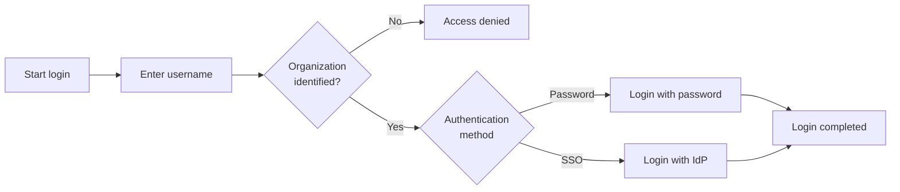
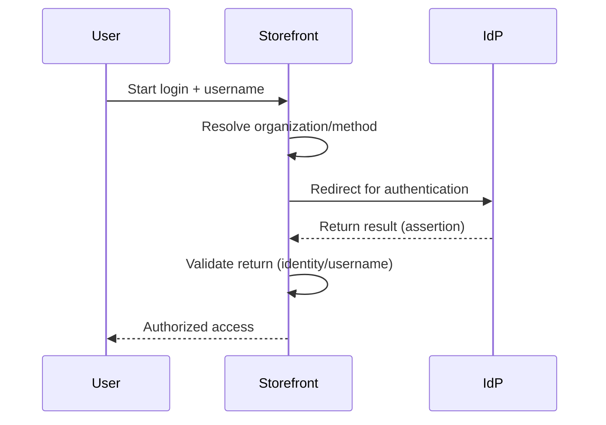
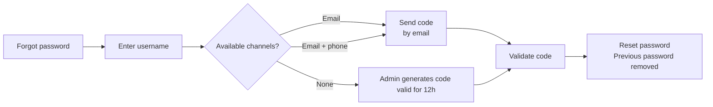

> ⚠️ This feature is only available for stores using [B2B Buyer Portal](https://help.vtex.com/en/docs/tutorials/b2b-buyer-portal), which is currently available for selected accounts.

In B2B environments, access to the storefront is usually linked to an organization. For this reason, the authentication process may use identifiers other than email and can be integrated with corporate identity systems.

Authentication options for user access to the B2B store include:

- Login with username and password
- Login with external identity provider (SSO)

## Overview

The diagram below provides an overview of the B2B login flow, from user identification to final authentication.

Logging in to B2B stores can occur via different authentication mechanisms. Depending on the store configuration and the user's organization, authentication may occur using username and password or via an external identity provider (IdP).

> ℹ️ The authentication methods used by the organization are defined through an API configuration. Learn more in [Configuring authentication methods by organizational unit](https://help.vtex.com/en/docs/tutorials/configuring-authentication-methods-by-organizational-unit).

In the login component, the buyer first enters their username. Based on this identifier, the VTEX platform determines the contract associated with the user and identifies the authentication method that should be used.

Based on this information, the login component dynamically displays the authentication method configured for that organization, such as password login or authentication via an external identity provider.

## Login with username

In the B2B authentication model, users can access the storefront using their username as the primary identifier.

This model is common in scenarios such as:

- Corporate portals for employees or representatives
- Companies that use corporate IDs
- Organizations that adopt standardized username login

### Username rules

The username must follow these rules:

- 3 to 30 characters
- Not case-sensitive
- Allowed characters: Letters, numbers, `.`, `@`, `-`, and `_`
- No spaces allowed

### Emails

In B2B environments, email isn't required as a login identifier. Users may have two types of email for different purposes: recovery and transactional.

| Email type | Use | Rules |
| :---- | :---- | :---- |
| Access recovery email | Used for actions related to authentication, such as password recovery or reset.      | Must be unique in the store. Can be optional. Can be the same as the transactional email, but doesn't have to be. |
| Transactional email   | Used for store communications, such as order confirmations and status notifications. | Doesn't need to be unique and can be shared by multiple users. Can also be optional. |

#### Usage example

Consider a medical office (organization) with three employees who make purchases. All employees can share a corporate transactional email used for store communications, such as order confirmations.

Additionally, two of these employees may also have their own individual access recovery emails. These individual emails are used for authentication-related actions, such as password recovery or reset, following the rule that the recovery email must be unique in the store.

## Login with external identity provider (IdP)

Organizations can authenticate users using an external identity provider (IdP) through Single Sign-On (SSO).

The authentication flow is as follows:

1. The user enters their username during login.
2. The VTEX platform identifies the organization associated with the user.
3. The user is redirected to the configured identity provider.
4. The provider authenticates the user.
5. After authentication, the user returns to the storefront with authorized access.

> ℹ️ Identity providers are configured by the merchant. Learn more in [Login (SSO)](https://developers.vtex.com/docs/guides/login-integration-guide).
>
> The buyer organization must also enable login with the external identity provider in the buyer portal. Learn more in [Enable login for the organization via an external identity provider (IdP)](https://help.vtex.com/en/docs/tutorials/enable-login-for-the-organization-via-an-external-identity-provider-idp).

The diagram below illustrates the authentication flow when an organization uses an external identity provider (IdP).

When the store uses authentication with an external identity provider (IdP), the provider is configured by the merchant in the Admin through **Account settings > Authentication**, just as is currently done for VTEX stores.

## Unsupported login methods

For B2B users, some login methods available in B2C stores **are not supported**, including:

- **Access code**
- **Google**
- **Facebook**

## Password recovery

Password recovery uses verification codes sent to the channels available to the user.

The behavior varies depending on the contact information that's in the system:

| User situation | How the access code is sent | Notes |
| :---- | :---- | :---- |
| User has email | Code sent by email | Follows the same access code rules as B2C stores. |
| User has email and phone | Code sent by email | - |
| User doesn't have email or phone | Code generated by organization admin | The admin generates and shares the code with the user. Access codes generated by organization admins are valid for 12 hours. Learn more in [Adding users to buyer organizations](https://help.vtex.com/docs/tutorials/adding-users-to-buyer-organizations). |

When an access code is generated and sent to the user, the previous password is removed from VTEX systems.

The diagram below shows the main password recovery paths, depending on the channels available to the user.

## Access restrictions

Access to the storefront can be blocked when there are restrictions related to the user's organization. These cases include:

- User isn't associated with a valid organization
- Organization without active contract

In these cases, the user must contact the organization admin.
