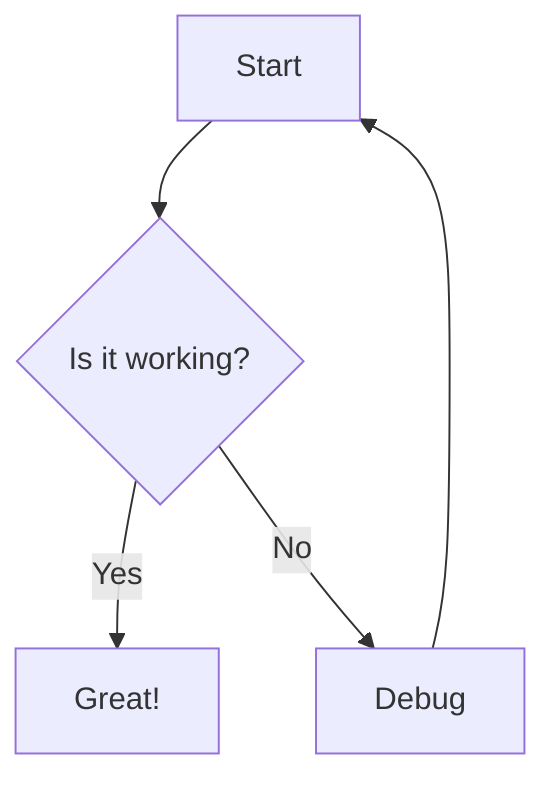
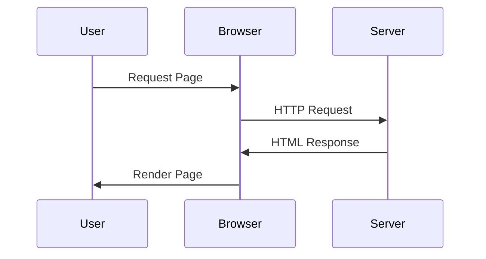

## Mermaid Diagram Test

Below is a simple flowchart:



## Sequence Diagram



## Regular Markdown Content

### Subtitle

Text Template: Lorem ipsum dolor sit amet, consectetur adipiscing elit.

[📣 Link Example](https://help.vtex.com/)

## Bullet points

- First item
  - subtopic
- **Second (Bold)** item
- *Third (Italic)* item
- `Fourth (Code)` item

**Code Block**

```json
{
  "test": "value",
  "number": 123
}
```
