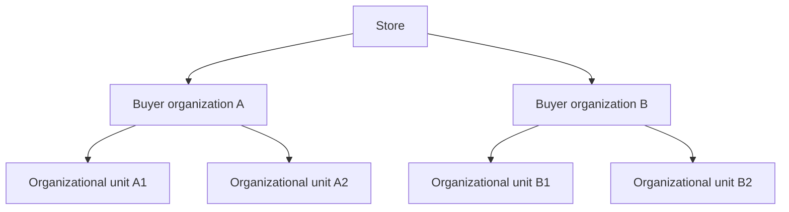
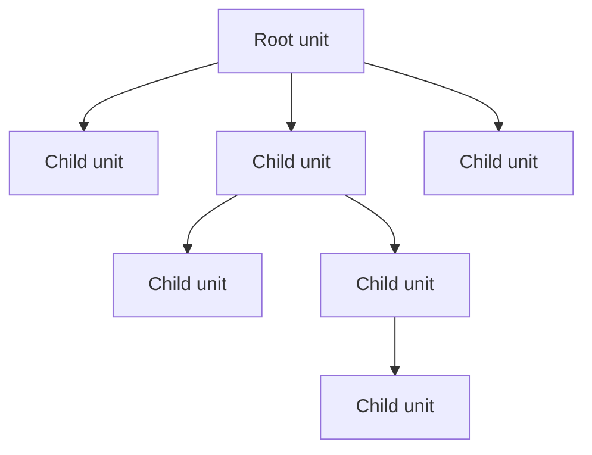

> ⚠️ This feature is only available to stores using B2B Buyer Portal, which is currently available for selected accounts.

In B2B operations, the buyer is a company and not an individual consumer. Each company is represented by a buyer organization that maintains a business relationship with the store.

Companies usually have multiple branches, departments, cost centers, and internal approval workflows. Each of these entities can have purchasing autonomy, its own budget, or specific financial rules. Organizational units allow this structure to be represented within a VTEX store for B2B operations.

## Buyer organizations structure

A VTEX store operating in a B2B context can contain multiple buying organizations, each of which:

- Having their own contract
- Operating independently from other organizations
- Having multiple internal subdivisions (organizational units)

Organizational units model the internal structure of a single buyer organization.

The operation hierarchy follows the model below:

An organizational unit is a hierarchical subdivision within a specific buyer organization. This structure defines how business rules and access are applied.

Instead of creating multiple accounts or multiple buyer organizations to represent internal areas of the same company, you can organize your hierarchy internally using organizational units and apply different rules to each entity in a single buyer organization.

## Hierarchical structure of organizational units

The organizational unit structure follows a tree model. Every buyer organization has a **root unit**, which represents the organization as a whole. From it, **child units** can be created, representing subdivisions such as branches, departments, or cost centers.

The root unit is the highest level in the hierarchy. Child units can exist at multiple levels, reflecting the actual structure of the company. General rules are defined in the [contract](#contract), but each unit may have [specific rules](#organizational-unit-settings) that respect its position in the hierarchy.

## Contract

Each buyer organization has its own B2B contract. This contract is associated with the organization's **root unit**.

The business conditions defined in the contract are inherited by the child units. This means that prices, policies, and commercial agreements negotiated with the company are applied to the whole structure. On top of this inheritance, you can define [settings per unit](#organizational-unit-settings), allowing internal segmentation without requiring multiple contracts or separate accounts.

To understand how contracts are configured and managed, see:

- [B2B contracts](https://help.vtex.com/en/docs/tutorials/contratos-b2b)

## Organizational unit settings

Even when sharing the same contract, each unit can operate with its own rules. Among the settings that can vary per organizational unit are:

- Visible product assortment
- Payment methods and conditions
- Delivery and billing addresses
- Custom checkout fields
- Order approval rules

This segmentation allows aligning store operations with the internal policies of the buyer company.

For more information, see:

- [Buying Policies](https://help.vtex.com/en/docs/tutorials/buying-policies-overview)
- [Budgets overview](https://help.vtex.com/en/docs/tutorials/visao-geral-de-budgets)
- [Custom checkout fields](https://help.vtex.com/en/docs/tutorials/campos-customizaveis-do-checkout)

## Organizational unit users

The unit the user is linked to determines what they can do on the platform. When logging in to the store, the platform identifies the user's organizational unit and automatically applies the rules configured for that unit.

## Roles and storefront permissions

A user's scope of action within an organizational unit in a B2B store is defined by the combination of two elements:

- **Organizational units**, which determine the group the user belongs to.
- **Storefront roles**, which define the user's role in the organization by gathering certain permissions to perform actions in the storefront.

Learn more in [Buyer organization members](https://help.vtex.com/docs/tutorials/membros-da-organizacao-compradora).

## Shopping experience

Organizational units ensure that the browsing experience reflects the organizational structure of the buyer company.

Each company area operates with:

- Appropriate business rules
- Permissions compatible with their role
- Governance and autonomy

Thus, the platform allows a single B2B company to operate with multiple internal structures, maintaining contractual consistency and operational control.
