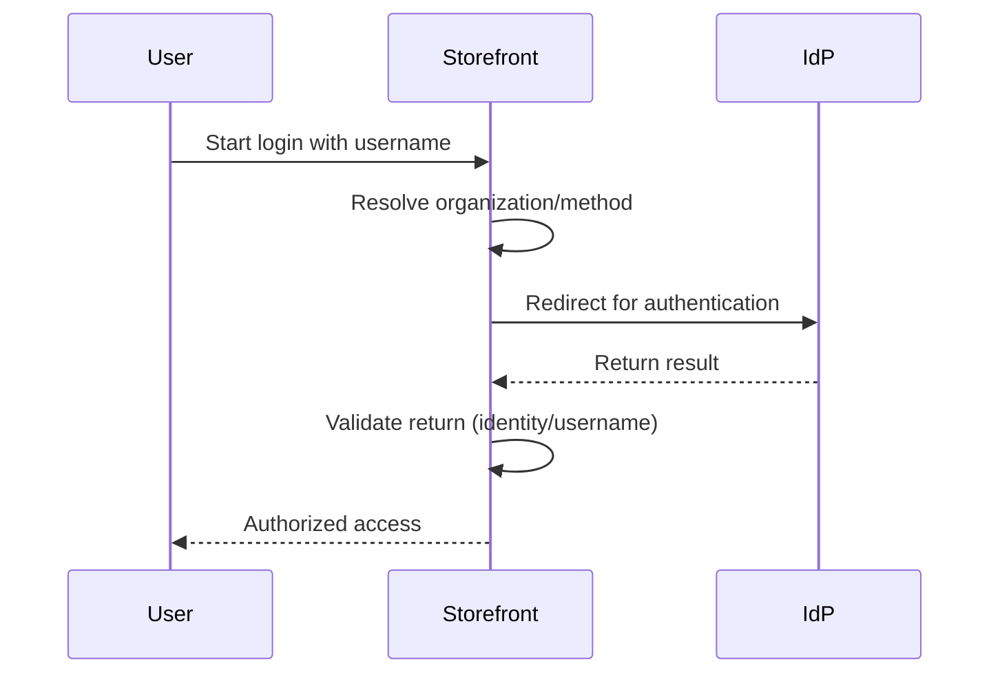

> ⚠️ This feature is only available for stores using the [B2B Buyer Portal](https://help.vtex.com/docs/tutorials/b2b-buyer-portal), which is currently available for selected accounts.

Buyer organizations can authenticate their members through an external identity provider (IdP) using Single Sign-On (SSO). For this process to work, the buyer organization needs to enable login with an external identity provider in the Buyer Portal interface, as described in this guide.

## Prerequisites

Before enabling login via external IdP in the Buyer Portal, make sure that:

* The retailer has already configured the identity provider in the VTEX Admin under **Account Settings > Authentication**, following the instructions in [Login (SSO)](https://developers.vtex.com/docs/guides/login-integration-guide) and [Webstore (OAuth 2.0)](https://developers.vtex.com/docs/guides/login-integration-guide-webstore-oauth2).
* You have the **Organizational Unit Admin** role in the buyer organization.

## Enable login via external IdP in the Buyer Portal

Follow the instructions to enable login via external IdP:

1. Go to the store using a browser and log in with your user account.
2. In the top menu, click **Company**. The organization dashboard will be displayed.
3. Click **Manage**.
4. If you want to enable login for the organization, proceed to step 5. If you want to select a child organization to enable, click **Organizational Units** and then the name of the organizational unit.
5. Click the **⋮** menu and then **Authentication**.

   

6. In the **Authentication methods** section, select one or more desired options (in the example image below, the external IdP option is PingFederate (SSO)). Remember to deselect authentication methods that won't be used.

7. Click `Save`.

> ℹ️ You can also manage authentication options for the organization via API. See the [VTEX ID API reference](https://developers.vtex.com/docs/api-reference/vtex-id-api#post-/api/vtexid/organization-units/-unitId-/settings) for more details.

## Authentication flow

After enabling, the authentication flow for organization members works as follows:

1. The user enters their username during storefront login.
2. The VTEX platform identifies the organization associated with the user.
3. The user is redirected to the configured identity provider.
4. The provider authenticates the user.
5. After authentication, the user returns to the storefront with authorized access. The diagram below illustrates this flow:

## Learn more

* [Login (SSO)](https://developers.vtex.com/docs/guides/login-integration-guide)
* [Webstore (OAuth 2.0)](https://developers.vtex.com/docs/guides/login-integration-guide-webstore-oauth2)
* [Login for B2B](https://help.vtex.com/docs/tutorials/login-para-b2b)
