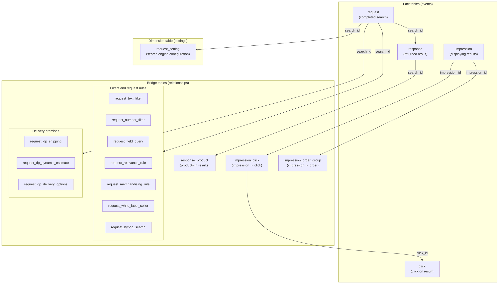
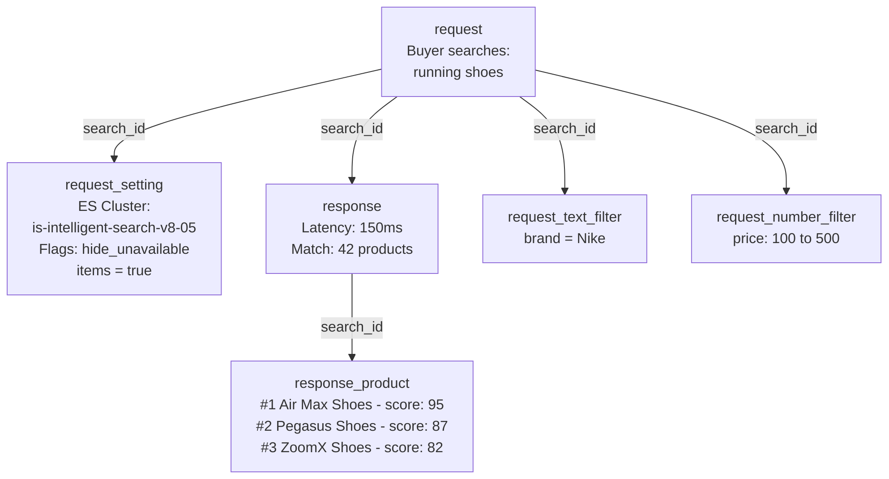
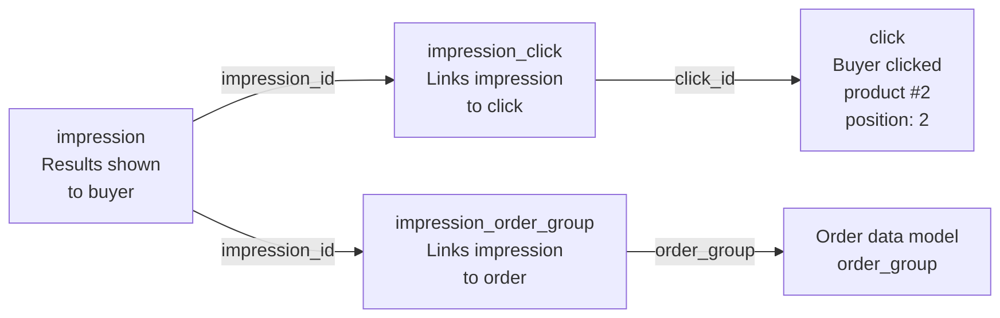
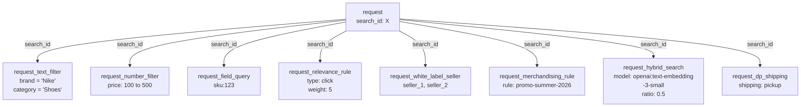

The `search` data model contains comprehensive information about search queries, results, and user interactions with the Intelligent Search platform. This data allows analyzing search performance, product discovery, click-through rates, and search-to-purchase conversion rates.

This section includes the following information:

- [Table types and relationships](#table-types-and-relationships)
- [Search data characteristics](#search-data-characteristics)
- [Table: request](#table-request)
- [Table: response](#table-response)
- [Table: response_product](#table-response-product)
- [Table: click](#table-click)
- [Table: impression](#table-impression)
- [Table: impression_click](#table-impression-click)
- [Table: impression_order_group](#table-impression-order-group)
- [Table: session_query](#table-session-query)
- [Table: session_query_click](#table-session-query-click)
- [Table: request_white_label_seller](#table-request-white-label-seller)
- [Table: request_merchandising_rule](#table-request-merchandising-rule)
- [Table: request_field_query](#table-request-field-query)
- [Table: request_text_filter](#table-request-text-filter)
- [Table: request_number_filter](#table-request-number-filter)
- [Table: request_relevance_rule](#table-request-relevance-rule)
- [Table: request_hybrid_search](#table-request-hybrid-search)
- [Table: request_setting](#table-request-setting)
- [Table: request_dp_shipping](#table-request-dp-shipping)
- [Table: request_dp_dynamic_estimate](#table-request-dp-dynamic-estimate)
- [Table: request_dp_delivery_options](#table-request-dp-delivery-options)
- [Analyses with search data](#analyses-with-search-data)
- [Correlations with other data](#correlations-with-other-data)

## Table types and relationships

The search data model consists of three types of tables, each with a specific role:

- **Fact tables:** Store events that have taken place. Each row is a record of an action — a search, a product click, or a displayed impression. These tables have the largest data volume and are the starting point for most analyses. Example: In the `request` table, each row records a search made by a buyer, including the search term, applied filters, and the event timestamp.
- **Bridge tables:** Establish relationships between two entities. They don't have their own business data, only keys connecting records from other tables. Example: The `impression_click` table contains only `impression_id` and `click_id`, allowing you to answer the question "Which impressions generated clicks?" without duplicating the data from either of the original tables.
- **Dimension tables:** Store descriptive attributes and settings that contextualize events. This type of table changes less often and has a smaller data volume. Example: The `request_setting` table indicates the [Elasticsearch](https://www.elastic.co/elasticsearch) cluster that processed the search and the flags that were active, such as `hide_unavailable_items` or `merchandising_rules_enabled`, which allows analyzing how different settings impact the results.

The diagram below shows how the tables are organized by type and how they connect to each other:

### Usage examples

Below are three distinct flows for using the data:

- Flow 1: Shows the journey of a search request and its components. Example: a buyer searches for "running shoes" with brand and price filters.

- Flow 2: Shows the full buyer journey from retrieving results → clicking → purchasing. Example: The buyer views the results, clicks product #2, and completes the purchase.

- Flow 3: each search request can have multiple associated details, all linked by `search_id`. For example, a single search may have two text filters, one number filter and three active sellers at the same time.

## Search data characteristics

|  **Characteristic** | **Description** |
| :---------------:   | :-------------: |
|       **Data source**       | Obtained from Intelligent Search API requests and responses and Activity Flow events. |
|       **Availability**      |                  This metric is only available through Data Pipeline.                 |
|         **History**         |                         Historical data starts in August 2025.                        |
| **Minimum update interval** |            One hour.            |

## Table: request

Stores core information about buyer search queries, including the search text, filters, sorting, pagination, and search configuration. Each row represents a single search request event. Not all search requests made on the frontend are recorded in this table, as some requests are served from the cache and are not logged.

The table fields are described below:

| **Column name**  | **Column type** | **Column description** |
| :-----------:    | :-------------: | :------------: |
|  search_id   |  string     |  Search UUID. Unique identifier for each search request used to join with response tables and other search-related tables.   |
|  account_name  |  string     |  Name of the account where the search was completed. Identifies the store associated with the search. |
|  event_time  |    timestamp    | Search event timestamp. Indicates when the search request was received and processed by the search API.  |
| origin |string  |   Request origin. Indicates where the search originated from, such as 'autocomplete', 'search', or other entry points. Used to understand user search behavior patterns. |
| default_locale | string |  Default locale of the tenant. The store's default language and region setting (example: 'en-US', 'pt-BR').  |
|  locale   | string |  Locale requested by the buyer. The specific language and region setting requested for this search (example: 'en-US', 'pt-BR'). It may differ from the `default_locale` if the user selects a different language. |
| query  |  string |  Full-text search query string entered by the buyer. The search term or phrase used to find products. This may be empty for searches that only use field queries or filters.|
| operator  |  string |  Query operator. Defines how multiple search terms are combined: 'and' requires all terms to match while 'or' requires at least one term to match. |
| fuzzy  |  string  | Tolerance for query errors. Controls the tolerance for typos and spelling errors in the search. It can be '0' (exact match), '1' (difference of one character), '2' (difference of two characters), or 'auto' (automatic calculation). |
|  sort_field  |  string  |  Product field used to sort the results. The may be 'relevance', 'price', 'name', or other product attributes. |
|  sort_order   | string |  Sort order for the results. Specifies if the results are sorted in ascending ('asc') or descending ('desc') order based on the sort_field. |
|   page  |  int  | Current page number in the search results. Used for pagination, starting at page 1. Each page is considered a separate search request. |
|  products_per_page |  int |  Number of products per page. The page size requested for search results, typically 10, 20, 30, etc. |
|  trade_policy  | string |  Sales channel (trade policy) of the session. Identifies the specific sales channel used for this search. |
| delivery_promises_enabled | boolean |  Indicates whether the Delivery Promise feature is enabled on the account. |
|  delivery_promises_active |  boolean |  Indicates whether the Delivery Promise feature is active for this search. |
| record_created_at | timestamp |  Timestamp for when this record was created in the lakehouse. |
|record_updated_at | timestamp  | Timestamp when this record was last updated in the lakehouse. |
|  batch_id  |  timestamp | Identifier used when data is loaded into the table for data ingestion quality control. It also serves as a partition key.  |

## Table: response

Table that stores search response information. Contains metadata about the search results returned to the buyer, including redirect information, performance metrics, match count, and query processing details. Each row represents the response to a single search request, linked to the request table via 'search_id'.

The table fields are described below:

| **Column name** | **Column type** | **Column description** |
| :--------: | :-------------: | :----------: |
|  search_id  | string     |  Search UUID. Unique identifier linking this response to the corresponding search request.   |
| account_name |  string  | Name of the account where the search was completed. Identifies the store associated with the search.  |
| event_time |    timestamp    | Search event timestamp. Indicates when the search request was received and processed by the search API. |
| query | string | Full-text query string entered by the shopper. The search term or phrase used; may be empty for searches using field queries or filters only. Duplicated from the `request` table. |
| default_locale | string | Default locale of the tenant (example: 'en-US', 'pt-BR'). The store's primary language and region setting. Duplicated from the `request` table. |
| locale | string | Locale requested by the shopper for this search. May differ from `default_locale` if the user selects another language. Duplicated from the `request` table. |
| redirect  |string  | Redirect URL, if applicable. This field is completed when a search triggers a redirect rule (for example, to specific brand pages). Otherwise, it returns null. |
|  latency | int | Search response latency in milliseconds. Measures the time taken to process and return the search results. |
|  misspelled| boolean|  Indicates if there is a misspelled word in the query. |
|  match | int | Number of matching products. Indicates the total number of items that match the search and applied filters.|
|  operator | string | Query operator after fallback. Indicates the operator used after fallback or corrections are applied to the search. |
|  fuzzy  | string | Query tolerance level after fallback. Indicates the final tolerance value used after any query processing or fallback logic.|
| record_created_at | timestamp| Date and time when this record was created in the lakehouse. |
| record_updated_at | timestamp |  Date and time of the last time this record was updated in the lakehouse.|
| batch_id  | timestamp | Identifier generated when the data is loaded into the table. This is used for ingestion quality control and also as a partition key. |

## Table: response_product

Table that contains the products returned in the search response. It stores detailed information about each product in the search results, including position, availability, relevance score, and identification details. Each row represents a single product in a search results set.

The table fields are described below:

| **Column name** | **Column type** | **Column description** |
| :---------: | :-------------: | :--------------: |
| search_id | string| Search UUID. Unique identifier linking this product result to the corresponding search request and response. |
| account_name  | string |  Name of the account where the search was completed. Identifies the store associated with the search.  |
| local_index  |  bigint  |  Product index relative to the current page. The position of the product within the current search results page (0-based index).  |
| global_index | bigint  | Product index relative to the complete result set. The position of the product within the complete search result set across all pages. |
| internal_product_id | string | Internal product ID. Unique identifier for the product variant within the search engine. When splitting SKUs by specification is enabled, this differs from product_id and includes the specification value (example: '124633-blue'). |
|product_id |  string |  Product ID. The default product identifier that can be joined with the Catalog data model. This is the base product ID without specification details. |
| specification | string | Product specification. The product specification value when separating SKUs by specification is enabled. |
| available |  boolean | Indicates if the product is available. Shows if the product is currently in stock and available for purchase. |
|  score  |bigint  |Relevance score. The numerical score assigned by the search engine indicating how relevant this product is to the query. Higher scores indicate better relevance. |
| cosine_similarity_match | boolean  | Indicates if the product matched based on cosine similarity in hybrid search. Shows if the product was matched by semantic similarity (vector search) when hybrid search is enabled. |
| record_created_at | timestamp | Timestamp of when this record was created in the lakehouse.|
| record_updated_at  |  timestamp| Timestamp of when this record was last updated in the lakehouse. |
| batch_id | timestamp | Identifier used when data is loaded into the table for quality control of data ingestion. It also serves as a partition key. |

## Table: click

Table containing search result clicks. Stores information about buyers clicking products in search result pages, including click position, product details, and user session information. Each row represents a single click event on a search result.

The table fields are described below:

|  **Column name** | **Column type** |  **Column description** |
| :------------: | :-------------: | :-----------------: |
| click_id  | string | Unique identifier for the click event. UUID that uniquely identifies each search result click.  |
| search_id  | string  |  Search UUID that generated the results. Links the click to the corresponding search request. |
|session_id  | string  | Unique session ID from Activity Flow. Links the click to the user's browsing session.  |
| mac_id| string | Unique ID (UUID) to identify recurring users from Activity Flow. Links the click to the device identifier of the user. |
| account_name  |  string|VTEX account of the store where the click occurred. Identifies the store associated with the click.|
| event_time| timestamp    | Timestamp of when the click event was ingested. Indicates when the event was received and processed by the data pipeline. |
| client_time |    timestamp    | Timestamp of the event on the buyer's device. Indicates when the click actually occurred on the client side. May be inconsistent if the time on the user's device is incorrect. |
| url | string  |Full URL where the click occurred. The complete web address of the page where the search results were displayed and the click happened.   |
|  ref |   string |   URL of the page that directed the buyer to this page. The reference URL that indicates where the user came from before viewing the search results.  |
|   workspace |  string     |     Workspace the user is visiting (example: master). Relevant for A/B testing on the IO platform.|
| access_type  |  string     |  Type of page access. Can be 'internal' for internal VTEX URLs (myvtex domains) or 'public' for customer-facing pages. |
| sp_variant |      string     |   Current experiment ID and variant ID from the Intelligent Search A/B testing service. Identifies the A/B test variant the user was exposed to.  |
|search_anonymous |      string     | Anonymous ID from the Intelligent Search pixel. Anonymous identifier used for tracking and analytics.    |
| search_session  |      string     |  Session ID from the Intelligent Search pixel. Session identifier used to track user sessions within the search context.   |
|  page_x   | float |    X coordinate of the click on the page. Horizontal position where the user clicked in pixels.   |
|  page_y   | float |     Y coordinate of the click on the page. Vertical position where the user clicked in pixels.    |
|element| string|  HTML element that was clicked. Identifies the type of element that received the click event (example: 'button', 'link', 'div').  |
| element_source  |  string     |      Identifies the origin of the event on the frontend. In the search context, this can be 'search-result' or 'search-autocomplete'.     |
| storefront | string | VTEX environment used to render the page: 'portal', 'store_framework', or 'fast_store'. |
|  product_id  |  string  | Product ID of the clicked item. When SKU separation by specification is enabled, this value may not be unique because it represents the base product ID without specification details.  |
| product_specification  |  string |Product specification of the clicked item. The value of the specification when SKU separation by specification is enabled.        |
|  product_position   |int |  Position of the clicked product. The position of the product in the search results when it was clicked (starts at 1). |
| record_created_at | timestamp | Timestamp of when this record was created in the lakehouse. |
| record_updated_at | timestamp | Timestamp of when this record was last updated in the lakehouse. |
|  batch_id |    timestamp    |  Identifier used when data is loaded into the table for quality control of data ingestion. It also serves as a partition key. |

## Table: impression

Table containing impressions of search results. Stores information about when search results are displayed to shoppers, including impression type, element details, and user session information. Each row represents a single impression event.

The table fields are described below:

|  **Column name** | **Column type** |  **Column description**  |
| :-----: | :-------------: | :----------: |
| impression_id  |      string     |  Unique identifier for the impression event. UUID that uniquely identifies each search result impression.     |
| search_id  |      string     |  UUID of the search that generated the results. Links the impression to the corresponding search request.     |
| session_id  |      string  | Unique session ID from Activity Flow. Links the impression to the user's browsing session. |
|  mac_id  |      string     | Unique ID (UUID) to identify recurring users from Activity Flow. Links the impression to the user's device identifier.        |
| account_name | string |   VTEX account of the store where the impression occurred. Identifies the store associated with the impression.  |
| event_time  | timestamp |  Timestamp of when the impression event was ingested. Indicates when the event was received and processed by the data pipeline.              |
| client_time  | timestamp | Timestamp of the event on the buyer's device. Indicates when the search results were actually displayed on the client side. May be inconsistent if the time on the user's device is incorrect. |
|  url  |  string | Full URL where the impression occurred. The complete web address of the page where the search results were displayed.  |
|  ref  | string | URL of the page that directed the buyer to this page. The reference URL that indicates where the user came from. |
| workspace | string     | Workspace the user is visiting (example: master). Relevant for A/B testing on the IO platform. |
| access_type | string |  Type of page access. Can be 'internal' for internal VTEX URLs (myvtex domains) or 'public' for customer-facing pages.  |
| sp_variant  | string |  Current experiment ID and variant ID from the Intelligent Search A/B testing service. Identifies the A/B test variant the user was exposed to. |
| search_anonymous  |  string | Anonymous ID from the Intelligent Search pixel. Anonymous identifier used for tracking and analytics. |
| search_session | string | Session ID from the Intelligent Search pixel. Session identifier used to track user sessions within the search context. |
| impression_type  |  string |Impression type. Categorizes the type of search result impression (example: 'search', 'autocomplete', 'recommendation').   |
|element|  string  |HTML element that was displayed. Identifies the type of element that generated the impression event (example: 'product-card', 'search-result').   |
|  element_source  |  string  |  Identifies the origin of the event on the frontend. In the search context, it can be 'search-result' or 'search-autocomplete'. |
| storefront | string | VTEX environment used to render the page: 'portal', 'store_framework', or 'fast_store'. |
| record_created_at |    timestamp    |Timestamp of when this record was created in the lakehouse. |
| record_updated_at |    timestamp    | Timestamp of when this record was last updated in the lakehouse. |
| batch_id|    timestamp |  Identifier used when data is loaded into the table for quality control of data ingestion. It also serves as a partition key. |

## Table: impression_click

Table that assigns clicks to impressions. Establishes the relationship between impression events and click events, enabling analysis of click-through and impression-to-click conversion rates. Each row represents a link between a specific impression and the click it generated. When no click is generated from the impression, a row isn't created.

The table fields are described below:

| **Column name** | **Type** | **Description** |
|:--|:--|:--|
| account_name | string | VTEX account of the store. |
| impression_id | string | Unique identifier for the impression event. Links to the impression table. |
| click_id | string | Unique identifier for the click event. Links to the click table. |
| record_created_at | timestamp | When the record was created in the lakehouse. |
| record_updated_at | timestamp | When the record was last updated in the lakehouse. |
| batch_id | timestamp | Identifier for data load batches; also serves as a partition key. |

## Table: impression_order_group

Table that assigns order groups to impressions. Establishes the relationship between impression events and completed purchases, enabling analysis of search-to-order conversion rates and the impact of search impressions on purchases. Each row represents a link between a specific impression and an order group from a completed purchase. When no order is placed from the impression, a row isn't created.

The table fields are described below:

| **Column name** | **Type** | **Description** |
|:--|:--|:--|
| impression_id | string | Unique identifier for the impression event. Links to the impression table. |
| account_name | string | VTEX account of the store. Order groups are unique to the account_name, not globally. |
| order_group | string | Links the impression to a specific order transaction, enabling analysis of the customer journey from search to purchase. |
| order_placement_time | timestamp | Timestamp when the order placement page view was ingested by the data pipeline (`event_time` on the Activity Flow `orderPlaced` page view matched to `session_order`). Reflects server-side ingestion time, not the shopper's device clock. |
| impression_time | timestamp | Timestamp when the impression event was ingested by the data pipeline (`event_time` on the `impression` table). Reflects server-side ingestion time. |
| impression_element_source | string | Identifies the source of the impression event on the frontend. Duplicated from the `impression` table to avoid heavy joins. |
| session_id | string | Activity Flow session identifier for the attributed impression, copied from the `impression` table. Enables joins to Activity Flow session data without returning to `impression`. |
| record_created_at | timestamp | When the record was created in the lakehouse. |
| record_updated_at | timestamp | When the record was last updated in the lakehouse. |
| batch_id | timestamp | Identifier for data load batches; also serves as a partition key. |

## Table: session_query

Table in the search layer containing queries deduplicated by session*, intended as input for the Unique Searches metric. Each row represents the first time a distinct combination of `query` and frontend `element_source` appears in the shopper's session (ordered using client-side impression time). The logical key is `(session_id, query, element_source)`, if the same query and source occur again in the same session in a later data batch, no additional row is inserted.

The table fields are described below:

| **Column name** | **Column type** | **Column description** |
|:---:|:---:|:---:|
| session_id | string | Unique session identifier from Activity Flow. Indicates the browsing session in which the query first appeared. |
| query | string | Query text as returned in the search response. Together with `session_id` and `element_source`, uniquely identifies a row in this table. |
| account_name | string | VTEX account where the search occurred, from the search response. |
| impression_id | string | Unique identifier of the impression event for the retained first occurrence, from the `impression` table. |
| search_id | string | UUID of the search that produced the qualifying impression and response. Join key to the `impression`, `response`, and other search tables. |
| access_type | string | Page access type for the qualifying impression, from the impression record. |
| element_source | string | Frontend event source for the qualifying impression from the impression record. |
| storefront | string | Storefront context for the qualifying impression, from the impression record (aligned with the `storefront` column on `impression`). |
| device_type | string | Device type inferred from the shopper session in Activity Flow, aligned with the impression session. |
| traffic_type | string | Session-level traffic classification from Activity Flow, aligned with the impression session. |
| locale | string | Language or region for the search: uses `locale` from `response` when set; otherwise `default_locale`. Empty values are stored as null. |
| misspelled | boolean | Indicates whether Intelligent Search treated the query as misspelled, from the search response. |
| has_match | boolean | Indicates whether the associated response reported at least one `match`. |
| operator | string | Search operator applied to the query in the response. Only responses with operator `and` or `or` are included in this table. |
| impression_time | timestamp | Timestamp from `event_time` on the retained impression row for the first occurrence of this combination of `session_id`, `query`, and `element_source`. |
| record_created_at | timestamp | Timestamp when this record was created in the lakehouse. |
| record_updated_at | timestamp | Timestamp when this record was last updated in the lakehouse. |
| batch_id | timestamp | Identifier used when data is loaded into the table for ingestion quality control. Also serves as a partition key. |

## Table: session_query_click

This table supports the Unique Clicks, it counts how many distinct search instances defined by the combination of `session_id`, `query`, and `element_source` resulted in at least one product click. Only the first click occurrence for each such combination within the session is recorded; additional clicks on the same search do not create new rows.

The table fields are described below:

| **Column name** | **Column type** | **Column description** |
|:---:|:---:|:---:|
| session_id | string | Unique session identifier from Activity Flow. Indicates the session in which the query first appeared in a click context. |
| query | string | Query text as returned in the search response. Together with `session_id` and `element_source`, uniquely identifies a row and pairs with the same grain as `session_query` for metrics such as CTR. |
| account_name | string | VTEX account where the search occurred, from the search response. |
| click_id | string | Unique identifier of the click event for the retained first occurrence, from the `click` table. |
| search_id | string | UUID of the search that produced the qualifying click and response. Join key to the `click`, `response`, and other search tables. |
| access_type | string | Page access type for the qualifying click, from the click record. |
| element_source | string | Frontend event source for the qualifying click, from the click record. |
| storefront | string | Storefront context for the qualifying click, from the click record (aligned with the `storefront` column on `click`). |
| device_type | string | Device type inferred from the shopper session in Activity Flow, aligned with the click session. |
| traffic_type | string | Session-level traffic classification from Activity Flow, aligned with the click session. |
| locale | string | Language or region for the search: uses `locale` from `response` when set; otherwise `default_locale`. Empty values are stored as null. |
| misspelled | boolean | Indicates whether Intelligent Search treated the query as misspelled, from the search response. |
| has_match | boolean | Indicates whether the associated response reported at least one `match`. |
| operator | string | Search operator applied to the query in the response. Only responses with operator `and` or `or` are included in this table. |
| click_time | timestamp | Timestamp from `event_time` on the retained click row for the first occurrence of this combination of `session_id`, `query`, and `element_source` in a click context. |
| record_created_at | timestamp | Timestamp when this record was created in the lakehouse. |
| record_updated_at | timestamp | Timestamp when this record was last updated in the lakehouse. |
| batch_id | timestamp | Identifier used when data is loaded into the table for ingestion quality control. Also serves as a partition key. |

## Request detail tables

The following tables provide additional details about search requests. Each table links to the `request` table via `search_id`.

All request detail tables include the standard metadata columns `record_created_at`, `record_updated_at`, `batch_id` for data lineage and quality control tracking.

### Table: request_white_label_seller

Table containing the list of active sellers in the session where the search occurred. It's related to the regionalization feature, which allows stores to filter search results based on sellers or specific regions. Each row represents a seller that was active during the search request.

The table fields are described below:

| **Column name** | **Type** | **Description** |
|:--|:--|:--|
| search_id | string | Unique identifier linking this seller to the corresponding search request. |
| account_name | string | Name of the account where the search was completed. |
| seller_id | string | ID of the seller active in the session during the search. Used for regionalization analysis. |
| record_created_at | timestamp | When the record was created in the lakehouse. |
| record_updated_at | timestamp | When the record was last updated in the lakehouse. |
| batch_id | timestamp | Identifier for data load batches; also serves as a partition key. |

### Table: request_merchandising_rule

Table containing the list of merchandising rules considered in the search request. Merchandising rules allow merchants to modify search results to prioritize and return more relevant products to customers based on custom criteria such as brand, category, or product attributes. Each row represents a merchandising rule that was active during the search request.

The table fields are described below:

| **Column name** | **Type** | **Description** |
|:--|:--|:--|
| search_id | string | Unique identifier linking this merchandising rule to the corresponding search request. |
| account_name | string | Name of the account where the search was completed. |
| merchandising_rule_id | string | Unique identifier of the merchandising rule applied to this search. |
| record_created_at | timestamp | When the record was created in the lakehouse. |
| record_updated_at | timestamp | When the record was last updated in the lakehouse. |
| batch_id | timestamp | Identifier for data load batches; also serves as a partition key. |

### Table: request_field_query

Table containing information about "get by ID" queries. These are queries like `sku:123` or `product:456` that fetch specific products using the identifier instead of a full-text search. Each row represents a field query used in the search request.

The table fields are described below:

| **Column name** | **Type** | **Description** |
|:--|:--|:--|
| search_id | string | Unique identifier linking this field query to the corresponding search request. |
| account_name | string | Name of the account where the search was completed. |
| field | string | Product field used in the query (e.g. `product`, `sku`). |
| query | string | Specific value searched for the given field (e.g. `123` for `sku:123`). |
| record_created_at | timestamp | When the record was created in the lakehouse. |
| record_updated_at | timestamp | When the record was last updated in the lakehouse. |
| batch_id | timestamp | Identifier for data load batches; also serves as a partition key. |

### Table: request_text_filter

Table containing information about text filters applied to facets instead of text searches. These filters are applied to text attributes such as brand, category, or other categorical attributes to refine search results. Each row represents a single text filter applied to a search request.

The table fields are described below:

| **Column name** | **Type** | **Description** |
|:--|:--|:--|
| search_id | string | Unique identifier linking this text filter to the corresponding search request. |
| account_name | string | Name of the account where the search was completed. |
| key | string | Name of the product attribute that was filtered (e.g. `brand`, `category`, `color`). |
| value | string | Specific value selected for the filter (e.g. `apple` for brand, `electronics` for category). |
| record_created_at | timestamp | When the record was created in the lakehouse. |
| record_updated_at | timestamp | When the record was last updated in the lakehouse. |
| batch_id | timestamp | Identifier for data load batches; also serves as a partition key. |

### Table: request_number_filter

Table containing information about numeric filters applied to facets instead of text searches. Numeric filters differ from text filters because they are applied as a range (from-to) instead of a single value. These filters are typically used for numeric attributes such as price, rating, or other measurable product characteristics. Each row represents a single numeric filter applied to a search request.

The table fields are described below:

| **Column name** | **Type** | **Description** |
|:--|:--|:--|
| search_id | string | Unique identifier linking this numeric filter to the corresponding search request. |
| account_name | string | Name of the account where the search was completed. |
| key | string | Name of the numeric attribute that was filtered (e.g. `price`, `rating`, `weight`). |
| from | string | Lower threshold of the range filter. |
| to | string | Upper threshold of the range filter. |
| record_created_at | timestamp | When the record was created in the lakehouse. |
| record_updated_at | timestamp | When the record was last updated in the lakehouse. |
| batch_id | timestamp | Identifier for data load batches; also serves as a partition key. |

### Table: request_relevance_rule

Table containing information about relevance rules applied to search requests. Relevance rules define the order in which products are displayed in search results on product listing pages (PLP). The order changes depending on the criteria and priorities set for the search engine. Each row represents a relevance rule that was active during the search request.

The table fields are described below:

| **Column name** | **Type** | **Description** |
|:--|:--|:--|
| search_id | string | Unique identifier linking this relevance rule to the corresponding search request. |
| account_name | string | Name of the account where the search was completed. |
| type | string | Type of relevance rule or boost applied (e.g. `click`, `newness`, `revenue`). |
| composition_weight | int | Weight assigned to this rule when multiple criteria are combined. Higher values indicate greater influence on ranking. |
| priority_index | int | Priority order of this rule when multiple priority criteria are applied. Lower indexes indicate higher priority. |
| priority | boolean | Whether this rule is treated as a priority criterion that takes precedence over other ranking factors. |
| record_created_at | timestamp | When the record was created in the lakehouse. |
| record_updated_at | timestamp | When the record was last updated in the lakehouse. |
| batch_id | timestamp | Identifier for data load batches; also serves as a partition key. |

### Table: request_hybrid_search

Table containing details about hybrid search for queries that use that feature. Hybrid search combines traditional lexical search, which is keyword-based, with semantic search, which is vector-based, to provide more relevant results. This table stores the configuration and parameters used for hybrid search.

The table fields are described below:

| **Column name** | **Type** | **Description** |
|:--|:--|:--|
| search_id | string | Unique identifier linking this hybrid search configuration to the corresponding search request. |
| account_name | string | Name of the account where the search was completed. |
| model | string | Identifier of the ML model used to generate embeddings for semantic search (e.g. `openai:text-embedding-3-small:1024`). |
| ratio | float | Balance between semantic and lexical search, from 0 to 1. A value of `0.5` means equal weight for both. |
| binning | float | Granularity level used to group similarity scores (e.g. `0.01`). |
| similarity | float | Minimum cosine similarity score required for a product to be considered a match. |
| products | int | Number of products to be returned from the semantic search. |
| candidates | int | Number of products to be returned from each shard. |
| record_created_at | timestamp | When the record was created in the lakehouse. |
| record_updated_at | timestamp | When the record was last updated in the lakehouse. |
| batch_id | timestamp | Identifier for data load batches; also serves as a partition key. |

### Table: request_setting

Table containing details about the search engine settings for each search request. Stores configuration information including details about the Elasticsearch cluster, feature flags, and search behavior settings. Each row represents the settings applied to a single search request.

The table fields are described below:

| **Column name** | **Type** | **Description** |
|:--|:--|:--|
| search_id | string | Unique identifier linking these settings to the corresponding search request. |
| account_name | string | Name of the account where the search was completed. |
| elasticsearch_cluster | string | Name of the Elasticsearch cluster used to process this search (e.g. `is-intelligent-search-v8-05`). |
| elasticsearch_group | string | Name of the Elasticsearch group used to process this search (e.g. `shared-01`). |
| hide_unavailable_items | boolean | Whether out-of-stock or unavailable products are filtered out from search results. |
| show_invisible_items | boolean | Whether products marked as invisible in the catalog are included in search results. |
| merchandising_rules_enabled | boolean | Whether the merchandising rules feature is active for this search. |
| priority_boosts_enabled | boolean | Whether the priority boost features are active for this search. |
| secondary_boosts_enabled | boolean | Whether the secondary boost features are active for this search. |
| diacritics_boost_enabled | boolean | Whether the diacritics (accents) boost is active for this search. |
| record_created_at | timestamp | When the record was created in the lakehouse. |
| record_updated_at | timestamp | When the record was last updated in the lakehouse. |
| batch_id | timestamp | Identifier for data load batches; also serves as a partition key. |

### Table: request_dp_shipping

Table containing delivery information from delivery promises. Stores the delivery methods selected as filters when the Delivery Promise feature is active in a search request. The delivery promise allows buyers to filter products based on delivery options, such as pickup points or specific delivery methods. Each row represents a delivery filter applied to a search request.

The table fields are described below:

| **Column name** | **Type** | **Description** |
|:--|:--|:--|
| search_id | string | Unique identifier linking this delivery filter to the corresponding search request. |
| account_name | string | Name of the account where the search was completed. |
| shipping | string | Delivery method selected as a filter (e.g. `pickup-in-point`, `delivery`). |
| record_created_at | timestamp | When the record was created in the lakehouse. |
| record_updated_at | timestamp | When the record was last updated in the lakehouse. |
| batch_id | timestamp | Identifier for data load batches; also serves as a partition key. |

### Table: request_dp_dynamic_estimate

Table containing dynamic estimate information from the delivery promise. Stores the selected dynamic delivery time estimates as filters when the Delivery Promise feature is active in a search request. Dynamic estimates allow buyers to filter products based on delivery time windows, such as same-day or next-day delivery. Each row represents a dynamic estimate filter applied to a search request.

The table fields are described below:

| **Column name** | **Type** | **Description** |
|:--|:--|:--|
| search_id | string | Unique identifier linking this dynamic estimate filter to the corresponding search request. |
| account_name | string | Name of the account where the search was completed. |
| dynamic_estimate | string | Delivery time estimate selected as a filter (e.g. `same-day`, `next-day`). |
| record_created_at | timestamp | When the record was created in the lakehouse. |
| record_updated_at | timestamp | When the record was last updated in the lakehouse. |
| batch_id | timestamp | Identifier for data load batches; also serves as a partition key. |

### Table: request_dp_delivery_options

Table containing information about delivery options originating from delivery promises. Stores the identifiers of delivery options selected as filters when the Delivery Promise feature is active in a search request. Delivery options are specific settings for delivery services that can be used to filter products. Each row represents a delivery option filter applied to a search request.

The table fields are described below:

| **Column name** | **Type** | **Description** |
|:--|:--|:--|
| search_id | string | Unique identifier linking this delivery option filter to the corresponding search request. |
| account_name | string | Name of the account where the search was completed. |
| delivery_options | string | Hash of the JSON object describing the selected delivery option filter. Actual values are not currently available. |
| record_created_at | timestamp | When the record was created in the lakehouse. |
| record_updated_at | timestamp | When the record was last updated in the lakehouse. |
| batch_id | timestamp | Identifier for data load batches; also serves as a partition key. |

## Analyses with search data

Some of the analyses that you can run using the search tables are listed below:

- **Search performance metrics:** Calculate search latency, query success rates, and result relevance by analyzing the request and response tables. Track performance trends over time and identify slow queries that need optimization.
- **Click-through rate analysis:** Measure click rates by product position, search query, or category. Identify the positions in the search results that generate more clicks and optimize product ranking.
- **Search-to-order conversion:** Track the complete customer journey from search impression to click and purchase. Calculate conversion rates at each stage: **impression → click → order** to understand search effectiveness.
- **Query analysis:** Analyze the most common search queries, identify searches with no results, and understand query patterns. Use this to improve product discovery and search relevance.
- **Product ranking performance:** Evaluate how product positions in the search results affect clicks and conversions. Identify products that rank well but don't convert, or products that convert well but have a low ranking.
- **Use of filters and facets:** Indentify the filters and facets that are most commonly used by buyers. Analyze how filters impact search results and conversion rates.
- **Hybrid search effectiveness:** Compare the performance of semantic search (hybrid search) versus traditional keyword search. Measure how hybrid search affects relevance scores and conversion rates.
- **A/B test analysis:** Use sp_variant and experiment data to analyze the impact of different search settings, relevance rules, or UI changes on user behavior and conversion.
- **Search source analysis:** Compare performance across different search sources to understand user behavior patterns and optimize all entry points. Example: Autocomplete _versus_ full search.
- **Impact of merchandising rules:** Measure how merchandising rules affect product visibility, clicks, and conversions. Identify the rules that are most effective for driving sales.

## Correlations with other data

| **Dataset** | **Description** |
|:--|:--|
| Navigation | Correlating search queries with navigation paths helps understand how users discover products, optimizing both search and navigation experiences. |
| Orders | Linking impressions and clicks to order data enables search-to-purchase conversion analysis, identifying queries, positions, or filters that drive the highest conversion rates. |
| Catalog | Joining search results with catalog data allows analysis of product discovery, attribute influence on ranking, and identification of underranked products. |
| Inventory | Combining search data with inventory information helps identify how out-of-stock events affect search results and conversions. |
| Cart availability | Correlating search results with cart availability data helps identify products that become unavailable during checkout, optimizing availability in search results. |

### Learn more about other datasets

- [Catalog](https://help.vtex.com/docs/tutorials/catalog-data-pipeline)
- [Cart Availability](https://help.vtex.com/docs/tutorials/cart-availability-data-pipeline)
- [Inventory](https://help.vtex.com/docs/tutorials/inventory-data-pipeline-beta)
- [Navigation](https://help.vtex.com/docs/tutorials/navigation-data-pipeline)
- [Payments](https://help.vtex.com/docs/tutorials/payments)
- [Orders](https://help.vtex.com/docs/tutorials/orders-data-pipeline-beta)
- [Prices](https://help.vtex.com/docs/tutorials/prices-data-pipeline-beta)
- [Promotions](https://help.vtex.com/docs/tutorials/promotions)
- [Gift Card](https://help.vtex.com/docs/tutorials/gift-card-data-pipeline)
- [Bridge logs](https://help.vtex.com/docs/tutorials/bridge-logs-data-pipeline)
- [Marketplace in](https://help.vtex.com/docs/tutorials/marketplace-in-data-pipeline)
