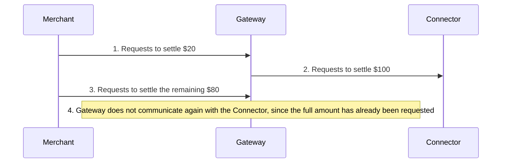
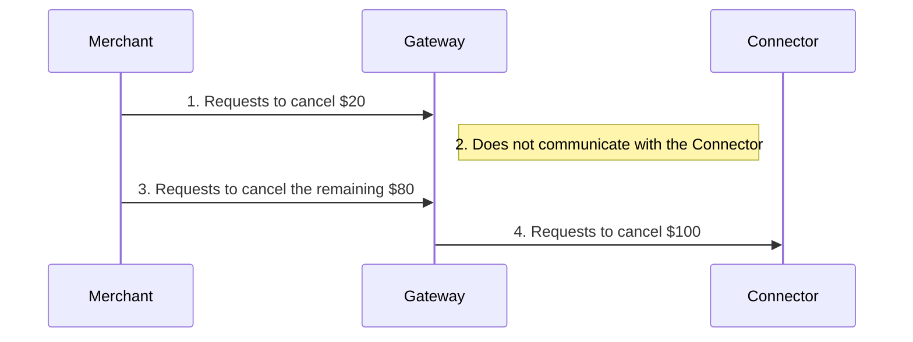
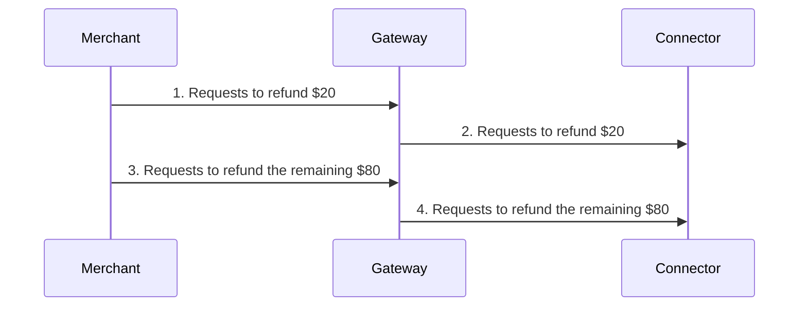
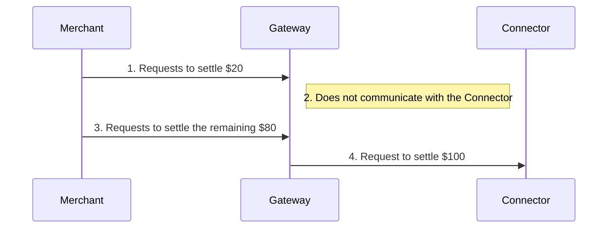
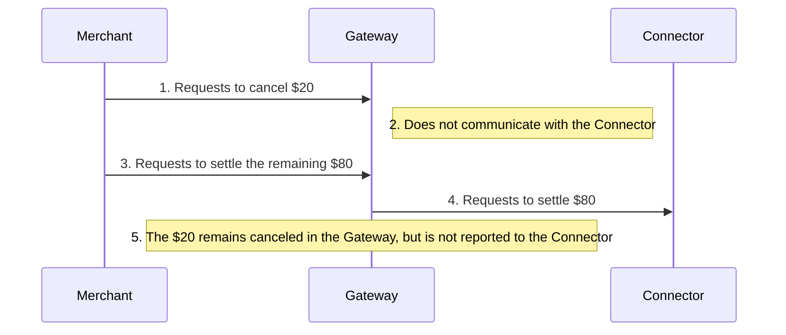
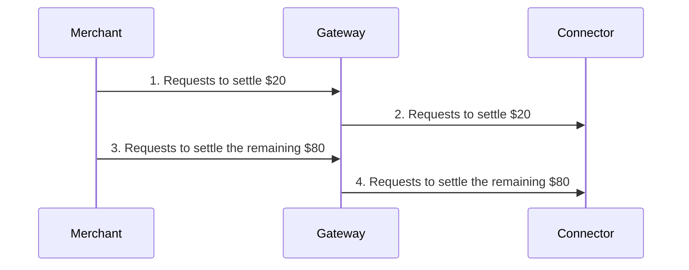
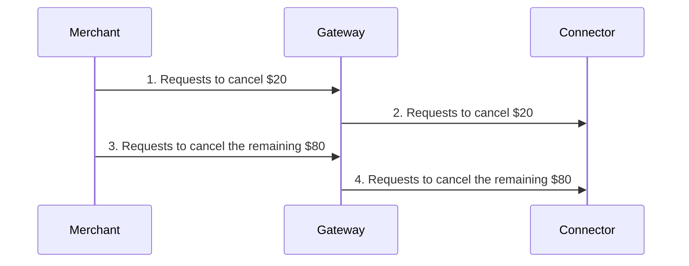

Post-purchase payment operations occur after an order is approved and can be of three types: settlement, cancellation, and refund.
 
The behavior of these operations depends on the processing mode configured for each connector in the VTEX Gateway, which can be:

- Total mode
- Hold mode
- Partial

> ℹ️ A single account (store) can have connectors configured with different modes within VTEX Gateway — for example, one connector in **Partial mode** and another in **Hold mode**. When a transaction involves multiple connectors using different modes, such as **Hold** and **Partial**, the system automatically switches to **Total mode** to ensure consistency and integrity in the payment process.

## Overview of processing modes

The table below shows the general behavior of each operation in the different modes:

| Operation | Total mode | Hold mode | Parcial mode |
| :---: | :--- | :--- | :--- |
| **Settlement** | Always sends a settlement request to the connector for the order total, even if the merchant requested a lower amount. | Internally holds requests for amounts lower than the total. Sends the settlement request to the connector only when the total amount is reached. | Sends the amount requested in each settlement operation to the connector. |
| **Cancellation** | Internally holds requests for partial cancellations. Sends the cancellation request to the connector only when the total amount is reached.  | Internally holds requests for partial cancellations. Sends the cancellation request to the connector only when the total amount is reached. | Sends the exact amount requested in each cancellation operation to the connector. |
| **Refund** | Sends the exact amount requested in each refund operation to the connector. | Sends the exact amount requested in each refund operation to the connector. | Sends the exact amount requested in each refund operation to the connector. |

> ⚠️ The mode selected for each connector consistently defines how settlement, cancellation, and refund operations behave. You can't combine the behaviors of different modes in the same connector simultaneously.

## Operation flow by mode

The following examples and diagrams show how each processing mode works in settlement, cancellation, and refund operations. For simplicity, all the examples use a $100 order.

> ⚠️ The **Total mode** is the default behavior used in VTEX stores. If the **Hold** or **Partial** modes are more suitable for your business strategy, contact [VTEX Support](https://help.vtex.com/docs/tutorials/opening-tickets-to-vtex-support#technical-support) para solicitar a alteração da configuração da sua loja.

## Total mode

### Settlement

1. The merchant requests a settlement of $20 from the gateway
2. The gateway requests a settlement of $100 from the connector
3. The merchant requests settlement of the remaining order amount ($80) from the gateway
4. The gateway doesn't communicate with the connector, as the total order amount has already been requested

### Cancellation

1. The merchant requests the cancellation of $20 from the gateway
2. The gateway doesn't communicate with the connector
3. The merchant requests cancellation of the remaining order amount ($80) from the gateway
4. The gateway requests the cancellation of $100 from the connector

### Refund

1. The merchant requests a refund of $20 from the gateway
2. The gateway requests a refund of $20 from the connector
3. The merchant requests a refund of the remaining order amount ($80) from the gateway
4. The gateway requests a refund of the remaining order amount ($80) from the connector

> ℹ️ The connector will only carry out a refund operation if the requested amount has already been settled previously.

## Hold mode

### Settlement

1. The merchant requests a settlement of $20 from the gateway
2. The gateway doesn't communicate with the connector
3. The merchant requests settlement of the remaining order amount ($80) from the gateway
4. The gateway requests a settlement of $100 from the connector

### Cancellation

**Example 1**: Cancellation of the order total

1. The merchant requests the cancellation of $20 from the gateway
2. The gateway doesn't communicate with the connector
3. The merchant requests cancellation of the remaining order amount ($80) from the gateway
4. The gateway requests the cancellation of $100 from the connector

**Example 2**: Cancellation of a partial order amount

1. The merchant requests the cancellation of $20 from the gateway
2. The gateway doesn't communicate with the connector
3. The merchant requests settlement of the remaining order amount ($80) from the gateway
4. The gateway requests a settlement of $80 from the connector
5. The amount of $20 remains canceled in the gateway, but isn't reflected in the connector

### Refund

1. The merchant requests a refund of $20 from the gateway
2. The gateway requests a refund of $20 from the connector
3. The merchant requests a refund of the remaining order amount ($80) from the gateway
4. The gateway requests a refund of the remaining order amount ($80) from the connector

> ℹ️ The connector will only carry out a refund operation if the requested amount has already been settled previously.

## Partial mode

> ⚠️ For orders paid with multiple payment methods, the system initially processes the operation using the method with the lowest amount assigned to the transaction.

### Settlement

1. The merchant requests a settlement of $20 from the gateway
2. The gateway requests a settlement of $20 from the connector
3. The merchant requests settlement of the remaining order amount ($80) from the gateway
4. The gateway requests the settlement of the remaining order amount ($80) from the connector

### Cancellation

1. The merchant requests the cancellation of $20 from the gateway
2. The gateway requests the cancellation of $20 from the connector
3. The merchant requests the cancellation of the remaining order amount ($80) from the gateway
4. The gateway requests the cancellation of the remaining order amount ($80) from the connector

### Refund

1. The merchant requests a refund of $20 from the gateway
2. The gateway requests a refund of $20 from the connector
3. The merchant requests a refund of the remaining order amount ($80) from the gateway
4. The gateway requests a refund of the remaining order amount ($80) from the connector

> ℹ️ The connector will only carry out a refund operation if the requested amount has already been settled previously.

## Choosing the best mode

The mode configured in the account may affect the store financial flow, operational costs, and customer post-purchase experience.

Before requesting any changes, assess how each option behaves regarding settlement, cancellation, and refund, and choose the one that best fits your operation strategy.

> ⚠️ **Partial mode** requires the payment connector to support multiple partial operations. This mode isn't compatible with [payment split](https://help.vtex.com/docs/tutorials/split-payment).

| Mode | Recommended for | Advantages| Limitations |
| :---: | :--- | :--- | :--- |
| **Total** | Stores that want to process settlements quickly after order approval. | <ul><li>Reduces the time between approval and fund transfer.</li><li>Ideal for merchants who prefer immediate settlement.</li></ul> | <ul><li>May incur high refund fees if amounts that have been already settled need to be refunded.</li><li>Doesn't support partial settlements.</li></ul> |
| **Hold** | Stores that wait for multiple confirmations, such as invoices from various sellers, before settling the total amount. | <ul><li>Supports [payment split](https://help.vtex.com/docs/tutorials/split-payment), allowing item and amount changes in an order with multiple sellers, if needed.</li><li>Avoids refund costs, as it only settles when the total amount is reached.</li><li>Centralizes information transmission to the connector, reducing intermediary transactions.</li></ul> | <ul><li>For orders involving multiple sellers, settlement takes place only after all invoices have been issued.</li><li>Doesn't support partial settlements.</li></ul> |
| **Partial** | Stores that operate with frequent settlements, cancellations, or partial refunds. | <ul><li>Allows multiple partial settlement and cancellation operations.</li><li>For orders with multiple sellers, it enables partial settlement without waiting for all sellers.</li><li>May avoid additional refund fees.</li></ul> | <ul><li>Doesn't support [payment split](https://help.vtex.com/docs/tutorials/split-payment).</li><li>Requires the connector to support multiple operations.</li><li>Requires greater operational control.</li></ul> |