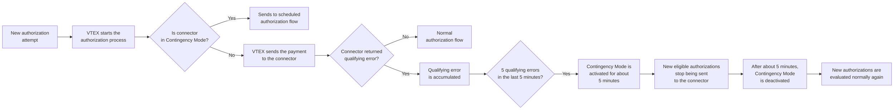
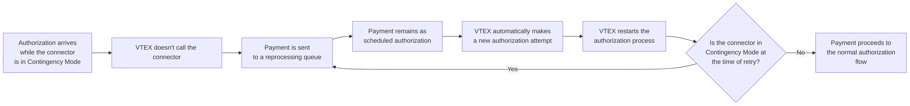

**Contingency Mode** (formerly known as **Mode-off**) is a VTEX Payments resilience feature that helps protect eligible transactions during temporary outages at payment providers.

This article covers the following topics:

- [How **Contingency Mode** works](#how-contingency-mode-works)
- [The impact on transactions](#impact-on-transactions)
- [Which payment methods and flows may be affected](#affected-payment-methods)
- [Connector recovery and retry behavior](#recovery-and-retry-behavior)
- [How to identify **Contingency Mode**](#how-to-identify-contingency-mode)
- [What to do when **Contingency Mode** is active](#what-to-do-when-contingency-mode-is-active)
- [Guidance for payment providers](#guidance-for-payment-providers)

> ℹ️ Merchants don't need to configure or activate **Contingency Mode** manually. VTEX automatically manages transaction activation, recovery, and retries.

## How Contingency Mode works

**Contingency Mode** is an automatic protection mechanism for payment connectors. When VTEX detects recurring technical failures in a connector, the system activates this mode to reduce the impact of instability on payment processing.

During this period:

- New eligible authorizations are temporarily stopped from being sent to the provider.
- New eligible transactions may be postponed for later processing.
- Transactions that were postponed follow an independent scheduled retry flow.

This protection applies to the affected connector, not to the entire store. Other payment providers or methods not affected by the instability may continue to operate normally.

The activation and recovery cycle of **Contingency Mode** is independent of the retry cycle of postponed transactions. This means a connector may have already exited **Contingency Mode** while certain transactions are still waiting for the next scheduled retry window.

### Activation

**Contingency Mode** is activated when VTEX detects 5 qualifying technical errors in 5 minutes for the same connector.

Qualifying technical errors may include:

- Request timeouts.
- Connection failures.
- Requests canceled due to technical instability.
- HTTP `408` timeout responses.
- HTTP `5xx` errors from the provider, such as `500`, `502`, `503`, or `504`.

> ℹ️ Expected responses from the authorization process don't activate **Contingency Mode**. For example, insufficient funds, invalid card, expired card, and payment not authorized are part of the normal authorization flow and aren't considered connector instability.

### Contingency Mode cycle

When **Contingency Mode** is active:

- VTEX marks the affected connector as temporarily unavailable.
- New eligible authorization requests aren't sent to the provider.
- New eligible transactions may be postponed for retry later.
- The connector remains temporarily unavailable until the automatic recovery period ends.
- Merchants may see **Contingency Mode** indicated in transaction details or payment logs.

This behavior helps avoid new calls to an unstable connector while the provider recovers.

The following diagram shows the activation and recovery cycle of **Contingency Mode** for new authorizations:

## Impact on transactions

**Contingency Mode** doesn't cancel orders on its own. Transactions affected by **Contingency Mode** may be postponed for an automatic retry later.

> ℹ️ **Contingency Mode** doesn't override the normal rules of payment expiration and cancellation. If payment can't be authorized before the applicable deadline, the order may still be canceled based on the normal order flow.

Customers may see the payment as processing or pending while VTEX awaits the next retry of the authorization.

Merchants should avoid asking customers to place a new order immediately unless the original order has already been canceled or the payment method requires a new customer action.

## Affected payment methods

**Contingency Mode** applies to payment flows that can be processed asynchronously and retried safely after a temporary provider instability.

Payment methods or flows that require an immediate online response, client redirection, or a new customer action may not be postponed and retried in the same way. In these cases, the transaction follows the standard behavior for those payment methods.

> ℹ️ If you're unsure whether a specific payment method is eligible for **Contingency Mode**, contact [VTEX Support](https://supporticket.vtex.com/support) or your payment provider.

## Recovery and retry behavior

Connector recovery is automatic. After approximately 5 minutes since the last qualifying error, VTEX removes the connector from **Contingency Mode**, and new eligible authorizations can be sent to the provider normally.

Exiting **Contingency Mode** only affects new authorization attempts. Previously postponed transactions follow their own scheduled retry flow.

### Retrying postponed transactions

Transactions postponed during **Contingency Mode** aren't necessarily retried immediately after connector recovery.

These transactions follow an independent retry flow based on:

- The retry rules of the payment method.
- The payment cancellation time (`delayToCancel`).
- Information returned by the provider.
- Other operational conditions of the payment flow.

The following diagram shows the behavior of scheduled authorizations:

The recovery period of **Contingency Mode** and the retry interval for transactions are independent processes, so:

- The connector may exit **Contingency Mode** after approximately 5 minutes.
- Postponed transactions may continue to wait for the next scheduled retry window for that payment flow.

This behavior avoids new immediate calls to still-unstable connectors while preserving eligible transactions for later automatic reprocessing.

The interval between retries may vary according to:

- The payment method.
- Information returned by the provider.
- The payment cancellation time (`delayToCancel`).
- Operational conditions of the payment flow.

These factors determine how long the transaction can still be reprocessed and the interval that must be observed between attempts. Therefore, the time until the next retry is not fixed for all payments and may vary depending on the transaction's configuration and context.

In general:

When `delayToCancel` is less than 1 day, retries usually occur every 1 hour.
When `delayToCancel` is 1 day or more, retries usually occur every 4 hours.

For more information, see the [Create Payment](https://developers.vtex.com/docs/api-reference/payment-provider-protocol?endpoint=post-/payments) endpoint.

> ℹ️ Although [Pix](https://help.vtex.com/docs/tutorials/setting-up-pix-as-a-payment-method) payments aren't affected by the **Contingency Mode**, meaning that transactions made through this method aren't blocked, other issues may interrupt payment processing. In these cases, when the `delayToCancel` field is set between 5 minutes and 1 hour, retry attempts usually occur every 5 minutes.

> ⚠️ The retry time may vary according to the payment method, account settings, and operational conditions. VTEX manages this process automatically to minimize retry intervals and reduce the time transactions spend in the pending queue.

## How to identify Contingency Mode

Merchants may notice **Contingency Mode** when instability in a payment provider affects a specific connector.

Common indicators include:

- An unusual number of payments are pending authorization or processing for the same provider.
- Transaction logs indicate that **Contingency Mode** is active on the affected connector.
- A temporary reduction in the volume of approved payments for a specific payment method or provider.
- Eligible authorizations being postponed for later retry.

Payment providers may also notice other indicators of integration instability, such as:

- Timeouts.
- Connection failures.
- HTTP `5xx` errors.

## What to do when Contingency Mode is active

In most cases, no action is required by merchants. VTEX automatically protects the transaction flow, re-enables the connector when the instability subsides, and processes eligible transactions according to the automatic retry rules.

Recommended actions:

1. Monitor the affected transactions in the VTEX Admin.
2. Check whether the issue is specific to a particular provider or payment method.
3. Contact the payment provider if the instability persists or if the integration requires further investigation.
4. Contact [VTEX Support](https://supporticket.vtex.com/support) if transactions remain pending longer than expected or if customers report recurring payment issues.

> ⚠️ Avoid canceling or recreating orders manually unless there's a clear business reason to do so, such as a customer request, order expiration, or confirmation that payment can't be completed.

## Guidance for payment providers

Payment providers should investigate and resolve the instability that caused the recurring technical failures.

Common checks include:

- Availability of authorization endpoints.
- Response time and timeout behavior.
- HTTP `5xx` errors.
- Network connectivity.
- Recent deployments or infrastructure changes.

Once the provider stabilizes, VTEX automatically removes the connector from **Contingency Mode**, and new eligible authorizations can be sent normally.

> ℹ️ Previously postponed transactions continue to follow their configured retry rules.
