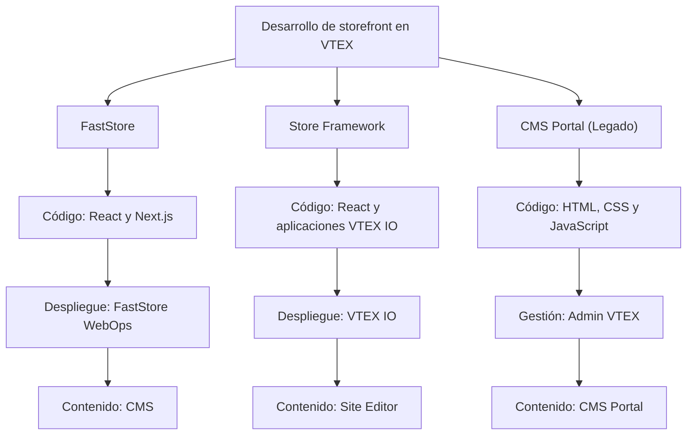

El desarrollo de una tienda implica crear y mantener la experiencia orientada al cliente de una tienda de ecommerce, comúnmente denominada storefront.

El storefront muestra datos comerciales y permite que los clientes naveguen por los productos, gestionen sus cuentas y realicen pedidos. Se comunica con servicios de backend responsables de funcionalidades como catálogo, precios, promociones, checkout, logística y pedidos.

En VTEX, puedes desarrollar un storefront mediante [FastStore](https://developers.vtex.com/docs/guides/faststore), [Store Framework](https://developers.vtex.com/docs/guides/store-framework) o [CMS Portal (Legado)](https://help.vtex.com/docs/tracks/legacy-cms-portal).

## Soluciones de storefront

Cada solución de storefront tiene un modelo diferente de desarrollo, despliegue y gestión de contenido:

| Solución | Tecnologías principales | Desarrollo y despliegue |
| --- | --- | --- |
| [FastStore](https://developers.vtex.com/docs/guides/faststore) | Next.js, React, TypeScript, Node.js y GraphQL | Se desarrolla en GitHub y se despliega mediante FastStore WebOps |
| [Store Framework](https://developers.vtex.com/docs/guides/store-framework) | Aplicaciones VTEX IO, React, TypeScript, Node.js y GraphQL | Se desarrolla y despliega mediante VTEX IO |
| [CMS Portal (Legado) — Ya no está disponible para tiendas VTEX recién creadas.](https://help.vtex.com/docs/tracks/legacy-cms-portal) | HTML, CSS y JavaScript | Se desarrolla y gestiona mediante el Admin VTEX |

Para comparar las tres soluciones en más detalle, consulta [Primeros pasos con las soluciones de storefront](https://developers.vtex.com/docs/guides/getting-started-with-storefront-solutions).

### FastStore

[FastStore](https://developers.vtex.com/docs/guides/faststore) es un conjunto de herramientas para desarrollar storefronts de alto rendimiento con [React](https://react.dev/) y [Next.js](https://nextjs.org/). Sigue una arquitectura [Jamstack](https://jamstack.org/) en la que las páginas pueden renderizarse previamente y entregarse mediante una red de distribución de contenido (CDN), mientras que las API proporcionan datos y funcionalidades comerciales dinámicos.

En los storefronts FastStore, los desarrolladores mantienen el código fuente en GitHub y despliegan el storefront mediante [FastStore WebOps](https://developers.vtex.com/docs/guides/faststore/webops-dashboard). Los usuarios de negocio gestionan el contenido del storefront con [CMS](https://help.vtex.com/docs/tutorials/cms-overview).

FastStore tiene varias versiones principales con diferentes niveles de soporte. FastStore v4 es la versión actual recomendada para nuevas implementaciones de storefront. Para más información, consulta [Versiones y niveles de soporte de FastStore](https://developers.vtex.com/docs/guides/faststore/getting-started-faststore-versions-and-support-levels).

### Store Framework

[Store Framework](https://developers.vtex.com/docs/guides/store-framework) es un framework de desarrollo frontend basado en React y en la plataforma de desarrollo VTEX IO. Los desarrolladores crean storefronts mediante la composición de aplicaciones VTEX IO nativas y personalizadas en un tema de tienda.

Como Store Framework se ejecuta en VTEX IO, los desarrolladores pueden utilizar funcionalidades como workspaces de desarrollo y producción, pruebas A/B e infraestructura de nube gestionada. Los usuarios de negocio gestionan el contenido del storefront mediante [Site Editor](https://help.vtex.com/docs/tutorials/site-editor-overview).

### CMS Portal (Legado)

[CMS Portal (Legado)](https://help.vtex.com/docs/tracks/legacy-cms-portal) es la solución original de VTEX para el desarrollo y la gestión de contenido de storefronts. Los desarrolladores crean plantillas HTML y utilizan CSS, JavaScript y controles nativos de VTEX para renderizar datos comerciales, con el código gestionado directamente mediante el Admin VTEX.

> ⚠️ CMS Portal (Legado) ya no está disponible para tiendas VTEX recién creadas. Para obtener orientación sobre cómo migrar un storefront existente a FastStore, contacta al [equipo de Soporte VTEX](https://help.vtex.com/support).

## Desarrollo de backend e integraciones

El storefront se comunica con servicios de backend que proporcionan los datos y las funcionalidades necesarios para la operación de ecommerce. Los desarrolladores pueden ampliar estas funcionalidades mediante la creación de aplicaciones de backend e integraciones con VTEX IO y las API de VTEX.

### VTEX IO

[VTEX IO](https://developers.vtex.com/docs/guides/vtex-io-documentation-what-is-vtex-io) es una plataforma de desarrollo basada en la nube para crear aplicaciones frontend y backend. Proporciona infraestructura gestionada y herramientas de desarrollo para que los equipos puedan centrarse en implementar los requisitos de negocio.

VTEX IO permite desarrollar:

- Storefronts con Store Framework.
- Aplicaciones personalizadas para el Admin VTEX.
- Servicios de backend e integraciones.

### API de VTEX

Las [API de VTEX](https://developers.vtex.com/docs/api-reference) exponen funcionalidades comerciales como catálogo, precios, promociones, checkout, logística y pedidos.

Las tres soluciones de storefront dependen de los servicios comerciales subyacentes de VTEX. Sin embargo, la forma en que un storefront accede a esos servicios depende de la tecnología seleccionada. Por ejemplo, FastStore puede consumir datos comerciales mediante su capa de API, Store Framework utiliza aplicaciones VTEX IO y CMS Portal puede renderizar datos mediante controles nativos de VTEX.

## Admin VTEX

El Admin VTEX es la interfaz en la que los usuarios de negocio gestionan datos y configuraciones comerciales, incluidos productos, pedidos, promociones, logística y contenido del storefront.

Las funcionalidades de storefront disponibles en el Admin VTEX dependen de la tecnología seleccionada:

- FastStore utiliza CMS para el contenido del storefront.
- Store Framework utiliza Site Editor.
- Los storefronts de CMS Portal utilizan las funcionalidades de layout y plantillas de CMS Portal.

## Próximos pasos

- [Desarrollo de storefront](https://developers.vtex.com/docs/storefront-development): Explora la documentación completa para desarrolladores sobre las soluciones de storefront de VTEX.
- [Primeros pasos con las soluciones de storefront](https://developers.vtex.com/docs/guides/getting-started-with-storefront-solutions): Compara las funcionalidades y la experiencia de desarrollo de cada solución.
- [Implementación de frontend](https://help.vtex.com/docs/tracks/frontend-implementation): Obtén más información sobre los pasos necesarios para implementar un proyecto de storefront.
