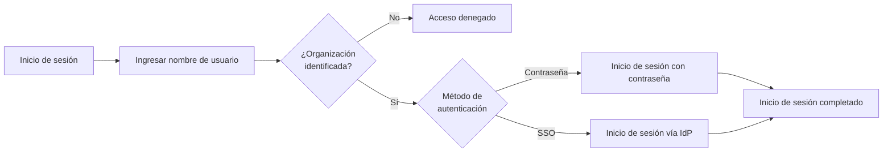
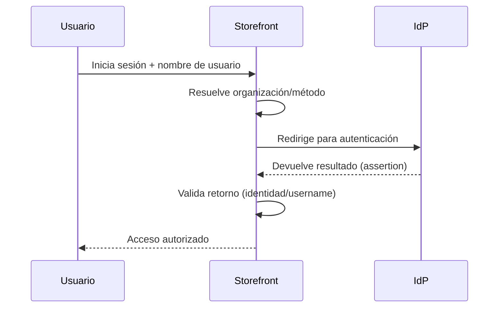
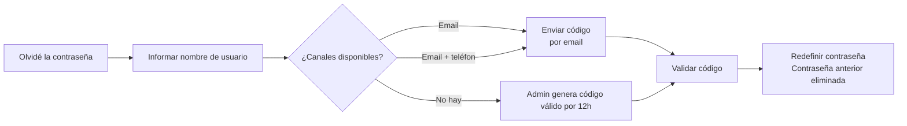

> ⚠️ Esta funcionalidad se encuentra disponible únicamente para tiendas que usan [B2B Buyer Portal](https://help.vtex.com/es/docs/tutorials/b2b-buyer-portal-es), actualmente disponible para cuentas seleccionadas.

En entornos B2B el acceso al storefront generalmente está vinculado a una organización, por lo que el proceso de autenticación puede utilizar identificadores distintos al email e integrarse a sistemas corporativos de identidad.

Algunas de las opciones de autenticación para acceso de usuarios a la tienda B2B son:

- Inicio de sesión con nombre de usuario y contraseña
- Inicio de sesión a través de proveedor de identidad externo (SSO)

## Información general

El siguiente diagrama presenta información general del flujo de inicio de sesión en tiendas B2B, desde la identificación del usuario hasta la autenticación final.

El inicio de sesión en tiendas B2B puede realizarse mediante diferentes mecanismos de autenticación. Dependiendo de la configuración de la tienda y de la organización del usuario, la autenticación puede realizarse mediante nombre de usuario y contraseña o a través de un proveedor de identidad (IdP) externo.

> ℹ️ La definición de los métodos de autenticación utilizados por la organización se realiza mediante una configuración a través de API. Más información en [Setting up authentication methods per organization unit](#).

En el componente de inicio de sesión, el comprador primero ingresa su nombre de usuario. A partir de este identificador, la plataforma VTEX determina el contrato asociado con el usuario e identifica el método de autenticación que debe utilizarse.

Con base en esta información, el componente de inicio de sesión muestra dinámicamente el método de autenticación configurado para esa organización, como inicio de sesión con contraseña o autenticación mediante un proveedor de identidad externo.

## Iniciar sesión con nombre de usuario

En el modelo de autenticación B2B, los usuarios pueden acceder al storefront utilizando el nombre de usuario como identificador principal.

Este modelo es común en escenarios como:

- Portales corporativos para empleados o representantes
- Empresas que utilizan IDs corporativos
- Organizaciones que adoptan inicio de sesión predeterminado por nombre de usuario

### Reglas del nombre de usuario

El nombre de usuario debe seguir las siguientes reglas:

- 3 a 30 caracteres
- No diferencia entre mayúsculas y minúsculas
- Caracteres permitidos: letras, números, `.`, `@`, `-` y `_`
- No permite espacios

### Emails

En entornos B2B, el email no es obligatorio como identificador de inicio de sesión. Los usuarios pueden tener dos tipos de emails con diferentes propósitos: email de recuperación de acceso e email transaccional.

| Tipo de email | Uso | Reglas |
| :---- | :---- | :---- |
| Email de recuperación de acceso | Se utiliza para acciones relacionadas con autenticación, como recuperación o restablecimiento de contraseña. | Debe ser único en la tienda. Puede ser opcional. Puede ser igual al email transaccional, pero no es necesario. |
| Email transaccional             | Utilizado para comunicaciones de la tienda, como confirmaciones de pedido y notificaciones de status.        | No necesita ser único y pueden compartirlo múltiples usuarios. También puede ser opcional.                                     |

#### Ejemplo de uso

Considera un consultorio médico (organización) con tres empleados que realizan compras. Todos los empleados pueden compartir un email transaccional corporativo utilizado para comunicaciones de la tienda, como confirmación de pedidos.

Además, dos de estos empleados también pueden tener sus propios emails individuales para la recuperación de acceso. Estos emails individuales se utilizan para acciones relacionadas con la autenticación, como la recuperación o restablecimiento de contraseña, siguiendo la regla de que el email de recuperación de acceso debe ser único en la tienda.

## Inicio de sesión a través de proveedor de identidad (IdP) externo

Las organizaciones pueden autenticar a los usuarios utilizando un proveedor de identidad (IdP) externo mediante inicio de sesión único (SSO).

El flujo de autenticación funciona de la siguiente manera:

1. El usuario proporciona su nombre de usuario en el inicio de sesión.
2. La plataforma VTEX identifica la organización asociada al usuario.
3. El usuario es redirigido al proveedor de identidad configurado.
4. El proveedor autentica al usuario.
5. Después de la autenticación, el usuario regresa a la tienda con acceso autorizado.

> ℹ️ Los proveedores de identidad los configura el retailer. Más información en [Login (SSO)](https://developers.vtex.com/docs/guides/login-integration-guide).
>
> La organización compradora también debe activar el inicio de sesión con el proveedor de identidad externo en Buyer Portal. Más información en [Iniciar sesión en la organización a través de un proveedor de identidad externo](#).

El diagrama a continuación ilustra el flujo de autenticación cuando una organización utiliza un proveedor de identidad (IdP) externo.

Cuando la tienda utiliza autenticación por proveedor de identidad (IdP) externo, el retailer configura el proveedor en el Admin en **Configuración de la cuenta > Autenticación** de la misma manera que para tiendas VTEX actualmente.

## Métodos de inicio de sesión no admitidos

Hay algunos métodos de inicio de sesión disponibles en tiendas B2C que **no son compatibles** para usuarios B2B, incluyendo:

- **Código de acceso**
- **Google**
- **Facebook**

## Recuperación de contraseña

La recuperación de contraseña utiliza códigos de verificación enviados a los canales disponibles del usuario.

El comportamiento varía según la información de contacto registrada:

| Status del usuario | Forma de envío del código de acceso | Observaciones |
| :---- | :---- | :---- |
| El usuario tiene email | Código enviado por email | Sigue las mismas reglas de códigos de acceso en tiendas B2C. |
| El usuario tiene email y teléfono | Código enviado por email | - |
| El usuario no tiene email ni teléfono | Código generado por el administrador de la organización | El administrador genera y comparte el código con el usuario. Los códigos de acceso generados por administradores de la organización tienen una validez de 12 horas. Más información en [Agregar usuarios a la organización compradora](https://help.vtex.com/es/docs/tutorials/agregar-usuarios-a-la-organizacion-compradora#generar-codigo-de-acceso-para-usuarios-sin-email). |

Cuando se genera y envía un código de acceso al usuario, la contraseña anterior se elimina de los sistemas de VTEX.

El siguiente diagrama muestra las principales vías para la recuperación de contraseña, dependiendo de los canales disponibles para el usuario.

## Restricciones de acceso

El acceso al storefront puede bloquearse cuando existen restricciones relacionadas con la organización del usuario. Algunos ejemplos incluyen:

- Usuario no asociado a una organización válida
- Organización sin contrato activo

En estos casos, el usuario debe ponerse en contacto con el administrador de la organización.
