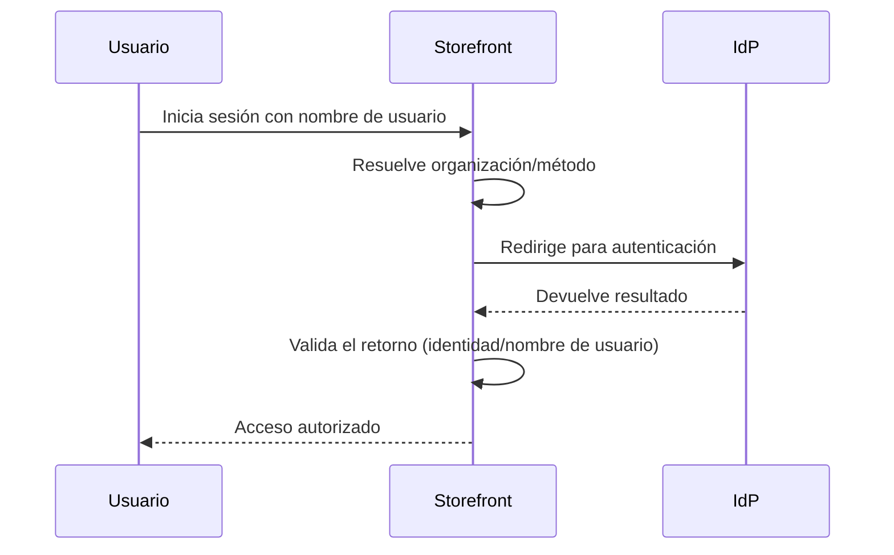

> ⚠️ Esta funcionalidad se encuentra disponible únicamente para tiendas que utilizan [B2B Buyer Portal](https://help.vtex.com/es/docs/tutorials/b2b-buyer-portal-es), actualmente disponible para cuentas seleccionadas.

Las organizaciones compradoras pueden autenticar a sus miembros utilizando un proveedor de identidad (IdP) externo mediante inicio de sesión único (SSO). Para que este flujo funcione debes activar el inicio de sesión con el proveedor de identidad externo en la interfaz de Buyer Portal, como se describe en esta guía.

## Prerrequisitos

Antes de habilitar el inicio de sesión mediante IdP externo en Buyer Portal verifica si:

* El retailer ya configuró el proveedor de identidad en el Admin VTEX en **Configuración de la cuenta > Autenticación**, según las instrucciones en [Login (SSO)](https://developers.vtex.com/docs/guides/login-integration-guide) y [Webstore (OAuth 2.0)](https://developers.vtex.com/docs/guides/login-integration-guide-webstore-oauth2).
* Tienes el perfil **Organizational Unit Admin** en la organización compradora.

## Activar inicio de sesión mediante IdP externo en Buyer Portal

Sigue las instrucciones a continuación para activar el inicio de sesión mediante IdP externo:

1. Accede a la tienda a través del navegador e inicia sesión con tu usuario.
2. En el menú superior, haz clic en **Empresa**. Se mostrará el panel de la organización.
3. Haz clic en **Gestionar**.
4. Si deseas activar el inicio de sesión para la organización, continúa con el paso 5. Si deseas activar una organización hija, haz clic en **Unidades organizativas** y luego en el nombre de la unidad organizativa.
5. Haz clic en el menú **⋮** y luego en **Autenticación**.

   

6. En la sección **Métodos de autenticación**, selecciona una o más opciones deseadas (en el ejemplo de la imagen a continuación, la opción de IdP externo es PingFederate (SSO). Recuerda desmarcar los métodos de autenticación que no vayan a utilizarse.

7. Haz clic en `Guardar`.

> ℹ️ También puedes gestionar las opciones de autenticación de la organización vía API. Consulta la [referencia de la API VTEX ID](https://developers.vtex.com/docs/api-reference/vtex-id-api#post-/api/vtexid/organization-units/-unitId-/settings) para más detalles.

## Flujo de autenticación

Después de la activación, el flujo de autenticación para los miembros de la organización ocurre de la siguiente forma:

1. El usuario ingresa su nombre de usuario al iniciar sesión en el storefront.
2. La plataforma VTEX identifica la organización asociada al usuario.
3. El usuario es redirigido al proveedor de identidad configurado.
4. El proveedor autentica al usuario.
5. Después de la autenticación, el usuario regresa al storefront con acceso autorizado. El diagrama a continuación ilustra este flujo:

## Más información

* [Login (SSO)](https://developers.vtex.com/docs/guides/login-integration-guide)
* [Webstore (OAuth 2.0)](https://developers.vtex.com/docs/guides/login-integration-guide-webstore-oauth2)
* [Inicio de sesión para tiendas B2B](https://help.vtex.com/es/docs/tutorials/login-para-tiendas-b2b)
