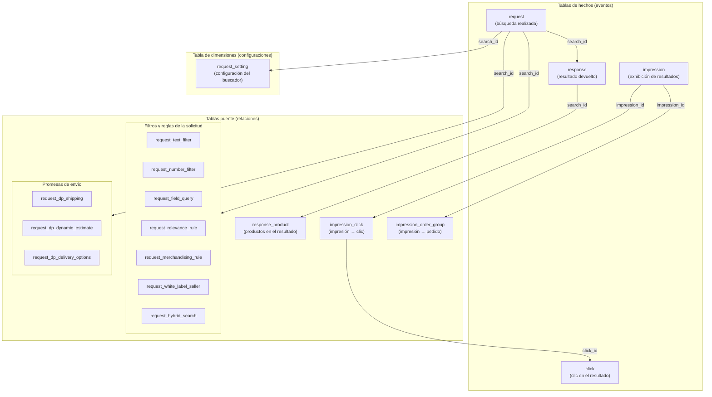
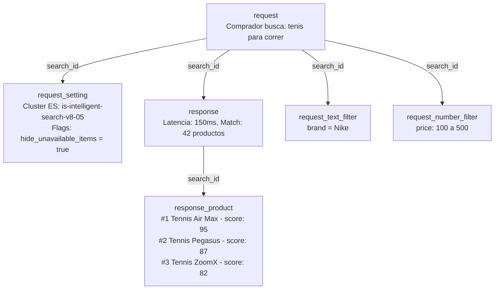
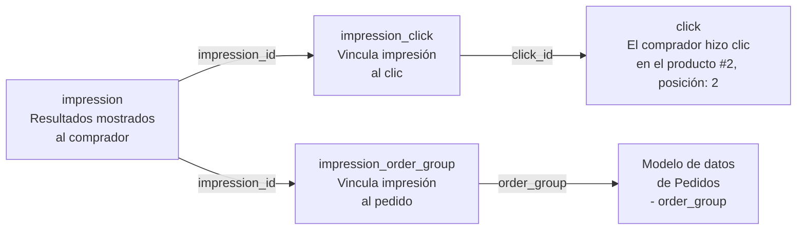
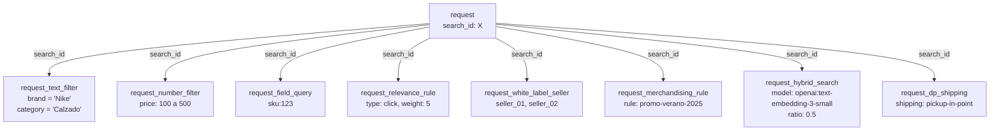

El modelo de datos `search` contiene información completa sobre las consultas de búsqueda, resultados e interacciones de los usuarios con la plataforma Intelligent Search. Estos datos permiten el análisis del rendimiento de búsqueda, descubrimiento de productos, tasas de clic y conversión de búsqueda a compra.

En esta sección puedes consultar la siguiente información:

- [Tipos de tablas y relaciones](#tipos-de-tablas-y-relaciones)
- [Características de los datos de búsqueda](#caracteristicas-de-los-datos-de-busqueda)
- [Tabla: request](#tabla-request)
- [Tabla: response](#tabla-response)
- [Tabla: response_product](#tabla-response-product)
- [Tabla: click](#tabla-click)
- [Tabla: impression](#tabla-impression)
- [Tabla: impression_click](#tabla-impression-click)
- [Tabla: impression_order_group](#tabla-impression-order-group)
- [Tabla: session_query](#tabla-session-query)
- [Tabla: session_query_click](#tabla-session-query-click)
- [Tabla: request_white_label_seller](#tabla-request-white-label-seller)
- [Tabla: request_merchandising_rule](#tabla-request-merchandising-rule)
- [Tabla: request_field_query](#tabla-request-field-query)
- [Tabla: request_text_filter](#tabla-request-text-filter)
- [Tabla: request_number_filter](#tabla-request-number-filter)
- [Tabla: request_relevance_rule](#tabla-request-relevance-rule)
- [Tabla: request_hybrid_search](#tabla-request-hybrid-search)
- [Tabla: request_setting](#tabla-request-setting)
- [Tabla: request_dp_shipping](#tabla-request-dp-shipping)
- [Tabla: request_dp_dynamic_estimate](#tabla-request-dp-dynamic-estimate)
- [Tabla: request_dp_delivery_options](#tabla-request-dp-delivery-options)
- [Análisis con datos de búsqueda](#analisis-con-datos-de-busqueda)
- [Correlaciones con otros datos](#correlaciones-con-otros-datos)

## Tipos de tablas y relaciones

El modelo de datos de búsqueda se compone de tres tipos de tabla, cada una con un papel específico:

- **Tablas de hechos:** almacenan eventos que ocurrieron. Cada fila es el registro de una acción: una búsqueda realizada, un clic en un producto o una impresión mostrada. Son las tablas con mayor volumen de datos y el punto de partida para la mayoría de los análisis. Ejemplo: en la tabla `request`, cada fila registra una búsqueda realizada por un comprador, con el término buscado, los filtros aplicados y la marca de tiempo del evento.
- **Tablas puente:** establecen relaciones entre dos entidades. No contienen datos de negocio propios, solo claves que conectan registros de otras tablas. Ejemplo: la tabla `impression_click` contiene solo `impression_id` y `click_id`, permitiendo responder "¿qué impresiones generaron clics?" sin duplicar datos de ninguna de las dos tablas originales.
- **Tablas de dimensiones:** almacenan atributos descriptivos y configuraciones que contextualizan los eventos. Este tipo de tabla cambia con menos frecuencia y tiene menor volumen de datos. Ejemplo: la tabla `request_setting` indica el clúster de [Elasticsearch](https://www.elastic.co/elasticsearch) que procesó la búsqueda y las flags que estaban activas, como `hide_unavailable_items` o `merchandising_rules_enabled`, permitiendo analizar la manera en que diferentes configuraciones impactan los resultados.

El diagrama a continuación muestra cómo se organizan las tablas por tipo y cómo se conectan entre ellas:

### Ejemplos de uso

Consulta a continuación 3 flujos distintos de uso de los datos

- Flujo 1: representa el recorrido de una solicitud de búsqueda y los detalles que la componen. Ejemplo: un comprador busca "zapatillas para correr" con filtros de marca y precio.

- Flujo 2: representa el recorrido completo del comprador, desde la obtención de resultados → clic → compra. Ejemplo: el comprador observa los resultados, hace clic en el producto #2 y finaliza la compra.

- Flujo 3: cada solicitud de búsqueda puede tener varios detalles asociados, todos vinculados por `search_id`. Una misma búsqueda puede tener, por ejemplo, dos filtros de texto, un filtro numérico y tres sellers activos al mismo tiempo.

## Características de los datos de búsqueda

| **Característica**  | **Descripción**   |
| :-----: | :----: |
| **Origen de los datos**  | Obtenidos a partir de solicitudes y respuestas de la API Intelligent Search y eventos de Activity Flow. |
|  **Disponibilidad**   |    Esta métrica solo está disponible a través de Data Pipeline. |
| **Historial** |  El historial de datos comienza en agosto de 2025.  |
| **Intervalo mínimo de actualización** |  Una hora. |

## Tabla: request

Almacena la información central de las consultas de búsqueda realizadas por los compradores, incluyendo el texto de la consulta, filtros, orden, paginación y configuración de búsqueda. Cada fila representa un solo evento de solicitud de búsqueda. No todas las búsquedas hechas desde el frontend quedan registradas en esta tabla, ya que algunas se responden desde la caché y no se registran.

Los campos de la tabla se describen a continuación:

| **Nombre de la columna** | **Tipo** | **Descripción** |
|:--|:--|:--|
| search_id | string | UUID de la búsqueda. Identificador único para cada solicitud de búsqueda, utilizado para hacer combinaciones con tablas de respuesta y otras tablas relacionadas con la búsqueda. |
| account_name | string | Nombre de la cuenta en la que se realizó la búsqueda. Identifica a qué tienda pertenece la búsqueda. |
| event_time | timestamp | Marca de tiempo del evento de búsqueda. Representa el momento en que la API de búsqueda recibió y procesó la solicitud de búsqueda. |
| origin | string | Origen de la solicitud. Indica de dónde se originó la búsqueda, como 'autocomplete', 'search' u otros puntos de entrada. Se utiliza para entender los patrones de comportamiento de búsqueda del usuario. |
| default_locale | string | Configuración regional predeterminada del inquilino. La configuración predeterminada de idioma y región de la tienda (ejemplo: 'es-MX', 'pt-BR'). |
| locale | string | Configuración regional solicitada por el comprador. La configuración específica de idioma y región solicitada para esta búsqueda (ejemplo: 'es-MX', 'pt-BR'). Puede diferir del `default_locale` si el usuario selecciona un idioma diferente. |
| query | string | String de consulta de texto completo ingresada por el comprador. El término o frase de búsqueda utilizado para encontrar productos. Puede estar vacío para búsquedas que solo utilizan consultas por campo o filtros. |
| operator | string | Operador de la consulta. Define cómo se combinan múltiples términos de búsqueda: 'and' requiere que todos los términos coincidan, 'or' requiere que al menos un término coincida. |
| fuzzy | string | Nivel de tolerancia a errores de la consulta. Controla la tolerancia de la búsqueda a errores de tipeo y ortografía. Puede ser '0' (coincidencia exacta), '1' (diferencia de un carácter), '2' (diferencia de dos caracteres) o 'auto' (cálculo automático). |
| sort_field | string | Campo del producto utilizado para ordenar los resultados. Puede ser 'relevance', 'price', 'name' u otros atributos del producto. |
| sort_order | string | Orden de clasificación de los resultados. Especifica si los resultados se ordenan en orden ascendente ('asc') o descendente ('desc') basado en el sort_field. |
| page | int | Número de la página actual en los resultados de búsqueda. Utilizado para la paginación, comenzando desde la página 1. Cada página se considera una solicitud de búsqueda separada. |
| products_per_page | int | Número de productos por página. El tamaño de página solicitado para los resultados de búsqueda, típicamente 10, 20, 30, etc. |
| trade_policy | string | Política comercial de la sesión. Identifica la política comercial o canal de ventas específico utilizado para esta búsqueda. |
| delivery_promises_enabled | boolean | Indica si la funcionalidad de promesas de entrega está activa en la cuenta. |
| delivery_promises_active | boolean | Indica si la funcionalidad de promesas de entrega está activa en esta búsqueda. |
| record_created_at | timestamp | Marca de tiempo de cuando se creó este registro en el lakehouse. |
| record_updated_at | timestamp | Marca de tiempo de la última vez que se actualizó este registro en el lakehouse. |
| batch_id | timestamp | Identificador utilizado durante la carga de datos en la tabla para el control de calidad de la ingesta. También sirve como clave de partición. |

## Tabla: response

Tabla que almacena información de respuesta de búsqueda. Contiene metadatos sobre los resultados de búsqueda devueltos al comprador, incluyendo información de redirecciones, métricas de desempeño, recuento de coincidencias y detalles de procesamiento de la consulta. Cada fila representa la respuesta a una única solicitud de búsqueda, vinculada a la tabla request vía 'search_id'.

Los campos de la tabla se describen a continuación:

| **Nombre de la columna** | **Tipo** | **Descripción** |
|:--|:--|:--|
| search_id | string | UUID de la búsqueda. Identificador único que vincula esta respuesta con la solicitud de búsqueda correspondiente. |
| account_name | string | Nombre de la cuenta en la que se realizó la búsqueda. Identifica a qué tienda pertenece la búsqueda. |
| event_time | timestamp | Marca de tiempo del evento de búsqueda. Representa el momento en que la API de búsqueda recibió y procesó la solicitud de búsqueda. |
| query | string | Cadena de consulta de texto completo ingresada por el comprador. Representa el término o la frase de búsqueda utilizados; puede estar vacía para búsquedas que solo utilizan consultas por campo o filtros. Duplicada de la tabla `request`. |
| default_locale | string | Configuración regional predeterminada del inquilino (ejemplo: 'es-MX', 'pt-BR'). Idioma y región principales de la tienda. Duplicada de la tabla `request`. |
| locale | string | Configuración regional solicitada por el comprador en esta búsqueda. Puede diferir del `default_locale` si el usuario elige otro idioma. Duplicada de la tabla `request`. |
| redirect | string | URL de redirección, si aplica. Este campo se llena cuando una búsqueda activa una regla de redirección (por ejemplo, para páginas específicas de marcas). De lo contrario, devuelve null. |
| latency | int | Latencia de la respuesta en milisegundos. Mide el tiempo necesario para procesar y devolver los resultados de la búsqueda. |
| misspelled | boolean | Indica si hay una palabra con error ortográfico en la consulta. |
| match | int | Cantidad de productos coincidentes. Representa el total de ítems que coinciden con la búsqueda y los filtros aplicados. |
| operator | string | Operador de la consulta después del resguardo. Indica el operador utilizado después de aplicar el resguardo o correcciones en la búsqueda. |
| fuzzy | string | Nivel de tolerancia de la consulta después del resguardo. Representa el valor final de tolerancia usado luego de cualquier procesamiento de la consulta o la lógica de resguardo. |
| record_created_at | timestamp | Fecha y hora en que se creó este registro en el lakehouse. |
| record_updated_at | timestamp | Fecha y hora de la última actualización de este registro en el lakehouse. |
| batch_id | timestamp | Identificador generado en el momento en que los datos se cargan en la tabla. Se utiliza para el control de calidad de la ingesta y también como clave de partición. |

## Tabla: response_product

Tabla que contiene los productos obtenidos en la respuesta de búsqueda. Almacena información detallada sobre cada producto en los resultados de búsqueda, incluyendo su posición, disponibilidad, puntuación de relevancia y detalles de identificación. Cada fila representa un único producto en un conjunto de resultados de búsqueda.

Los campos de la tabla se describen a continuación:

| **Nombre de la columna** | **Tipo** | **Descripción** |
|:--|:--|:--|
| search_id | string | UUID de la búsqueda. Identificador único que vincula este resultado de producto con la solicitud y la respuesta de búsqueda correspondientes. |
| account_name | string | Nombre de la cuenta en la que se realizó la búsqueda. Identifica a qué tienda pertenece la búsqueda. |
| local_index | bigint | Índice del producto dentro de la página actual. La posición del producto dentro de la página actual de resultados (índice basado en 0). |
| global_index | bigint | Índice del producto en relación al conjunto completo de resultados. La posición del producto dentro del conjunto total de resultados de búsqueda en todas las páginas. |
| internal_product_id | string | ID interno del producto. Identificador único para la variante del producto dentro del buscador. Cuando la separación de SKUs por especificación está activa, este valor difiere de product_id e incluye el valor de la especificación (ejemplo: "124633-azul"). |
| product_id | string | ID del producto. El identificador predeterminado del producto que puede unirse con el modelo de datos de Catálogo. Este es el ID del producto base sin detalles de especificación. |
| specification | string | Especificación del producto. El valor de la especificación del producto cuando la separación de SKUs por especificación está activa. |
| available | boolean | Indica si el producto está disponible. Muestra si el producto está actualmente en stock y disponible para compra. |
| score | bigint | Puntuación de relevancia. La puntuación numérica otorgada por el buscador que indica cuán relevante es este producto para la consulta. Las puntuaciones más altas indican mejor relevancia. |
| cosine_similarity_match | boolean | Indica si el producto coincidió con la consulta basándose en la similitud de coseno en la búsqueda híbrida. Indica si el producto coincidió con la consulta mediante similitud semántica (búsqueda vectorial) cuando la búsqueda híbrida está activa. |
| record_created_at | timestamp | Marca de tiempo del momento en que se creó este registro en el lakehouse. |
| record_updated_at | timestamp | Marca de tiempo de la última vez que se actualizó este registro en el lakehouse. |
| batch_id | timestamp | Identificador utilizado cuando los datos se cargan en la tabla para control de calidad de la ingesta de datos. También sirve como clave de partición. |

## Tabla: click

Tabla que contiene los clics en los resultados de búsqueda. Almacena información sobre los clics de los compradores en productos en las páginas de resultados de búsqueda, incluyendo su posición, los detalles del producto y la sesión del usuario. Cada fila representa un solo evento de clic en un resultado de búsqueda.

Los campos de la tabla se describen a continuación:

| **Nombre de la columna** | **Tipo** | **Descripción** |
|:--|:--|:--|
| click_id | string | Identificador único para el evento de clic. UUID que identifica de manera exclusiva cada clic en un resultado de búsqueda. |
| search_id | string | UUID de la búsqueda que generó los resultados. Vincula el clic a la solicitud de búsqueda correspondiente. |
| session_id | string | ID único de sesión de Activity Flow. Vincula el clic a la sesión de navegación del usuario. |
| mac_id | string | ID único (UUID) para identificar usuarios recurrentes de Activity Flow. Vincula el clic al identificador del dispositivo del usuario. |
| account_name | string | Cuenta VTEX de la tienda donde ocurrió el clic. Identifica a qué tienda pertenece el clic. |
| event_time | timestamp | Marca de tiempo del momento en que se ingirió el evento de clic. Representa el momento en que el evento fue recibido y procesado por el pipeline de datos. |
| client_time | timestamp | Marca de tiempo del evento en el dispositivo del comprador. Indica el momento en que ocurrió realmente el clic en el dispositivo del cliente. Puede ser inexacta si la hora en el dispositivo del usuario es incorrecta. |
| url | string | URL completa donde ocurrió el clic. La dirección web completa de la página donde se mostraron los resultados de búsqueda y ocurrió el clic. |
| ref | string | URL de la página que dirigió al comprador a esta página. La URL de referencia que indica de dónde vino el usuario antes de ver los resultados de búsqueda. |
| workspace | string | Workspace que el usuario está visitando (ejemplo: master). Relevante para pruebas A/B en la plataforma IO. |
| access_type | string | Tipo de acceso a la página. Puede ser 'internal' para URLs internas de VTEX (dominios myvtex) o 'public' para páginas orientadas al cliente. |
| sp_variant | string | ID del experimento actual e ID de la variante del servicio de pruebas A/B de Intelligent Search. Identifica la variante de la prueba A/B a la que fue expuesto el usuario. |
| search_anonymous | string | ID anónimo del píxel de Intelligent Search. Identificador anónimo utilizado para seguimiento y analytics. |
| search_session | string | ID de sesión del píxel de Intelligent Search. Identificador de sesión utilizado para hacer seguimiento de sesiones de usuario dentro del contexto de búsqueda. |
| page_x | float | Coordenada X del clic en la página. Posición horizontal donde el usuario hizo clic, medida en píxeles. |
| page_y | float | Coordenada Y del clic en la página. Posición vertical donde el usuario hizo clic, medida en píxeles. |
| element | string | Elemento HTML en el que se hizo clic. Identifica el tipo de elemento que recibió el evento de clic (ejemplo: 'button', 'link', 'div'). |
| element_source | string | Identifica el origen del evento en el frontend. En el contexto de búsqueda, puede ser 'search-result' o 'search-autocomplete'. |
| storefront | string | Entorno VTEX utilizado para renderizar la página: 'portal', 'store_framework' o 'fast_store'. |
| product_id | string | ID del producto del ítem en el que se hizo clic. Cuando la separación de SKUs por especificación está activa, este valor puede no ser único, ya que representa el ID del producto base sin detalles de especificación. |
| product_specification | string | Especificación del producto del ítem en el que se hizo clic. El valor de la especificación cuando la separación de SKUs por especificación está activa. |
| product_position | int | Posición del producto en el que se hizo clic. La posición del producto en los resultados de búsqueda cuando se hizo clic (empieza en 1). |
| record_created_at | timestamp | Marca de tiempo del momento en que se creó este registro en el lakehouse. |
| record_updated_at | timestamp | Marca de tiempo de la última vez que se actualizó este registro en el lakehouse. |
| batch_id | timestamp | Identificador utilizado cuando los datos se cargan en la tabla para control de calidad de la ingesta de datos. También sirve como clave de partición. |

## Tabla: impression

Tabla que contiene impresiones de los resultados de búsqueda. Almacena información sobre el momento en que se muestran los resultados de búsqueda a los compradores, incluyendo el tipo de impresión, los detalles del elemento y la información de la sesión del usuario. Cada fila representa un solo evento de impresión.

Los campos de la tabla se describen a continuación:

| **Nombre de la columna** | **Tipo** | **Descripción** |
|:--|:--|:--|
| impression_id | string | Identificador único para el evento de impresión. UUID que identifica de manera exclusiva cada impresión de resultados de búsqueda. |
| search_id | string | UUID de la búsqueda que generó los resultados. Vincula la impresión a la solicitud de búsqueda correspondiente. |
| session_id | string | ID único de sesión de Activity Flow. Vincula la impresión a la sesión de navegación del usuario. |
| mac_id | string | ID único (UUID) para identificar usuarios recurrentes de Activity Flow. Vincula la impresión al identificador del dispositivo del usuario. |
| account_name | string | Cuenta VTEX de la tienda donde ocurrió la impresión. Identifica a qué tienda pertenece la impresión. |
| event_time | timestamp | Marca de tiempo del momento en que se ingirió el evento de impresión. Representa el momento en que el evento fue recibido y procesado por el pipeline de datos. |
| client_time | timestamp | Marca de tiempo del evento en el dispositivo del comprador. Representa el momento en que los resultados de búsqueda se mostraron en el dispositivo del cliente. Puede ser inexacta si la hora del dispositivo del usuario es incorrecta. |
| url | string | URL completa donde ocurrió la impresión. La dirección web completa de la página donde se mostraron los resultados de búsqueda. |
| ref | string | URL de la página que dirigió al comprador a esta página. La URL de referencia que indica de dónde vino el usuario. |
| workspace | string | Workspace que el usuario está visitando (ejemplo: master). Relevante para pruebas A/B en la plataforma IO. |
| access_type | string | Tipo de acceso a la página. Puede ser 'internal' para URLs internas de VTEX (dominios myvtex) o 'public' para páginas orientadas al cliente. |
| sp_variant | string | ID del experimento actual e ID de la variante del servicio de pruebas A/B de Intelligent Search. Identifica la variante de la prueba A/B a la que fue expuesto el usuario. |
| search_anonymous | string | ID anónimo del píxel de Intelligent Search. Identificador anónimo utilizado para seguimiento y analytics. |
| search_session | string | ID de sesión del píxel de Intelligent Search. Identificador de sesión utilizado para hacer seguimiento de sesiones de usuario dentro del contexto de búsqueda. |
| impression_type | string | Tipo de impresión. Categoriza el tipo de impresión de resultados de búsqueda (ejemplo: 'search', 'autocomplete', 'recommendation'). |
| element | string | Elemento HTML que se mostró. Identifica el tipo de elemento que generó el evento de impresión (ejemplo: 'product-card', 'search-result'). |
| element_source | string | Identifica el origen del evento en el frontend. En el contexto de búsqueda, puede ser 'search-result' o 'search-autocomplete'. |
| storefront | string | Entorno VTEX utilizado para renderizar la página: 'portal', 'store_framework' o 'fast_store'. |
| record_created_at | timestamp | Marca de tiempo del momento en que se creó este registro en el lakehouse. |
| record_updated_at | timestamp | Marca de tiempo de la última vez que se actualizó este registro en el lakehouse. |
| batch_id | timestamp | Identificador utilizado cuando los datos se cargan en la tabla para control de calidad de la ingesta de datos. También funciona como clave de partición. |

## Tabla: impression_click

Tabla que asigna clics a impresiones. Establece la relación entre eventos de impresión y eventos de clic, permitiendo el análisis de tasas de clic y conversión de impresiones a clics. Cada fila representa un vínculo entre una impresión específica y el clic que generó. Cuando no se genera ningún clic a partir de la impresión, no se crea una fila.

Los campos de la tabla se describen a continuación:

| **Nombre de la columna** | **Tipo** | **Descripción** |
|:--|:--|:--|
| account_name | string | Cuenta VTEX de la tienda. Identifica la tienda a la que pertenece la relación impresión-clic. |
| impression_id | string | Identificador único para el evento de impresión. Vincula a la tabla impression para identificar la impresión de resultado de búsqueda que llevó a un clic. |
| click_id | string | Identificador único para el evento de clic. Vincula a la tabla click para identificar el clic que se generó a partir de esta impresión. |
| record_created_at | timestamp | Marca de tiempo del momento en que se creó este registro en el lakehouse. |
| record_updated_at | timestamp | Marca de tiempo de la última vez que se actualizó este registro en el lakehouse. |
| batch_id | timestamp | Identificador utilizado cuando los datos se cargan en la tabla para control de calidad de la ingesta de datos. También funciona como clave de partición. |

## Tabla: impression_order_group

Tabla que asigna grupos de pedidos a impresiones. Establece la relación entre los eventos de impresión y las compras completadas, lo que permite analizar las tasas de conversión de búsqueda a compra y el impacto de las impresiones en las compras. Cada fila representa un vínculo entre una impresión específica y un grupo de pedidos de una compra completada. Cuando no se realiza ningún pedido desde la impresión, no se crea una fila.

Los campos de la tabla se describen a continuación:

| **Nombre de la columna** | **Tipo** | **Descripción** |
|:--|:--|:--|
| impression_id | string | Identificador único para el evento de impresión. Vincula a la tabla impression para identificar la impresión de resultado de búsqueda que llevó a un pedido. |
| account_name | string | Cuenta VTEX de la tienda. Identifica a qué tienda pertenece la relación impresión-pedido. Los grupos de pedidos son únicos por account_name, no globalmente. |
| order_group | string | Identificador del grupo de pedidos. Vincula la impresión a una transacción de pedido específica (que también puede encontrarse en el modelo de datos de Pedidos), permitiendo el análisis integral de la experiencia del cliente desde la impresión de búsqueda hasta la compra. |
| order_placement_time | timestamp | Marca de tiempo en que la vista de página de pedido realizado (`orderPlaced` en Activity Flow) fue ingerida por el pipeline (`event_time` de esa vista emparejado con `session_order`). Refleja la ingestión en el servidor, no el reloj del dispositivo del comprador. |
| impression_time | timestamp | Marca de tiempo en que el evento de impresión fue ingerido por el pipeline (`event_time` en la tabla `impression`). Refleja la ingestión en el servidor. |
| impression_element_source | string | Identifica el origen del evento de impresión en el frontend. Columna duplicada de la tabla `impression` para reducir joins pesados. |
| session_id | string | Identificador de sesión de Activity Flow de la impresión atribuida, copiado de la tabla `impression`. Permite combinar con los datos de sesión en Activity Flow sin volver a la tabla `impression`. |
| record_created_at | timestamp | Marca de tiempo del momento en que se creó este registro en el lakehouse. |
| record_updated_at | timestamp | Marca de tiempo de la última vez que se actualizó este registro en el lakehouse. |
| batch_id | timestamp | Identificador utilizado cuando los datos se cargan en la tabla para control de calidad de la ingesta de datos. También funciona como clave de partición. |

## Tabla: session_query

Tabla en la capa de búsqueda con consultas deduplicadas por sesión, pensada como insumo para la métrica Unique Searches. Cada fila representa la primera vez que aparece en la sesión del comprador una combinación distinta de `query` y origen del `element_source`, ordenada según la hora de la impresión en el lado del cliente. La clave lógica es `(session_id, query, element_source)`: si la misma consulta y el mismo origen vuelven a ocurrir en la misma sesión en un lote posterior de datos, no se inserta otra fila.

Los campos de la tabla se describen a continuación:

| **Nombre de la columna** | **Tipo** | **Descripción** |
|:--|:--|:--|
| session_id | string | Identificador único de la sesión en Activity Flow. Indica la sesión de navegación en la que la consulta apareció por primera vez. |
| query | string | Texto de la consulta según lo devuelve la respuesta de búsqueda. Junto con `session_id` y `element_source`, identifica de forma única una fila en esta tabla. |
| account_name | string | Cuenta VTEX donde ocurrió la búsqueda, según la respuesta de búsqueda. |
| impression_id | string | Identificador único del evento de impresión de la primera ocurrencia retenida, a partir de la tabla `impression`. |
| search_id | string | UUID de la búsqueda que produjo la impresión y la respuesta elegibles. Clave para relacionar con las tablas `impression`, `response` y el resto de tablas de búsqueda. |
| access_type | string | Tipo de acceso a la página en la impresión elegible, según el registro de impresión. |
| element_source | string | Origen del evento en el frontend en la impresión elegible, según el registro de impresión. |
| storefront | string | Contexto de vitrina en la impresión elegible, según el registro de impresión (alineado con la columna `storefront` en `impression`). |
| device_type | string | Tipo de dispositivo inferido a partir de la sesión del comprador en Activity Flow, alineado con la sesión de la impresión. |
| traffic_type | string | Clasificación de tráfico a nivel de sesión en Activity Flow, alineada con la sesión de la impresión. |
| locale | string | Idioma o región de la búsqueda: usa `locale` de `response` cuando está definido; en caso contrario, `default_locale`. Los valores vacíos se guardan como null. |
| misspelled | boolean | Indica si Intelligent Search trató la consulta como mal escrita, según la respuesta de búsqueda. |
| has_match | boolean | Indica si la respuesta asociada reportó al menos una coincidencia de `match`. |
| operator | string | Operador de búsqueda aplicado a la consulta en la respuesta. Solo entran en esta tabla las respuestas con operador `and` u `or`. |
| impression_time | timestamp | Marca de tiempo del `event_time` en la fila de impresión retenida para la primera ocurrencia de esta combinación de `session_id`, `query` y `element_source`. |
| record_created_at | timestamp | Marca de tiempo en que se creó este registro en el lakehouse. |
| record_updated_at | timestamp | Marca de tiempo de la última actualización de este registro en el lakehouse. |
| batch_id | timestamp | Identificador utilizado cuando los datos se cargan en la tabla para control de calidad de la ingesta. También sirve como clave de partición. |

## Tabla: session_query_click

Esta tabla sustenta la métrica **Unique Clicks**: cuenta cuántas **instancias distintas de búsqueda**, definidas por la combinación de `session_id`, `query` y `element_source`, generaron **al menos un** clic en producto. Solo se registra la **primera** ocurrencia de clic para cada una de esas combinaciones dentro de la sesión; los clics adicionales en la misma búsqueda **no** crean nuevas filas.

Los campos de la tabla se describen a continuación:

| **Nombre de la columna** | **Tipo** | **Descripción** |
|:--|:--|:--|
| session_id | string | Identificador único de la sesión en Activity Flow. Indica la sesión en la que la consulta apareció por primera vez en contexto de clic. |
| query | string | Texto de la consulta según lo devuelve la respuesta de búsqueda. Junto con `session_id` y `element_source`, identifica de forma única una fila y empareja el mismo grano que la tabla `session_query` para métricas como el CTR. |
| account_name | string | Cuenta VTEX donde ocurrió la búsqueda, según la respuesta de búsqueda. |
| click_id | string | Identificador único del evento de clic de la primera ocurrencia retenida, a partir de la tabla `click`. |
| search_id | string | UUID de la búsqueda que produjo el clic y la respuesta elegibles. Clave para relacionar con las tablas `click`, `response` y el resto de tablas de búsqueda. |
| access_type | string | Tipo de acceso a la página en el clic elegible, según el registro de clic. |
| element_source | string | Origen del evento en el frontend en el clic elegible, según el registro de clic. |
| storefront | string | Contexto de vitrina en el clic elegible, según el registro de clic (alineado con la columna `storefront` en `click`). |
| device_type | string | Tipo de dispositivo inferido a partir de la sesión del comprador en Activity Flow, alineado con la sesión del clic. |
| traffic_type | string | Clasificación de tráfico a nivel de sesión en Activity Flow, alineada con la sesión del clic. |
| locale | string | Idioma o región de la búsqueda: usa `locale` de `response` cuando está definido; en caso contrario, `default_locale`. Los valores vacíos se guardan como null. |
| misspelled | boolean | Indica si Intelligent Search trató la consulta como mal escrita, según la respuesta de búsqueda. |
| has_match | boolean | Indica si la respuesta asociada reportó al menos un `match`. |
| operator | string | Operador de búsqueda aplicado a la consulta en la respuesta. Solo entran en esta tabla las respuestas con operador `and` u `or`. |
| click_time | timestamp | Marca de tiempo del `event_time` en la fila de clic retenida para la primera ocurrencia de esta combinación de `session_id`, `query` y `element_source` en contexto de clic. |
| record_created_at | timestamp | Marca de tiempo en que se creó este registro en el lakehouse. |
| record_updated_at | timestamp | Marca de tiempo de la última actualización de este registro en el lakehouse. |
| batch_id | timestamp | Identificador utilizado cuando los datos se cargan en la tabla para control de calidad de la ingesta. También sirve como clave de partición. |

## Tablas de detalles de la solicitud

Las siguientes tablas proveen detalles adicionales sobre las solicitudes de búsqueda. Cada tabla se vincula a la tabla `request` mediante `search_id`.

Todas las tablas de detalles de solicitud incluyen columnas predeterminadas de metadatos `record_created_at`, `record_updated_at`, `batch_id` para seguimiento de linaje de datos y control de calidad.

### Tabla: request_white_label_seller

Tabla que contiene la lista de sellers activos en la sesión donde se realizó la búsqueda. Está relacionada con la funcionalidad de regionalización, que permite a las tiendas filtrar resultados de búsqueda basándose en sellers o regiones específicas. Cada fila representa un seller que estuvo activo durante la solicitud de búsqueda.

Los campos de la tabla se describen a continuación:

| **Nombre de la columna** | **Tipo** | **Descripción** |
|:--|:--|:--|
| search_id | string | UUID de la búsqueda. Identificador único que vincula este seller a la solicitud de búsqueda correspondiente. |
| account_name | string | Nombre de la cuenta donde se realizó la búsqueda. Identifica a qué tienda pertenece la búsqueda. |
| seller_id | string | Identificador del seller. El ID del seller que estuvo activo en la sesión durante la búsqueda. Utilizado para análisis de regionalización. |
| record_created_at | timestamp | Marca de tiempo del momento en que se creó este registro en el lakehouse. |
| record_updated_at | timestamp | Marca de tiempo de la última vez que se actualizó este registro en el lakehouse. |
| batch_id | timestamp | Identificador utilizado cuando los datos se cargan en la tabla para control de calidad de la ingesta de datos. También funciona como clave de partición. |

### Tabla: request_merchandising_rule

Tabla que contiene la lista de reglas de merchandising consideradas en la solicitud de búsqueda. Las reglas de merchandising permiten que los retailers modifiquen los resultados de búsqueda para priorizar y devolver productos más relevantes a los clientes con base en criterios personalizados como marca, categoría o atributos de producto. Cada fila representa una regla de merchandising que estuvo activa durante la solicitud de búsqueda.

Los campos de la tabla se describen a continuación:

| **Nombre de la columna** | **Tipo** | **Descripción** |
|:--|:--|:--|
| search_id | string | UUID de la búsqueda. Identificador único que vincula esta regla de merchandising a la solicitud de búsqueda correspondiente. |
| account_name | string | Nombre de la cuenta donde se realizó la búsqueda. Identifica a qué tienda pertenece la búsqueda. |
| merchandising_rule_id | string | ID de la regla de merchandising. Identificador único de la regla de merchandising que se aplicó a esta búsqueda. |
| record_created_at | timestamp | Marca de tiempo del momento en que se creó este registro en el lakehouse. |
| record_updated_at | timestamp | Marca de tiempo de la última vez que se actualizó este registro en el lakehouse. |
| batch_id | timestamp | Identificador utilizado cuando los datos se cargan en la tabla para control de calidad de la ingesta de datos. También funciona como clave de partición. |

### Tabla: request_field_query

Tabla que contiene información sobre consultas "get by ID". Son consultas como `sku:123` o `product:456` que buscan productos específicos por sus identificadores en vez de usar una búsqueda de texto completo. Cada fila representa una búsqueda por campo utilizada en la solicitud de búsqueda.

Los campos de la tabla se describen a continuación:

| **Nombre de la columna** | **Tipo** | **Descripción** |
|:--|:--|:--|
| search_id | string | UUID de la búsqueda. Identificador único que vincula esta consulta de campo con la solicitud de búsqueda correspondiente. |
| account_name | string | Nombre de la cuenta donde se realizó la búsqueda. Identifica a qué tienda pertenece la búsqueda. |
| field | string | Campo del producto usado en la consulta. El nombre del campo consultado, como 'product', 'sku' u otros campos de identificación de producto. |
| query | string | Valor de la consulta del producto. El valor específico del identificador buscado (ejemplo: '123' para 'sku:123'). |
| record_created_at | timestamp | Marca de tiempo del momento en que se creó este registro en el lakehouse. |
| record_updated_at | timestamp | Marca de tiempo de la última vez que se actualizó este registro en el lakehouse. |
| batch_id | timestamp | Identificador utilizado cuando los datos se cargan en la tabla para control de calidad de la ingesta de datos. También funciona como clave de partición. |

### Tabla: request_text_filter

Tabla que contiene información sobre filtros de texto aplicados en facetas en vez de búsquedas textuales. Estos filtros se aplican a atributos de texto, como marca, categoría u otros atributos categóricos para refinar los resultados de búsqueda. Cada fila representa un solo filtro de texto aplicado a una solicitud de búsqueda.

Los campos de la tabla se describen a continuación:

| **Nombre de la columna** | **Tipo** | **Descripción** |
|:--|:--|:--|
| search_id | string | UUID de la búsqueda. Identificador único que vincula este filtro de texto a la solicitud de búsqueda correspondiente. |
| account_name | string | Nombre de la cuenta donde se realizó la búsqueda. Identifica a qué tienda pertenece la búsqueda. |
| key | string | Clave del atributo. Nombre del atributo del producto al que se aplicó el filtro (ejemplo: 'brand', 'category', 'color'). |
| value | string | Valor del atributo. El valor específico seleccionado para el filtro (ejemplo: 'apple' para marca, 'electronics' para categoría). |
| record_created_at | timestamp | Marca de tiempo del momento en que se creó este registro en el lakehouse. |
| record_updated_at | timestamp | Marca de tiempo de la última vez que se actualizó este registro en el lakehouse. |
| batch_id | timestamp | Identificador utilizado cuando los datos se cargan en la tabla para control de calidad de la ingesta de datos. También funciona como clave de partición. |

### Tabla: request_number_filter

Tabla que contiene información sobre filtros numéricos aplicados en facetas en vez de búsquedas textuales. Los filtros numéricos difieren de los filtros de texto porque se aplican como un intervalo (de-hasta) en vez de un valor único. Estos filtros suelen utilizarse para atributos numéricos como precio, calificación u otras características medibles del producto. Cada fila representa un solo filtro numérico aplicado a una solicitud de búsqueda.

Los campos de la tabla se describen a continuación:

| **Nombre de la columna** | **Tipo** | **Descripción** |
|:--|:--|:--|
| search_id | string | UUID de la búsqueda. Identificador único que vincula este filtro numérico a la solicitud de búsqueda correspondiente. |
| account_name | string | Nombre de la cuenta donde se realizó la búsqueda. Identifica a qué tienda pertenece la búsqueda. |
| key | string | Clave del atributo. Nombre del atributo numérico del producto al que se aplicó el filtro (ejemplo: 'price', 'rating', 'weight'). |
| from | string | El límite inferior del filtro de rango. |
| to | string | El límite superior del filtro de rango. |
| record_created_at | timestamp | Marca de tiempo del momento en que se creó este registro en el lakehouse. |
| record_updated_at | timestamp | Marca de tiempo de la última vez que se actualizó este registro en el lakehouse. |
| batch_id | timestamp | Identificador utilizado cuando los datos se cargan en la tabla para control de calidad de la ingesta de datos. También funciona como clave de partición. |

### Tabla: request_relevance_rule

Tabla que contiene información sobre reglas de relevancia aplicadas en las solicitudes de búsqueda. Las reglas de relevancia definen el orden en que los productos se muestran en los resultados de búsqueda en las páginas de lista de productos (PLP). El orden cambia según los criterios y prioridades configurados para el buscador. Cada fila representa una regla de relevancia que estuvo activa durante la solicitud de búsqueda.

Los campos de la tabla se describen a continuación:

| **Nombre de la columna** | **Tipo** | **Descripción** |
|:--|:--|:--|
| search_id | string | UUID de la búsqueda. Identificador único que vincula esta regla de relevancia a la solicitud de búsqueda correspondiente. |
| account_name | string | Nombre de la cuenta donde se realizó la búsqueda. Identifica a qué tienda pertenece la búsqueda. |
| type | string | Tipo de boost. El tipo de regla de relevancia o boost aplicado, como 'click', 'newness', 'revenue' u otros tipos de boost. |
| composition_weight | int | Peso del boost cuando se utilizan criterios compuestos. Peso de la regla de relevancia para criterios combinados. Pesos más altos indican mayor influencia en el ranking final. |
| priority_index | int | Índice del boost cuando es un criterio de prioridad. El orden de prioridad de esta regla de relevancia cuando se aplican múltiples criterios de prioridad. Índices menores indican mayor prioridad. |
| priority | boolean | Indica si es un criterio de prioridad. Muestra si esta regla de relevancia se trata como un criterio de prioridad, que tiene precedencia sobre otros factores de ranking. |
| record_created_at | timestamp | Marca de tiempo del momento en que se creó este registro en el lakehouse. |
| record_updated_at | timestamp | Marca de tiempo de la última vez que se actualizó este registro en el lakehouse. |
| batch_id | timestamp | Identificador utilizado cuando los datos se cargan en la tabla para control de calidad de la ingesta de datos. También funciona como clave de partición. |

### Tabla: request_hybrid_search

Tabla que contiene detalles sobre búsqueda híbrida para consultas que la utilizan. La búsqueda híbrida combina búsqueda léxica tradicional basada en palabras clave con búsqueda semántica basada en vectores para proporcionar resultados más relevantes. Esta tabla almacena la configuración y los parámetros utilizados para la búsqueda híbrida.

Los campos de la tabla se describen a continuación:

| **Nombre de la columna** | **Tipo** | **Descripción** |
|:--|:--|:--|
| search_id | string | UUID de la búsqueda. Identificador único que vincula esta configuración de búsqueda híbrida con la solicitud de búsqueda correspondiente. |
| account_name | string | Nombre de la cuenta donde se realizó la búsqueda. Identifica a qué tienda pertenece la búsqueda. |
| model | string | ID del modelo de incrustación. El identificador del modelo de aprendizaje automático utilizado para generar incrustaciones para la búsqueda semántica (ejemplo: 'openai:text-embedding-3-small:1024'). |
| ratio | float | Proporción entre la búsqueda semántica y la búsqueda léxica. El equilibrio entre resultados de búsqueda semántica y léxica, típicamente un valor entre 0 y 1. Una proporción de 0.5 significa igual peso para ambos enfoques. |
| binning | float | Nivel de agrupamiento de puntuación. El nivel de granularidad utilizado para agrupar puntuaciones de similitud (ejemplo: 0.01). |
| similarity | float | Umbral mínimo de similitud. Puntuación mínima de "similitud de coseno" para que un producto se considere como coincidencia en la búsqueda semántica. |
| products | int | Número de productos a retornar de la búsqueda semántica. |
| candidates | int | Número de productos a retornar de cada shard. |
| record_created_at | timestamp | Marca de tiempo del momento en que se creó este registro en el lakehouse. |
| record_updated_at | timestamp | Marca de tiempo de la última vez que se actualizó este registro en el lakehouse. |
| batch_id | timestamp | Identificador utilizado cuando los datos se cargan en la tabla para control de calidad de la ingesta de datos. También funciona como clave de partición. |

### Tabla: request_setting

Tabla que contiene detalles sobre las configuraciones del buscador para cada solicitud de búsqueda. Almacena información de configuración incluyendo detalles del clúster Elasticsearch, flags de funcionalidades y configuraciones de comportamiento de la búsqueda. Cada fila representa las configuraciones aplicadas a una sola solicitud de búsqueda.

Los campos de la tabla se describen a continuación:

| **Nombre de la columna** | **Tipo** | **Descripción** |
|:--|:--|:--|
| search_id | string | UUID de la búsqueda. Identificador único que vincula estas configuraciones con la solicitud de búsqueda correspondiente. |
| account_name | string | Nombre de la cuenta donde se realizó la búsqueda. Identifica a qué tienda pertenece la búsqueda. |
| elasticsearch_cluster | string | Identificador del clúster Elasticsearch. El nombre del clúster Elasticsearch utilizado para procesar esta búsqueda (ejemplo: 'is-intelligent-search-v8-05'). |
| elasticsearch_group | string | Identificador del grupo Elasticsearch. El nombre del grupo Elasticsearch utilizado para procesar esta búsqueda (ejemplo: 'shared-01'). |
| hide_unavailable_items | boolean | Indica si los ítems no disponibles se eliminan de la respuesta. Muestra si los productos sin stock o no disponibles se filtran de los resultados de la búsqueda. |
| show_invisible_items | boolean | Indica si los ítems invisibles se incluyen en la respuesta. Muestra si los productos marcados como invisibles en el catálogo se incluyen en los resultados de la búsqueda. |
| merchandising_rules_enabled | boolean | Indica si las reglas de merchandising están activas. Muestra si la funcionalidad de reglas de merchandising está activa para esta búsqueda. |
| priority_boosts_enabled | boolean | Indica si los boosts de prioridad están activos. Muestra si las funcionalidades de boost de prioridad están activas para esta búsqueda. |
| secondary_boosts_enabled | boolean | Indica si los boosts secundarios están activos. Muestra si las funcionalidades de boost secundario están activas para esta búsqueda. |
| diacritics_boost_enabled | boolean | Indica si el boost para diacríticos (acentos) está activo. Muestra si el boost para diacríticos está activo en esta búsqueda. |
| record_created_at | timestamp | Marca de tiempo del momento en que se creó este registro en el lakehouse. |
| record_updated_at | timestamp | Marca de tiempo de la última vez que se actualizó este registro en el lakehouse. |
| batch_id | timestamp | Identificador utilizado cuando los datos se cargan en la tabla para control de calidad de la ingesta de datos. También funciona como clave de partición. |

### Tabla: request_dp_shipping

Tabla que contiene información de envío proveniente de promesas de entrega. Almacena las formas de entrega seleccionadas como filtros cuando la funcionalidad de promesas de entrega está activa en una solicitud de búsqueda. Las promesas de entrega permiten a los compradores filtrar productos con base en opciones de envío, como puntos de recogida o formas de entrega específicas. Cada fila representa un filtro de envío aplicado a una solicitud de búsqueda.

Los campos de la tabla se describen a continuación:

| **Nombre de la columna** | **Tipo** | **Descripción** |
|:--|:--|:--|
| search_id | string | UUID de la búsqueda. Identificador único que vincula este filtro de envío con la solicitud de búsqueda correspondiente. |
| account_name | string | Nombre de la cuenta donde se realizó la búsqueda. Identifica a qué tienda pertenece la búsqueda. |
| shipping | string | Filtro de envío seleccionado. La forma de entrega seleccionada como filtro (ejemplo: 'pickup-in-point', 'delivery'). |
| record_created_at | timestamp | Marca de tiempo del momento en que se creó este registro en el lakehouse. |
| record_updated_at | timestamp | Marca de tiempo de la última vez que se actualizó este registro en el lakehouse. |
| batch_id | timestamp | Identificador utilizado cuando los datos se cargan en la tabla para control de calidad de la ingesta de datos. También funciona como clave de partición. |

### Tabla: request_dp_dynamic_estimate

Tabla que contiene información sobre estimados dinámicos de tiempo de entrega provenientes de promesas de entrega. Almacena los valores de estimados dinámicos de tiempo de entrega seleccionados como filtros cuando la funcionalidad de promesas de entrega está activa en una solicitud de búsqueda. Estas opciones permiten a los compradores filtrar productos según ventanas de entrega, como entrega en el mismo día o al día siguiente. Cada fila representa un filtro de estimado dinámico aplicado a una solicitud de búsqueda.

Los campos de la tabla se describen a continuación:

| **Nombre de la columna** | **Tipo** | **Descripción** |
|:--|:--|:--|
| search_id | string | UUID de la búsqueda. Identificador único que vincula este filtro de estimado dinámico con la solicitud de búsqueda correspondiente. |
| account_name | string | Nombre de la cuenta donde se realizó la búsqueda. Identifica a qué tienda pertenece la búsqueda. |
| dynamic_estimate | string | Filtro de estimado dinámico seleccionado. Tiempo de entrega estimado seleccionado como filtro (ejemplo: 'same-day', 'next-day'). |
| record_created_at | timestamp | Marca de tiempo del momento en que se creó este registro en el lakehouse. |
| record_updated_at | timestamp | Marca de tiempo de la última vez que se actualizó este registro en el lakehouse. |
| batch_id | timestamp | Identificador utilizado cuando los datos se cargan en la tabla para control de calidad de la ingesta de datos. También funciona como clave de partición. |

### Tabla: request_dp_delivery_options

Tabla que contiene información de opciones de entrega proveniente de promesas de entrega. Almacena los identificadores de opciones de entrega seleccionados como filtros cuando la funcionalidad de promesas de entrega está activa en una solicitud de búsqueda. Las opciones de entrega son configuraciones específicas de servicios de entrega que pueden utilizarse para filtrar productos. Cada fila representa un filtro de opción de entrega aplicado a una solicitud de búsqueda.

Los campos de la tabla se describen a continuación:

| **Nombre de la columna** | **Tipo** | **Descripción** |
|:--|:--|:--|
| search_id | string | UUID de la búsqueda. Identificador único que vincula este filtro de opción de envío con la solicitud de búsqueda correspondiente. |
| account_name | string | Nombre de la cuenta donde se realizó la búsqueda. Identifica a qué tienda pertenece la búsqueda. |
| delivery_options | string | Hash del objeto JSON que describe el filtro de opción de entrega seleccionado. Por el momento no tenemos los valores actuales de las opciones de entrega que se seleccionaron. |
| record_created_at | timestamp | Marca de tiempo del momento en que se creó este registro en el lakehouse. |
| record_updated_at | timestamp | Marca de tiempo de la última vez que se actualizó este registro en el lakehouse. |
| batch_id | timestamp | Identificador utilizado cuando los datos se cargan en la tabla para control de calidad de la ingesta de datos. También funciona como clave de partición. |

## Análisis con datos de búsqueda

A continuación se mencionan algunos de los análisis que se pueden realizar utilizando las tablas de búsqueda:

- **Métricas de desempeño de búsqueda:** calcula la latencia de búsqueda, tasas de éxito de consultas y relevancia de los resultados analizando las tablas request y response. Monitorea las tendencias de desempeño a lo largo del tiempo e identifica consultas lentas que necesitan optimización.
- **Análisis de tasa de clics:** mide tasas de clics por posición del producto, consulta de búsqueda o categoría. Identifica las posiciones en los resultados de búsqueda que generan más clics y optimiza el posicionamiento de productos.
- **Conversión de búsqueda a pedido:** monitorea la jornada del cliente desde la impresión de búsqueda hasta el clic y la compra. Calcula tasas de conversión en cada etapa: **impresión → clic → pedido** para entender la eficacia de la búsqueda.
- **Análisis de consultas:** analiza las consultas de búsqueda más comunes, identifica búsquedas sin resultado y entiende patrones de consulta. Esta información permite mejorar el descubrimiento de productos y la relevancia de la búsqueda.
- **Desempeño del ranking de productos:** evalúa cómo las posiciones de los productos en los resultados de búsqueda afectan los clics y conversiones. Identifica productos que tienen buen ranking pero no convierten, o productos que convierten bien pero tienen ranking bajo.
- **Uso de filtros y facetas:** conoce los filtros y facetas más comúnmente utilizados por los compradores. Analiza la forma en que los filtros afectan los resultados de búsqueda y las tasas de conversión.
- **Eficacia de la búsqueda híbrida:** compara el desempeño de la búsqueda semántica (búsqueda híbrida) versus la búsqueda tradicional por palabras clave. Mide cómo la búsqueda híbrida afecta las puntuaciones de relevancia y las tasas de conversión.
- **Análisis de pruebas A/B:** utiliza datos de sp_variant y experimentos para analizar el impacto de diferentes configuraciones de búsqueda, reglas de relevancia o cambios de UI en el comportamiento del usuario y la conversión.
- **Análisis de origen de la búsqueda:** compara el desempeño entre diferentes orígenes de búsqueda para entender patrones de comportamiento del usuario y optimizar cada punto de entrada. Ejemplo: autocompletar versus búsqueda completa.
- **Impacto de reglas de merchandising:** mide la forma en que las reglas de merchandising impactan la visibilidad de los productos, clics y conversiones. Identifica las reglas más eficaces para impulsar ventas.

## Correlaciones con otros datos

| **Conjunto de datos** | **Descripción** |
|:--|:--|
| Navegación | Al correlacionar consultas de búsqueda con rutas de navegación, puedes entender cómo los usuarios descubren productos: búsqueda versus navegación. Esto ayuda a optimizar tanto la búsqueda como la experiencia de navegación. |
| Pedidos | Vincular impresiones de búsqueda y clics con los datos de pedidos permite un análisis integral de la conversión de búsqueda a compra. Identifica las consultas, posiciones de productos o filtros que generan las tasas de conversión y de ingresos más altas. |
| Catálogo | Unir resultados de búsqueda con datos de catálogo permite analizar el descubrimiento de productos, entender qué atributos influyen en el ranking de búsqueda e identificar productos que deberían posicionarse mejor según sus características. |
| Stock | Combinar datos de búsqueda con información de stock permite identificar el impacto de la falta de stock en los resultados de búsqueda y la conversión. Comprende cómo la disponibilidad impacta el desempeño de la búsqueda. |
| Disponibilidad de carrito | Correlacionar resultados de búsqueda con datos de disponibilidad en el carrito permite identificar productos que aparecen en la búsqueda pero no están disponibles durante el checkout y optimizar su disponibilidad en los resultados. |

### Más información sobre otros conjuntos de datos

- [Catálogo](/es/docs/tutorials/catalogo-data-pipeline)
- [Disponibilidad de carrito](/es/docs/tutorials/disponibilidad-de-carrito-data-pipeline)
- [Stock](/es/docs/tutorials/stock-data-pipeline-beta)
- [Navegación](/es/docs/tutorials/navegacion-data-pipeline)
- [Pagos](/es/docs/tutorials/pagos)
- [Pedidos](/es/docs/tutorials/pedidos-data-pipeline-beta)
- [Precios](/es/docs/tutorials/precios-data-pipeline-beta)
- [Promociones](/es/docs/tutorials/promociones)
- [Tarjeta de regalo](/es/docs/tutorials/tarjeta-de-regalo-data-pipeline)
- [Logs del bridge](/es/docs/tutorials/registros-del-bridge-data-pipeline)
- [Marketplace in](es/docs/tutorials/marketplace-in-data-pipeline)
