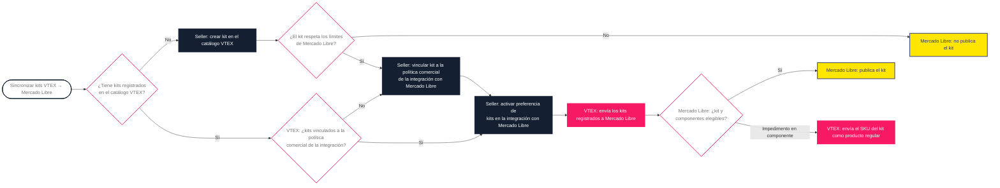

La funcionalidad de Kits permite que los sellers VTEX sincronicen sus kits registrados en el catálogo VTEX directamente con Mercado Libre, garantizando su publicación en el marketplace. Con esta sincronización, el seller puede acompañar el procesamiento desde el Admin VTEX.

Para sincronizar los kits del catálogo VTEX con la cuenta de Mercado Libre, el seller debe cumplir los siguientes requisitos:

- Tener la integración con Mercado Libre configurada.
- Tener kits previamente registrados en el catálogo VTEX.
- Los kits a sincronizar deben estar vinculados a la política comercial utilizada en la integración con Mercado Libre.
- Cada kit puede contener un máximo de 6 componentes y cada componente del kit puede tener un máximo de 10 unidades.

El proceso de sincronización de kits sigue el flujo que se muestra a continuación:

## Inventario y precio

Las reglas de inventario y de fijación de precios de un kit en Mercado Libre serán las mismas utilizadas en los kits registrados en el catálogo VTEX.

El inventario del kit es el inventario de sus componentes, no siendo posible insertar un inventario únicamente en el kit. Para gestionar esta información, accede a **Catálogo > Inventario > Gestión de inventario.**

El precio del kit se actualiza automáticamente al modificar el valor unitario de uno de los componentes. El precio final será la suma del valor de los componentes.

También es posible modificar únicamente el precio final del kit directamente desde el sistema de precios sin actualizar los componentes. De esta forma, el valor del componente se usará solo para prorratear el valor de venta entre los componentes, determinando el precio de cada componente en ese pedido específico.

## Activar la sincronización de kits

Después de registrar los kits en el catálogo VTEX siguiendo el tutorial [Registrar kit](https://help.vtex.com/es/docs/tutorials/cadastrar-kit) y vincularlos a la política comercial de la integración con Mercado Libre, el seller debe seguir los pasos a continuación para activar la sincronización:

1. En el Admin VTEX, ve a **Marketplace > Conexiones > Mercado Libre > Preferencias** o escribe **Preferencias** en la barra de búsqueda.
2. En la sección **Kits en Mercado Libre,** activa el toggle <label class="toggle-switch">.
3. Haz clic en el botón `Activar sincronización`.
4. Acompaña la sincronización de los kits en **Marketplace > Conexiones > Productos**.
