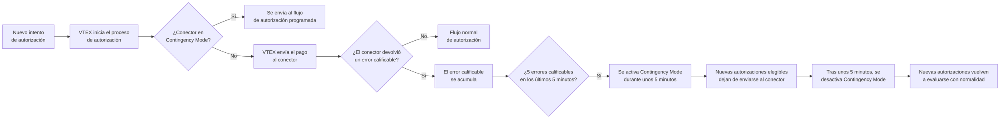
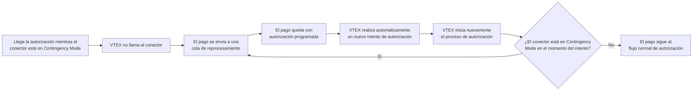

**Contingency Mode** (antes conocido como **Mode-off**) es una funcionalidad de resiliencia de VTEX Payments que ayuda a proteger transacciones elegibles durante inestabilidades temporales en proveedores de pago.

Este artículo explica:

- [Cómo funciona **Contingency Mode**](#como-funciona-contingency-mode)
- [El impacto en las transacciones](#impacto-en-las-transacciones)
- [Qué medios y flujos de pago pueden verse afectados](#medios-de-pago-afectados)
- [Cómo funcionan la recuperación del conector y los reintentos](#recuperacion-y-comportamiento-de-los-intentos)
- [Cómo identificar **Contingency Mode**](#como-identificar-contingency-mode)
- [Qué hacer cuando **Contingency Mode** está activo](#que-hacer-cuando-contingency-mode-esta-activo)
- [Orientaciones para proveedores de pago](#orientaciones-para-proveedores-de-pago)

> ℹ️ Los comerciantes no necesitan configurar ni activar **Contingency Mode** manualmente. VTEX gestiona automáticamente la activación, la recuperación y los intentos de las transacciones.

## Cómo funciona Contingency Mode

**Contingency Mode** es un mecanismo de protección automática para conectores de pago. Cuando VTEX identifica fallas técnicas recurrentes en un conector, el sistema activa este modo para reducir el impacto de la inestabilidad en el procesamiento de pagos.

Durante este periodo:

- Nuevas autorizaciones elegibles dejan de enviarse temporalmente al proveedor.
- Nuevas transacciones elegibles pueden posponerse para procesamiento posterior.
- Las transacciones ya pospuestas siguen un flujo independiente de intentos programados.

Esta protección se aplica al conector afectado, no a la tienda en su conjunto. Otros proveedores de pago o medios de pago que no se vieron afectados por la inestabilidad pueden seguir operando con normalidad.

El ciclo de activación y recuperación de **Contingency Mode** es independiente del ciclo de intentos de las transacciones pospuestas. Esto significa que un conector puede haber salido de **Contingency Mode** mientras ciertas transacciones aún esperan la siguiente ventana de intento configurada.

### Activación

**Contingency Mode** se activa cuando VTEX detecta 5 errores técnicos calificables en 5 minutos para el mismo conector.

Los errores técnicos calificables pueden incluir:

- Se agotó el tiempo de espera de la solicitud.
- Fallas de conexión.
- Solicitudes canceladas por inestabilidad técnica.
- Respuestas HTTP `408` de tiempo de espera agotado.
- Errores HTTP `5xx` del proveedor, como `500`, `502`, `503` o `504`.

> ℹ️ Los resultados esperados del proceso de autorización no activan **Contingency Mode**. Por ejemplo, el saldo insuficiente, tarjeta no válida, tarjeta vencida y pago no autorizado forman parte del flujo normal de autorización y no se consideran inestabilidad del conector.

### Ciclo de Contingency Mode

Cuando **Contingency Mode** está activo:

- VTEX marca el conector afectado como temporalmente no disponible.
- Las nuevas solicitudes de autorización elegibles no se envían al proveedor.
- Las nuevas transacciones elegibles pueden posponerse para un intento posterior.
- El conector permanece temporalmente no disponible hasta que finaliza el periodo automático de recuperación.
- Los retailers pueden ver una indicación de **Contingency Mode** en los detalles de la transacción o en los logs de pago.

Este comportamiento ayuda a evitar nuevas llamadas a un conector inestable mientras el proveedor se recupera.

El siguiente diagrama muestra el ciclo de activación y recuperación de **Contingency Mode** para nuevas autorizaciones:

## Impacto en las transacciones

**Contingency Mode** no cancela pedidos. Las transacciones afectadas por **Contingency Mode** pueden posponerse para un intento automático posterior.

> ℹ️ **Contingency Mode** no sustituye las reglas normales de vencimiento y cancelación del pago. Si el pago no puede autorizarse antes del plazo aplicable, se puede cancelar el pedido según el flujo normal del pedido.

Los clientes pueden ver el pago como en procesamiento o pendiente mientras VTEX espera el siguiente intento de la autorización.

Se debe evitar pedirles a los clientes que realicen un nuevo pedido de inmediato, a menos que el pedido original ya se haya cancelado o que el medio de pago exija una nueva acción del cliente.

## Medios de pago afectados

**Contingency Mode** se aplica a flujos de pago que pueden procesarse de forma asíncrona y volver a intentarse de forma segura tras una inestabilidad temporal en el proveedor.

Los medios o flujos de pago que requieren una respuesta online inmediata, redirección del cliente o una nueva acción del cliente pueden no posponerse ni intentarse de nuevo de la misma manera. En estos casos, la transacción sigue el comportamiento predeterminado de esos medios de pago.

> ℹ️ Si no sabes si un medio de pago específico es elegible para **Contingency Mode**, ponte en contacto con el [Soporte VTEX](https://supporticket.vtex.com/support) o con tu proveedor de pago.

## Recuperación y comportamiento de los intentos

La recuperación del conector es automática. Tras aproximadamente 5 minutos desde el último error calificable, VTEX remueve **Contingency Mode** del conector y nuevas autorizaciones elegibles pueden volver a enviarse con normalidad al proveedor.

La salida de **Contingency Mode** solo afecta a los nuevos intentos de autorización. Las transacciones pospuestas previamente siguen su propio flujo de intento programado.

### Intentos de transacciones pospuestas

Las transacciones pospuestas durante **Contingency Mode** no necesariamente se intentan de nuevo inmediatamente después de la recuperación del conector.

Estas transacciones siguen un flujo independiente de intento con base en:

- Las reglas de reintento del medio de pago.
- El tiempo de cancelación del pago (`delayToCancel`).
- La información devuelta por el proveedor.
- Otras condiciones operativas del flujo de pago.

El siguiente diagrama muestra el comportamiento de las autorizaciones programadas:

El periodo de recuperación de **Contingency Mode** y el intervalo de intento de las transacciones son procesos independientes. Esto significa que:

- El conector puede salir de **Contingency Mode** tras aproximadamente 5 minutos.
- Las transacciones pospuestas pueden seguir esperando la siguiente ventana de intento configurada para ese flujo de pago.

Este comportamiento evita nuevas llamadas inmediatas a conectores que aún estén inestables y, al mismo tiempo, preserva las transacciones elegibles para su reprocesamiento automático posterior.

El intervalo entre intentos puede variar según:

- El medio de pago.
- La información devuelta por el proveedor.
- El tiempo de cancelación del pago (`delayToCancel`).
- Las condiciones operativas del flujo de pago.

Estos factores determinan el tiempo que todavía es posible reprocesar la transacción y el intervalo que debe respetarse entre un intento y otro. Por eso el tiempo hasta el siguiente intento no es fijo para todos los pagos y puede variar según la configuración y el contexto de cada transacción.

En general:

Cuando `delayToCancel` es menor que 1 día, los intentos generalmente ocurren cada 1 hora.
Cuando `delayToCancel` es igual o mayor que 1 día, los intentos generalmente ocurren cada 4 horas.

Para más información, consulta el endpoint [Create Payment].

> ℹ️ Aunque los pagos vía [Pix (Brasil)](https://help.vtex.com/es/docs/tutorials/configurar-pix-como-medio-de-pago) no se vean afectados por **Contingency Mode**, es decir, que no hay bloqueo de transacciones realizadas por ese medio, hay otros problemas que pueden interrumpir el procesamiento del pago. En estos casos, cuando el campo `delayToCancel` está configurado entre 5 minutos y 1 hora, los intentos generalmente ocurren cada 5 minutos.

> ⚠️ El tiempo de intentos puede variar según el medio de pago, la configuración de la cuenta y las condiciones operativas. VTEX gestiona este proceso automáticamente para que los intentos ocurran en el menor intervalo posible, reduciendo el tiempo de procesamiento de la cola de transacciones pendientes.

## Cómo identificar Contingency Mode

Los comerciantes pueden notar **Contingency Mode** cuando hay inestabilidad en un proveedor de pago que afecta a un conector específico.

Los indicadores comunes incluyen:

- Un número inusual de pagos con autorización o procesamiento pendiente para el mismo proveedor.
- Registros de transacción que indican **Contingency Mode** en el conector afectado.
- Una reducción temporal en el volumen de pagos aprobados para un medio de pago o proveedor específico.
- Autorizaciones elegibles que se posponen para un intento posterior.

Los proveedores de pago también pueden observar más indicadores de inestabilidad en la integración, tales como:

- Eventos de tiempo de espera agotado.
- Fallas de conexión.
- Errores HTTP `5xx`.

## Qué hacer cuando Contingency Mode está activo

En la mayoría de los casos, no es necesaria ninguna acción por parte del retailer. VTEX protege automáticamente el flujo de transacciones, reactiva el conector cuando la inestabilidad disminuye y procesa las transacciones elegibles según las reglas automáticas de intento.

Acciones recomendadas:

1. Monitorea las transacciones afectadas en el Admin VTEX.
2. Verifica si el problema se concentra en un proveedor o medio de pago específico.
3. Ponte en contacto con el proveedor de pago si la inestabilidad persiste o si necesita investigar la integración.
4. Ponte en contacto con el [Soporte VTEX](https://supporticket.vtex.com/support) si las transacciones permanecen pendientes más tiempo del esperado o si los clientes reportan problemas de pago recurrentes.

> ⚠️ Evita cancelar o recrear pedidos manualmente, a menos que haya una razón comercial clara para ello, como una solicitud del cliente, el vencimiento del pedido o la confirmación de que el pago no puede completarse.

## Orientaciones para proveedores de pago

Los proveedores de pago deben investigar y resolver la inestabilidad que causó las fallas técnicas recurrentes.

Las verificaciones comunes incluyen:

- Disponibilidad de los endpoints de autorización.
- Tiempo de respuesta y comportamiento de tiempo de espera agotado.
- Errores HTTP `5xx`.
- Conectividad de la red.
- Deploys recientes o cambios en la infraestructura.

Cuando el proveedor se estabilice, VTEX automáticamente removerá **Contingency Mode** del conector y las nuevas autorizaciones elegibles podrán volver a enviarse con normalidad.

> ℹ️ Las transacciones pospuestas previamente seguirán las reglas de intento configuradas.
