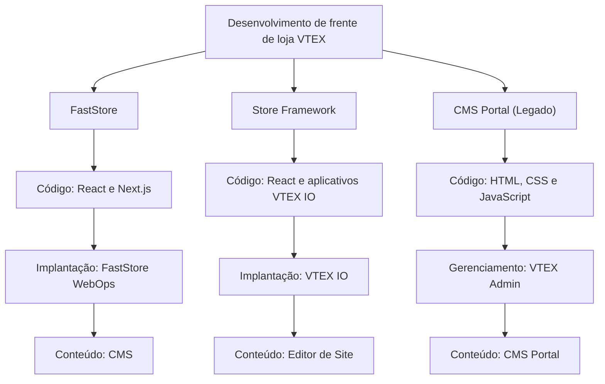

O desenvolvimento de loja envolve a criação e a manutenção da experiência voltada para o cliente de uma loja de ecommerce, comumente chamada de frente de loja.

A frente de loja exibe dados de comércio e permite que os clientes naveguem pelos produtos, gerenciem suas contas e façam pedidos. Ela se comunica com serviços de backend responsáveis por recursos como catálogo, preços, promoções, checkout, logística e pedidos.

Na VTEX, você pode desenvolver uma frente de loja usando [FastStore](https://developers.vtex.com/docs/guides/faststore), [Store Framework](https://developers.vtex.com/docs/guides/store-framework) ou [CMS Portal (Legado)](https://help.vtex.com/docs/tracks/legacy-cms-portal).

## Soluções de frente de loja

Cada solução de frente de loja tem um modelo diferente de desenvolvimento, implantação e gerenciamento de conteúdo:

| Solução | Principais tecnologias | Desenvolvimento e implantação |
| --- | --- | --- |
| [FastStore](https://developers.vtex.com/docs/guides/faststore) | Next.js, React, TypeScript, Node.js e GraphQL | Desenvolvida no GitHub e implantada pelo FastStore WebOps |
| [Store Framework](https://developers.vtex.com/docs/guides/store-framework) | Aplicativos VTEX IO, React, TypeScript, Node.js e GraphQL | Desenvolvida e implantada pelo VTEX IO |
| [CMS Portal (Legado) — Não está mais disponível para lojas VTEX recém-criadas.](https://help.vtex.com/docs/tracks/legacy-cms-portal) | HTML, CSS e JavaScript | Desenvolvida e gerenciada pelo VTEX Admin |

Para comparar as três soluções em mais detalhes, consulte [Primeiros passos com soluções de frente de loja](https://developers.vtex.com/docs/guides/getting-started-with-storefront-solutions).

### FastStore

O [FastStore](https://developers.vtex.com/docs/guides/faststore) é um conjunto de ferramentas para desenvolver frentes de loja de alto desempenho com [React](https://react.dev/) e [Next.js](https://nextjs.org/). Ele segue uma arquitetura [Jamstack](https://jamstack.org/), na qual as páginas podem ser pré-renderizadas e entregues por uma rede de distribuição de conteúdo (CDN), enquanto as APIs fornecem dados e funcionalidades dinâmicas de comércio.

Em frentes de loja FastStore, os desenvolvedores mantêm o código-fonte no GitHub e implantam a frente de loja pelo [FastStore WebOps](https://developers.vtex.com/docs/guides/faststore/webops-dashboard). Usuários de negócio gerenciam o conteúdo da frente de loja com o [CMS](https://help.vtex.com/docs/tutorials/cms-overview).

O FastStore tem várias versões principais com diferentes níveis de suporte. O FastStore v4 é a versão atual recomendada para novas implementações de frente de loja. Para mais informações, consulte [Versões e níveis de suporte do FastStore](https://developers.vtex.com/docs/guides/faststore/getting-started-faststore-versions-and-support-levels).

### Store Framework

O [Store Framework](https://developers.vtex.com/docs/guides/store-framework) é um framework de desenvolvimento frontend baseado em React e na plataforma de desenvolvimento VTEX IO. Os desenvolvedores criam frentes de loja compondo aplicativos VTEX IO nativos e personalizados em um tema de loja.

Como o Store Framework é executado no VTEX IO, os desenvolvedores podem usar recursos como workspaces de desenvolvimento e produção, testes A/B e infraestrutura de nuvem gerenciada. Usuários de negócio gerenciam o conteúdo da frente de loja pelo [Editor de Site](https://help.vtex.com/docs/tutorials/site-editor-overview).

### CMS Portal (Legado)

O [CMS Portal (Legado)](https://help.vtex.com/docs/tracks/legacy-cms-portal) é a solução original da VTEX para desenvolvimento e gerenciamento de conteúdo de frentes de loja. Os desenvolvedores criam templates HTML e usam CSS, JavaScript e controles nativos da VTEX para renderizar dados de comércio, com o código gerenciado diretamente pelo VTEX Admin.

> ⚠️ O CMS Portal (Legado) não está mais disponível para lojas VTEX recém-criadas. Para orientações sobre como migrar uma frente de loja existente para o FastStore, entre em contato com o [Suporte VTEX](https://help.vtex.com/support).

## Desenvolvimento de backend e integrações

A frente de loja se comunica com serviços de backend que fornecem os dados e as funcionalidades necessários para a operação de ecommerce. Os desenvolvedores podem ampliar esses recursos criando aplicativos de backend e integrações com o VTEX IO e as APIs da VTEX.

### VTEX IO

O [VTEX IO](https://developers.vtex.com/docs/guides/vtex-io-documentation-what-is-vtex-io) é uma plataforma de desenvolvimento baseada em nuvem para criar aplicações frontend e backend. Ela fornece infraestrutura gerenciada e ferramentas de desenvolvimento para que as equipes possam se concentrar na implementação dos requisitos de negócio.

O VTEX IO permite o desenvolvimento de:

- Frentes de loja com Store Framework.
- Aplicativos personalizados para o VTEX Admin.
- Serviços de backend e integrações.

### APIs da VTEX

As [APIs da VTEX](https://developers.vtex.com/docs/api-reference) expõem recursos de comércio como catálogo, preços, promoções, checkout, logística e pedidos.

As três soluções de frente de loja dependem dos serviços de comércio subjacentes da VTEX. No entanto, a forma como uma frente de loja acessa esses serviços depende da tecnologia selecionada. Por exemplo, o FastStore pode consumir dados de comércio pela sua camada de API, o Store Framework usa aplicativos VTEX IO e o CMS Portal pode renderizar dados por meio de controles nativos da VTEX.

## VTEX Admin

O VTEX Admin é a interface na qual usuários de negócio gerenciam dados e configurações de comércio, incluindo produtos, pedidos, promoções, logística e conteúdo da frente de loja.

Os recursos de frente de loja disponíveis no VTEX Admin dependem da tecnologia selecionada:

- O FastStore usa o CMS para o conteúdo da frente de loja.
- O Store Framework usa o Editor de Site.
- Frentes de loja CMS Portal usam os recursos de layout e templates do CMS Portal.

## Próximos passos

- [Desenvolvimento de frentes de loja](https://developers.vtex.com/docs/storefront-development): Explore a documentação completa para desenvolvedores sobre as soluções de frente de loja da VTEX.
- [Primeiros passos com soluções de frente de loja](https://developers.vtex.com/docs/guides/getting-started-with-storefront-solutions): Compare os recursos e a experiência de desenvolvimento de cada solução.
- [Implementação de frontend](https://help.vtex.com/docs/tracks/frontend-implementation): Saiba mais sobre as etapas envolvidas na implementação de um projeto de frente de loja.
