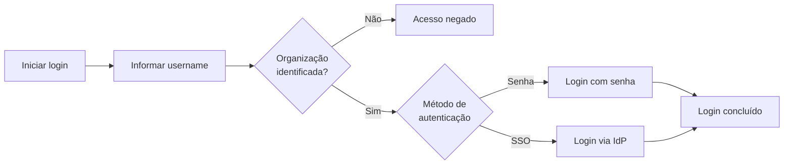
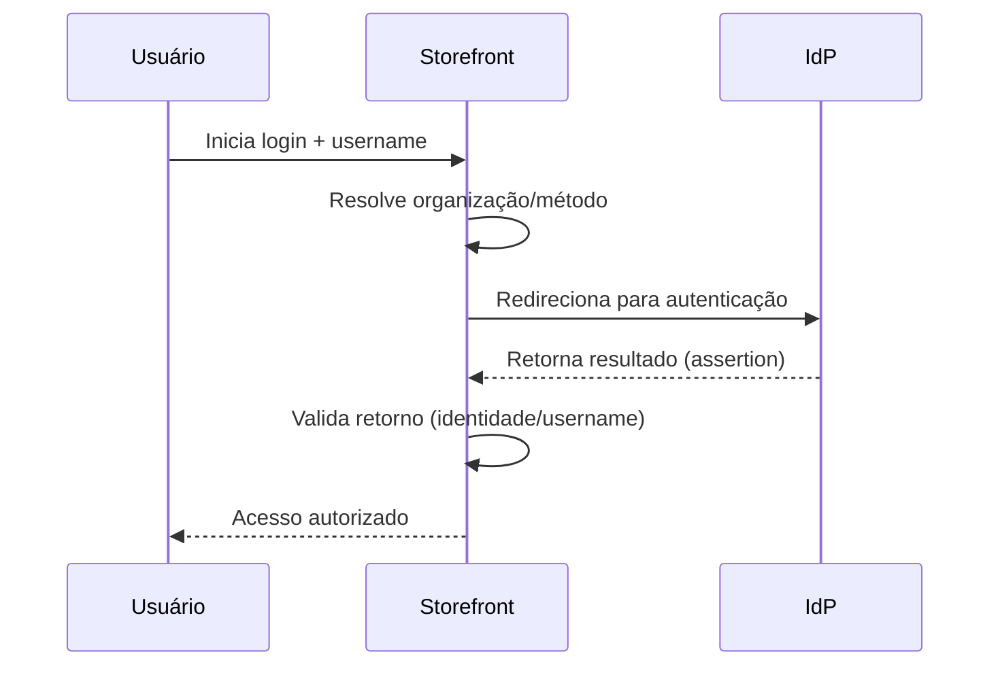
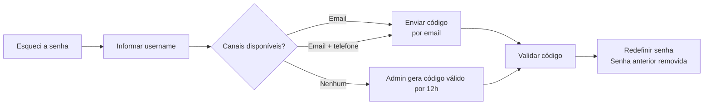

>⚠️ Esta funcionalidade está disponível apenas para lojas que usam [B2B Buyer Portal](https://help.vtex.com/pt/docs/tutorials/b2b-buyer-portal-pt), atualmente disponível para contas selecionadas.

Em ambientes B2B, o acesso ao storefront geralmente está vinculado a uma organização. Por esse motivo, o processo de autenticação pode utilizar identificadores diferentes do email e integrar-se a sistemas corporativos de identidade.

Entre as opções de autenticação para acesso de usuários à loja B2B estão:

* Login com nome de usuário e senha
* Login via provedor de identidade externo (SSO)

## Visão geral

O diagrama a seguir apresenta uma visão geral do fluxo de login em lojas B2B, desde a identificação do usuário até a autenticação final.

O login em lojas B2B pode ocorrer por diferentes mecanismos de autenticação. Dependendo da configuração da loja e da organização do usuário, a autenticação pode ocorrer por nome de usuário e senha ou por um provedor de identidade externo (IdP).

>ℹ️ A definição dos métodos de autenticação utilizados pela organização é feita em uma configuração via API. Saiba mais em [Configuring authentication methods by organizational unit](https://help.vtex.com/pt/docs/tutorials/configuring-authentication-methods-by-organizational-unit).

No componente de login, o comprador primeiro informa seu nome de usuário. A partir desse identificador, a plataforma VTEX determina o contrato associado ao usuário e identifica qual método de autenticação deve ser utilizado.

Com base nessa informação, o componente de login exibe dinamicamente o método de autenticação configurado para aquela organização, como login por senha ou autenticação via provedor de identidade externo.

## Login com nome de usuário

No modelo de autenticação B2B, usuários podem acessar o storefront utilizando o nome de usuário como identificador principal.

Esse modelo é comum em cenários como:

* Portais corporativos para funcionários ou representantes
* Empresas que utilizam IDs corporativos
* Organizações que adotam login padronizado por nome de usuário

### Regras do nome de usuário

O nome de usuário deve seguir as seguintes regras:

* 3 a trinta caracteres
* Não diferencia maiúsculas e minúsculas
* Caracteres permitidos: letras, números, `.`, `@`, `-` e `_`
* Não permite espaços

### Emails

Em ambientes B2B, o email não é obrigatório como identificador de login. Usuários podem possuir dois tipos de email com finalidades diferentes: email de recuperação de acesso e email transacional.

| Tipo de email | Uso | Regras |
| :---- | :---- | :---- |
| Email de recuperação de acesso | Utilizado para ações relacionadas à autenticação, como recuperação ou redefinição de senha. | Deve ser único na loja. Pode ser opcional. Pode ser igual ao email transacional, mas não precisa ser. |
| Email transacional | Utilizado para comunicações da loja, como confirmações de pedido e notificações de status. | Não precisa ser único e pode ser compartilhado por múltiplos usuários. Também pode ser opcional. |

#### Exemplo de aplicação

Considere um consultório médico (organização) com três funcionários que realizam compras. Todos os funcionários podem compartilhar um email transacional corporativo usado para comunicações da loja, como confirmações de pedidos.

Além disso, dois desses funcionários também podem possuir seus próprios emails de recuperação de acesso individuais. Estes emails individuais são utilizados para ações relacionadas à autenticação, como recuperação ou redefinição de senha, seguindo a regra de que o email de recuperação de acesso deve ser único na loja.

## Login via provedor de identidade (IdP) externo

Organizações podem autenticar usuários utilizando um provedor de identidade (IdP) externo por meio de Single Sign-On (SSO).

O fluxo de autenticação ocorre da seguinte forma:

1. O usuário informa seu nome de usuário no login.
2. A plataforma VTEX identifica a organização associada ao usuário.
3. O usuário é redirecionado para o provedor de identidade configurado.
4. O provedor autentica o usuário.
5. Após a autenticação, o usuário retorna ao storefront com acesso autorizado.

> ℹ️ Os provedores de identidade são configurados pelo lojista. Saiba mais em [Login (SSO)](https://developers.vtex.com/docs/guides/login-integration-guide).
>
> A organização compradora precisa também habilitar o login com o provedor de identidade externo no Buyer Portal. Saiba mais em [Enable login for the organization via an external identity provider (IdP)](https://help.vtex.com/pt/docs/tutorials/enable-login-for-the-organization-via-an-external-identity-provider-idp).

O diagrama abaixo ilustra o fluxo de autenticação quando uma organização utiliza um provedor de identidade (IdP) externo.

Quando a loja utiliza autenticação por provedor de identidade (IdP) externo, o provedor é configurado pelo lojista no Admin em **Configurações da conta > Autenticação**, da mesma forma que já ocorre para lojas VTEX atualmente.

## Métodos de login não suportados

Para usuários B2B, alguns métodos de login disponíveis em lojas B2C **não são suportados**, incluindo:

* **Código de acesso**
* **Google**
* **Facebook**

## Recuperação de senha

A recuperação de senha utiliza códigos de verificação enviados para os canais disponíveis do usuário.

O comportamento varia de acordo com as informações de contato cadastradas:

| Situação do usuário | Como o código de acesso é enviado | Observações |
| :---- | :---- | :---- |
| Usuário possui email | Código enviado por email | Segue as mesmas regras de códigos de acesso em lojas B2C. |
| Usuário possui email e telefone | Código enviado por email | - |
| Usuário não possui email nem telefone | Código gerado por administrador da organização | O administrador gera e compartilha o código com o usuário. Os códigos de acesso gerados por administradores da organização possuem validade de 12 horas. Saiba mais em [Adicionar usuários à organização compradora](https://help.vtex.com/pt/docs/tutorials/adicionar-usuarios-a-organizacao-compradora#gerar-codigo-de-acesso-para-usuarios-sem-email). |

Quando um código de acesso é gerado e enviado ao usuário, a senha anterior é removida dos sistemas da VTEX.

O diagrama a seguir mostra os principais caminhos de recuperação de senha, dependendo dos canais disponíveis para o usuário.

## Restrições de acesso

O acesso ao storefront pode ser bloqueado quando existem restrições relacionadas à organização do usuário. Alguns exemplos incluem:

* Usuário não associado a uma organização válida
* Organização sem contrato ativo

Nesses casos, o usuário deve entrar em contato com o administrador da organização.
