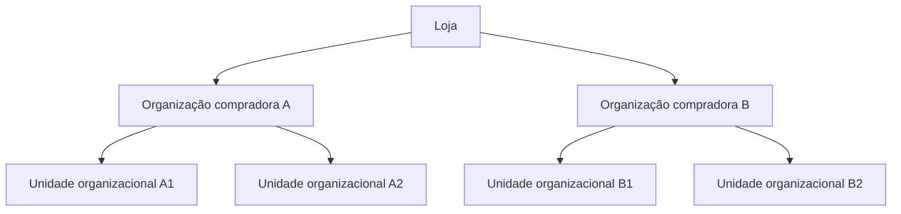
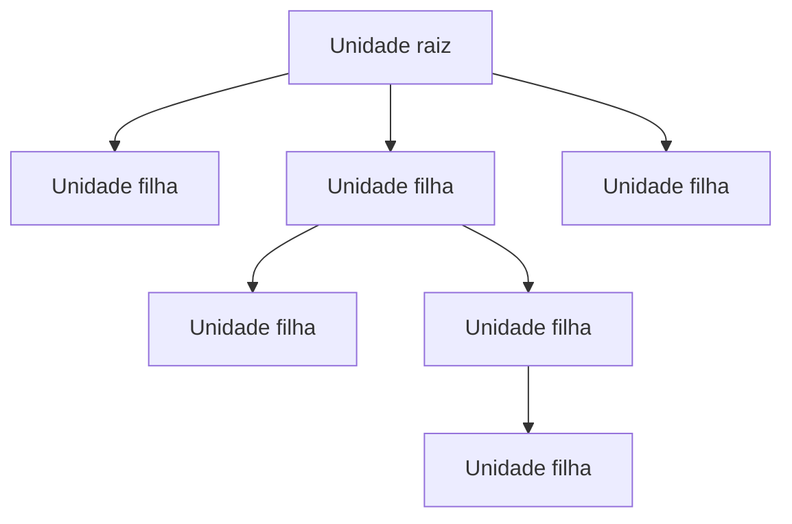

> ⚠️ Esta funcionalidade está disponível apenas para lojas que usam [B2B Buyer Portal](https://help.vtex.com/pt/docs/tutorials/b2b-buyer-portal-pt), atualmente disponível para contas selecionadas.

Em operações B2B, o comprador é uma empresa e não um consumidor individual. Cada empresa é representada por uma organização compradora que mantém relacionamento comercial com a loja.

Empresas geralmente possuem múltiplas filiais, departamentos, centros de custo e fluxos internos de aprovação. Cada uma dessas áreas pode ter autonomia de compra, orçamento próprio ou regras financeiras específicas. As unidades organizacionais permitem representar essa estrutura dentro de uma loja VTEX com operação B2B.

## Estrutura de organizações compradoras

Uma loja VTEX com operação B2B pode conter múltiplas organizações compradoras. Cada organização:

* Possui seu próprio contrato
* Opera de forma independente das demais organizações
* Pode ter múltiplas subdivisões internas (unidades organizacionais)

As unidades organizacionais são utilizadas para modelar a estrutura interna de uma única organização compradora.

A hierarquia da operação segue o seguinte modelo:

Uma unidade organizacional é uma subdivisão hierárquica dentro de uma organização compradora específica. Essa estrutura define como regras comerciais e acessos são aplicados.

Em vez de criar múltiplas contas ou múltiplas organizações compradoras para representar áreas internas da mesma empresa, é possível organizar sua hierarquia internamente por meio de unidades organizacionais e aplicar regras distintas para cada área, mantendo uma única organização compradora.

## Estrutura hierárquica de unidades organizacionais

A estrutura de unidades organizacionais segue um modelo em árvore. Toda organização compradora possui uma **unidade raiz**, que representa a organização como um todo. A partir dela, podem ser criadas **unidades filhas**, que representam subdivisões como filiais, departamentos ou centros de custo.

A unidade raiz é o nível mais alto da hierarquia. As unidades filhas podem existir em múltiplos níveis, refletindo a estrutura real da empresa. Existem regras gerais definidas no [contrato](#contrato), mas cada unidade pode possuir [regras específicas](#configuracoes-por-unidade-organizacional), respeitando sua posição na hierarquia.

## Contrato

Cada organização compradora possui seu próprio contrato B2B. Esse contrato é associado à **unidade raiz** da organização.

As condições comerciais definidas no contrato são herdadas pelas unidades filhas. Isso significa que preços, políticas e acordos comerciais negociados com a empresa são aplicados a toda a estrutura. Após essa herança, é possível definir [configurações por unidade](#configuracoes-por-unidade-organizacional), permitindo segmentação interna sem necessidade de múltiplos contratos ou contas separadas.

Para entender como contratos são configurados e gerenciados, consulte:

* [Contratos B2B](https://help.vtex.com/pt/docs/tutorials/contratos-b2b)

## Configurações por unidade organizacional

Mesmo compartilhando o mesmo contrato, cada unidade pode operar com regras próprias. Entre as configurações que podem variar por unidade organizacional estão:

* Sortimento de produtos visíveis
* Métodos e condições de pagamento
* Endereços de entrega e faturamento
* Campos customizáveis no checkout
* Regras de aprovação de pedidos

Essa segmentação permite alinhar a operação da loja às políticas internas da empresa compradora.

Saiba mais na documentação a seguir:

* [Buying Policies](https://help.vtex.com/pt/docs/tutorials/buying-policies)
* [Visão geral de Budgets](https://help.vtex.com/pt/docs/tutorials/visao-geral-de-budgets)
* [Campos customizáveis no checkout](https://help.vtex.com/pt/docs/tutorials/campos-customizaveis-do-checkout)

## Usuários de unidades organizacionais

A unidade à qual o usuário está vinculado define sua operação dentro da plataforma. No momento do login na loja, a plataforma identifica a unidade organizacional do usuário e aplica automaticamente as regras configuradas para aquela unidade.

## Perfis de acesso e permissões do storefront

O escopo de atuação do usuário membro de uma unidade organizacional em uma loja B2B é definido pela combinação de dois elementos:

* **Unidades organizacionais**, que determinam o grupo em que o usuário está contido.
* **Perfis de acesso do storefront**, que definem o papel do usuário na organização reunindo determinadas permissões para realizar ações na frente de loja.

Saiba mais em [Membros da organização compradora](https://help.vtex.com/pt/docs/tutorials/membros-da-organizacao-compradora).

## Experiência de compra

As unidades organizacionais garantem que a experiência de navegação reflita a estrutura organizacional da empresa compradora.

Cada área da empresa opera com:

* Regras comerciais adequadas
* Permissões compatíveis com seu papel
* Governança e autonomia

Dessa forma, a plataforma permite que uma única empresa B2B opere com múltiplas estruturas internas, mantendo consistência contratual e controle operacional.
