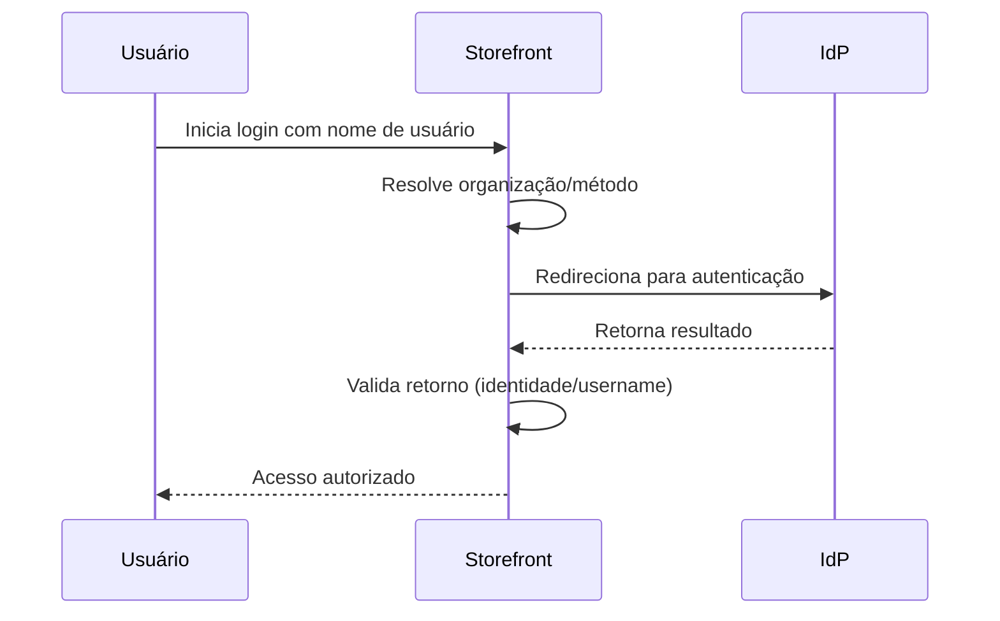

> ⚠️ Esta funcionalidade está disponível apenas para lojas que usam [B2B Buyer Portal](https://help.vtex.com/pt/docs/tutorials/b2b-buyer-portal-pt), atualmente disponível para contas selecionadas.

Organizações compradoras podem autenticar seus membros utilizando um provedor de identidade (IdP) externo por meio de Single Sign-On (SSO). Para que esse fluxo funcione, a organização compradora precisa habilitar o login com o provedor de identidade externo na interface do Buyer Portal, como descrito neste guia.

## Pré-requisitos

Antes de habilitar o login via IdP externo no Buyer Portal, verifique se:

* O lojista já configurou o provedor de identidade no Admin VTEX em **Configurações da conta > Autenticação**, conforme as instruções presentes em [Login (SSO)](https://developers.vtex.com/docs/guides/login-integration-guide) e [Webstore (OAuth 2.0)](https://developers.vtex.com/docs/guides/login-integration-guide-webstore-oauth2).  
* Você tem o perfil **Organizational Unit Admin** na organização compradora.

## Habilitar o login via IdP externo no Buyer Portal

Siga o passo a passo para habilitar o login via IdP externo:

1. Acesse a loja pelo navegador e faça login com seu usuário.  
2. No menu superior, clique em **Company**. O painel da organização será exibido.  
3. Clique em **Manage**.  
4. Se você quiser habilitar o login para a organização, prossiga para a etapa 5. Se você quiser escolher uma organização filha para habilitar, clique em **Organizational Units** e depois no nome da unidade organizacional.  
5. Clique no menu **⋮** e, em seguida, em **Authentication**.  
     
   

6. Na seção **Authentication methods**, selecione uma ou mais opções desejadas (no exemplo da imagem abaixo, a opção de IdP externo é o PingFederate (SSO). Lembre-se de desmarcar métodos de autenticação que não serão utilizados.

7. Clique em `Save`. 

> ℹ️ Também é possível gerenciar as opções de autenticação da organização via API. Consulte a [referência da API VTEX ID](https://developers.vtex.com/docs/api-reference/vtex-id-api#post-/api/vtexid/organization-units/-unitId-/settings) para mais detalhes. 

## Fluxo de autenticação

Após a habilitação, o fluxo de autenticação para membros da organização ocorre da seguinte forma:

1. O usuário informa seu nome de usuário no login do storefront.  
2. A plataforma VTEX identifica a organização associada ao usuário.  
3. O usuário é redirecionado para o provedor de identidade configurado.  
4. O provedor autentica o usuário.  
5. Após a autenticação, o usuário retorna ao storefront com acesso autorizado. O diagrama abaixo ilustra esse fluxo:

## Saiba mais

* [Login (SSO)](https://developers.vtex.com/docs/guides/login-integration-guide)   
* [Webstore (OAuth 2.0)](https://developers.vtex.com/docs/guides/login-integration-guide-webstore-oauth2)  
* [Login para B2B](https://help.vtex.com/pt/docs/tutorials/login-em-lojas-b2b)
