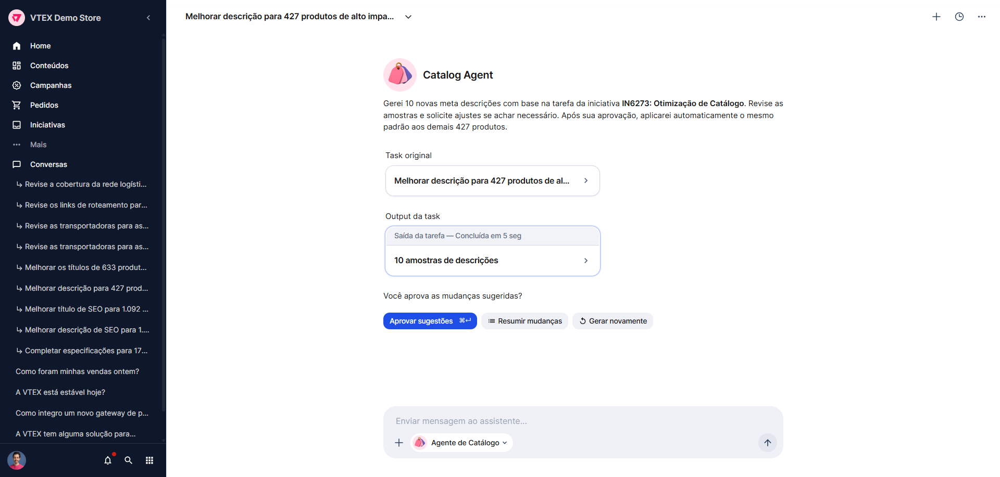
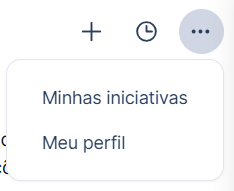
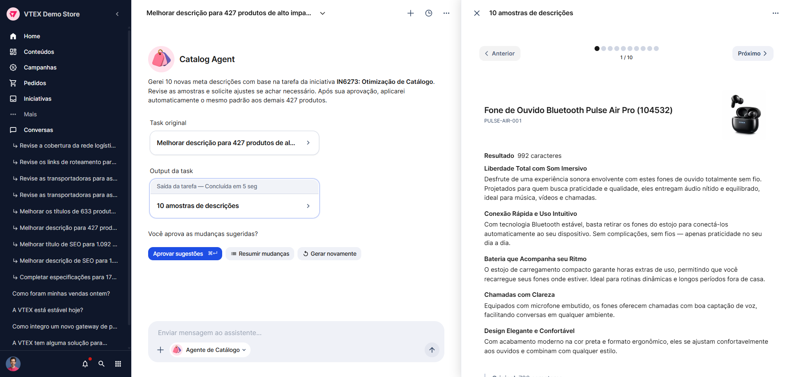

> ⚠️ O AI Workspace está disponível apenas para contas selecionadas.

A página **Conversa** é onde ocorre a interação entre o usuário e os agentes de IA do AI Workspace. Nela, você troca mensagens com o agente, acompanha o histórico da conversa e age com base nos resultados apresentados.

Uma conversa pode iniciar das seguintes formas:

- Ao enviar uma mensagem na [Caixa de mensagem da Página inicial](https://help.vtex.com/pt/docs/tutorials/ai-workspace-pagina-inicial#caixa-de-mensagem)
- Ao clicar nos [Indicadores de desempenho da Página inicial](https://help.vtex.com/pt/docs/tutorials/ai-workspace-pagina-inicial#indicadores-de-desempenho)
- Ao criar uma [iniciativa](https://help.vtex.com/pt/docs/tutorials/ai-workspace-iniciativas)
- Ao iniciar uma [tarefa](https://help.vtex.com/pt/docs/tutorials/ai-workspace-tarefas)

## Opções da conversa

No topo da página, à direita, ficam os elementos com as opções da conversa:

- **Participantes:** Contém os ícones dos participantes da conversa. Ao passar o mouse sobre um participante, aparece o nome dele.
- **… Mais opções:** exibe opções adicionais.

Ao clicar em **… Mais opções**, aparecem as seguintes opções:

- **Novo chat:** Leva para a página inicial, onde você pode iniciar uma nova conversa.
- **Ver histórico:** Mostra a Página Conversas.

## Conteúdo da conversa

No centro da página se encontra o histórico da conversa, com as mensagens do agente e do usuário em ordem cronológica. Ao longo da conversa, o agente pode apresentar **cartões do canvas** com conteúdo específico, como dados, resultados ou amostras geradas. No exemplo da imagem, há dois cartões: **Tarefa executada** e **Saída da tarefa**.

### Botões de interação rápida

Durante a conversa, o agente pode apresentar **botões** **de interação rápida** que permitem executar ações sem precisar escrever uma mensagem. Alguns exemplos de ações com botões incluem aprovar sugestões do agente em uma tarefa e usar um prompt sugerido para continuar a conversa.

> ℹ️ Os botões de interação rápida variam conforme o contexto da conversa e o conteúdo apresentado pelo agente.

## Caixa de mensagem

Na parte inferior da página, há a **caixa de mensagem**, igual à da [página inicial](https://help.vtex.com/pt/docs/tutorials/ai-workspace-pagina-inicial). Por meio dela, você envia mensagens ao agente para continuar a conversa.

## Canvas

Ao clicar em um **cartão do canvas**, abre-se o **canvas** no lado direito da página, exibindo o conteúdo referente àquele cartão.

As formas de interação com o canvas variam conforme o tipo de conteúdo apresentado. No exemplo da imagem, o canvas exibe 10 amostras de mudanças nas descrições de produtos, e o usuário pode:

- **Visualizar a comparação** dos detalhes do produto entre a sugestão de modificação e a versão original.
- **Navegar pelas amostras** utilizando a paginação (botões **\< Anterior** e **Próximo \>**).

> ℹ️ O conteúdo e as formas de interação com o canvas dependem do contexto em que ele é utilizado.
