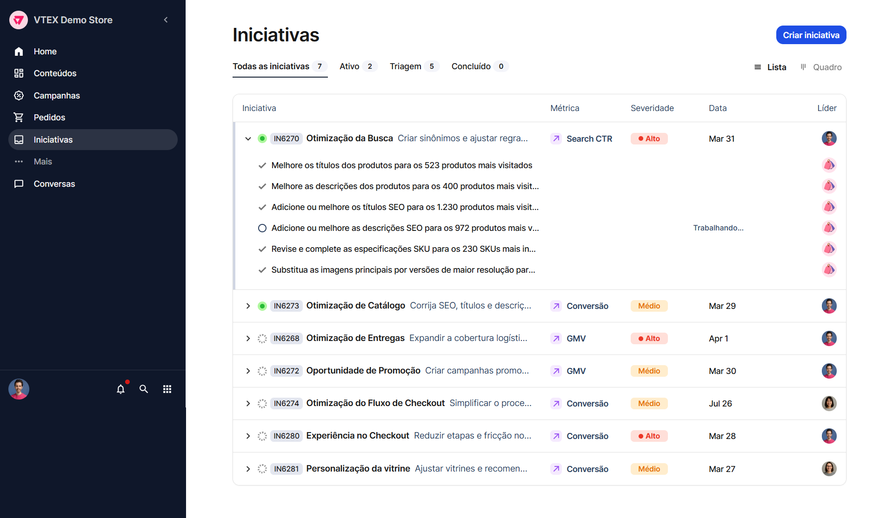
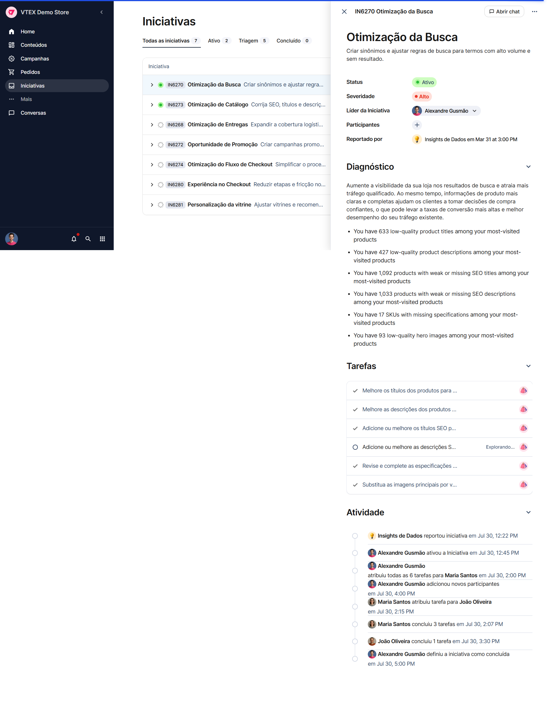

> ⚠️ O AI Workspace está disponível apenas para contas selecionadas.

No AI Workspace, uma **iniciativa** é o ponto de partida para a execução de tarefas. Cada iniciativa possui um objetivo maior e agrega múltiplas tarefas, cada uma com um escopo menor, que contribuem para alcançá-lo.

Toda iniciativa é identificada por um código que começa com `IN` seguido de números (por exemplo, `IN6270`). As iniciativas podem ser criadas **a partir de interações com agentes de IA**, que identificam problemas e oportunidades de melhoria na loja e propõem ações para tratá-los.

A página **Iniciativas** é acessada pelo item **Iniciativas** no [menu de navegação](https://help.vtex.com/pt/docs/tutorials/ai-workspace-pagina-inicial) lateral e reúne todas as iniciativas da sua operação, permitindo acompanhá-las e gerenciá-las.

## Tabela de iniciativas

A tabela de iniciativas mostra os detalhes de cada iniciativa com as seguintes colunas:

- **Iniciativa:** código (por exemplo, `IN6270`), título e descrição da iniciativa.
- **Métrica:** área de impacto da iniciativa (como GMV, Conversão ou Search CTR).
- **Severidade:** nível de prioridade da iniciativa (Baixo, Médio ou Alto).
- **Data:** data de criação da iniciativa.
- **Líder:** responsável pela iniciativa.

### Ordenação por coluna

Você pode ordenar a lista clicando no cabeçalho de uma coluna. Cada clique alterna o critério de ordenação daquela coluna, seguindo o ciclo:

1. **Crescente** (ascendente).
2. **Decrescente** (descendente).
3. **Sem ordenação** (remove a ordenação aplicada).

### Expansão de iniciativas

Ao clicar na seta à esquerda de uma iniciativa, ela se expande e exibe suas tarefas logo abaixo. Cada tarefa apresenta um ícone que indica seu status atual, permitindo acompanhar o progresso da iniciativa diretamente na lista. Para recolher a iniciativa, basta clicar novamente na seta.

## Detalhes da iniciativa (canvas)

Ao clicar em uma iniciativa, em qualquer modo de visualização, abre-se o **canvas** à direita com os detalhes completos da iniciativa.

O canvas é organizado nas seguintes seções:

- **Título e descrição:** nome e descrição da iniciativa.
- **Cabeçalho:** informações gerais da iniciativa:
  - **Status:** situação atual da iniciativa. Os possíveis status são **Triagem**, **Ativo** e **Concluído**.
  - **Severidade:** nível de prioridade da iniciativa.
  - **Líder:** responsável pela condução da iniciativa.
  - **Participantes:** demais pessoas envolvidas na iniciativa.
  - **Reportado por:** quem (usuário ou agente) reportou a iniciativa, com data e hora.
- **Diagnóstico:** análise da situação que originou a iniciativa, detalhando o problema ou a oportunidade identificada.
- **Tarefas:** lista de tarefas que compõem a iniciativa. Cada tarefa apresenta:
  - **Status de execução:** um ícone ou botão que representa o estado atual da tarefa. Os possíveis status são:
    - **Em aberto:** exibe o botão ▶️ **Executar tarefa**.
    - **Trabalhando:** exibe o ícone de spinner 🔁 de carregamento, indicando que a tarefa está sendo processada por um agente.
    - **Aguardando ação:** exibe o ícone 🔵, indicando que a tarefa aguarda uma interação do usuário para prosseguir.
    - **Completa:** exibe o ícone ✔️, indicando que a tarefa foi concluída.
  - **Título:** nome da tarefa.
  - **Botão "Ver conversa":** disponível quando a tarefa exige interação.
  - **Responsável:** exibido como dropdown antes da execução, permitindo definir quem executará a tarefa (usuário ou agente). Após iniciar a tarefa, apenas a imagem do responsável é exibida.
- **Atividade:** histórico das ações realizadas na iniciativa, registrando o responsável pela ação, a ação executada, o receptor (quando houver) e a data/hora.

No topo do canvas, o botão **Abrir chat** permite iniciar uma conversa relacionada à iniciativa, e o menu “**...**” oferece ações adicionais.
