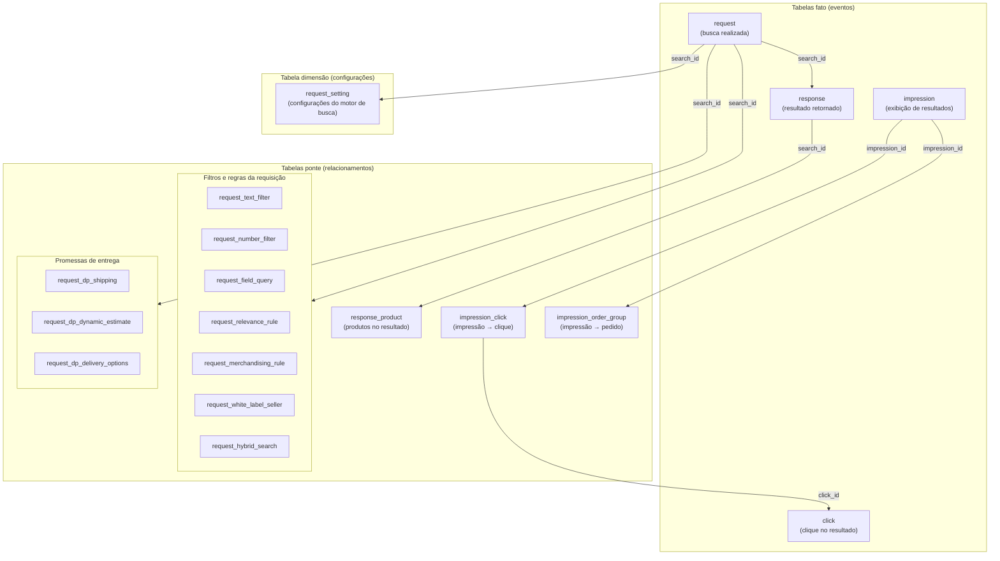
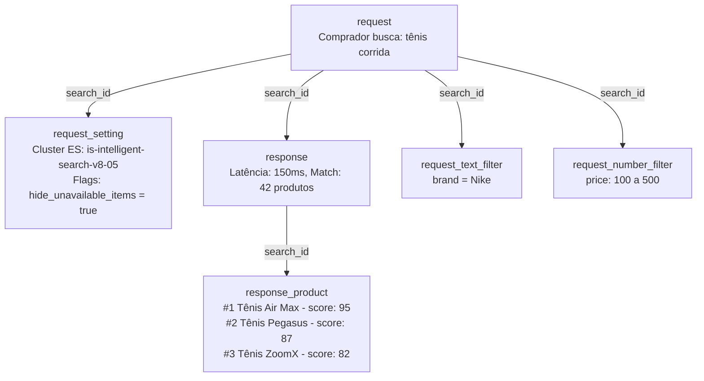
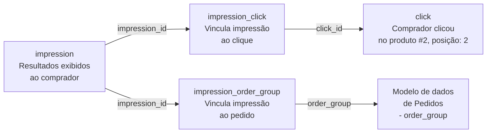
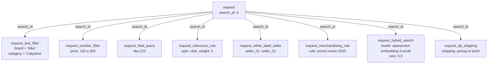

O modelo de dados `busca` contém informações abrangentes sobre consultas de busca, resultados e interações dos usuários com a plataforma Intelligent Search. Esses dados permitem a análise do desempenho de busca, da descoberta de produtos, das taxas de clique e de conversão de busca para compra.

Nesta seção você encontra as seguintes informações:

- [Tipos de tabelas e relacionamentos](#tipos-de-tabelas-e-relacionamentos)
- [Características dos dados de busca](#caracteristicas-dos-dados)
- [Tabela: request](#tabela-request)
- [Tabela: response](#tabela-response)
- [Tabela: response_product](#tabela-response-product)
- [Tabela: click](#tabela-click)
- [Tabela: impression](#tabela-impression)
- [Tabela: impression_click](#tabela-impression-click)
- [Tabela: impression_order_group](#tabela-impression-order-group)
- [Tabela: session_query](#tabela-session-query)
- [Tabela: session_query_click](#tabela-session-query-click)
- [Tabela: request_white_label_seller](#tabela-request-white-label-seller)
- [Tabela: request_merchandising_rule](#tabela-request-merchandising-rule)
- [Tabela: request_field_query](#tabela-request-field-query)
- [Tabela: request_text_filter](#tabela-request-text-filter)
- [Tabela: request_number_filter](#tabela-request-number-filter)
- [Tabela: request_relevance_rule](#tabela-request-relevance-rule)
- [Tabela: request_hybrid_search](#tabela-request-hybrid-search)
- [Tabela: request_setting](#tabela-request-setting)
- [Tabela: request_dp_shipping](#tabela-request-dp-shipping)
- [Tabela: request_dp_dynamic_estimate](#tabela-request-dp-dynamic-estimate)
- [Tabela: request_dp_delivery_options](#tabela-request-dp-delivery-options)
- [Análises com dados de busca](#analises-com-dados-de-busca)
- [Correlações com outros dados](#correlacoes-com-outros-dados)

## Tipos de tabelas e relacionamentos

O modelo de dados de busca é composto por três tipos de tabela, cada uma com um papel específico:

- **Tabelas fato:** armazenam eventos que aconteceram. Cada linha é um registro de uma ação — uma busca realizada, um clique em um produto ou uma impressão exibida. São as tabelas com maior volume de dados e o ponto de partida para a maioria das análises. Exemplo: na tabela `request`, cada linha registra uma busca feita por um comprador, com o termo pesquisado, os filtros aplicados e o timestamp do evento.
- **Tabelas ponte:** estabelecem relacionamentos entre duas entidades. Não possuem dados de negócio próprios, apenas chaves que conectam registros de outras tabelas. Exemplo: a tabela `impression_click` contém apenas `impression_id` e `click_id`, permitindo responder "quais impressões geraram cliques?" sem duplicar dados de nenhuma das duas tabelas originais.
- **Tabelas dimensão:** armazenam atributos descritivos e configurações que contextualizam os eventos. Este tipo de tabela muda com menos frequência e possui menor volume de dados. Exemplo: a tabela `request_setting` indica qual cluster do [Elasticsearch](https://www.elastic.co/elasticsearch) processou a busca e quais flags estavam ativas, como `hide_unavailable_items` ou `merchandising_rules_enabled`, permitindo analisar como diferentes configurações impactam os resultados.

O diagrama abaixo mostra como as tabelas se organizam por tipo e se conectam entre si:

### Exemplos de utilização

Veja abaixo três fluxos distintos de utilização dos dados

- Fluxo 1: representa a jornada de uma requisição de busca e os detalhes que a compõem. Exemplo: um comprador busca "tênis de corrida" com filtros de marca e preço.

- Fluxo 2: representa a jornada completa do comprador, da recuperação de resultados → clicar → comprar. Exemplo: o comprador vê os resultados, clica no produto #2 e finaliza a compra.

- Fluxo 3: cada requisição de busca pode ter múltiplos detalhes associados, todos vinculados por `search_id`. Uma mesma busca pode ter, por exemplo, dois filtros de texto, um filtro numérico e três vendedores ativos simultaneamente.

## Características dos dados

| **Característica** | **Descrição** |
|:---:|:---:|
| **Origem do dado** | Obtidos a partir de requisições e respostas da API do Intelligent Search e eventos do Activity Flow. |
| **Disponibilidade** | Esta métrica está disponível apenas através do Data Pipeline. |
| **Histórico** | O histórico de dados começa em agosto de 2025. |
| **Menor intervalo de atualização possível** | Uma hora. |

## Tabela: request

Armazena as informações centrais das consultas de busca realizadas pelos compradores, incluindo o texto da consulta, filtros, ordenação, paginação e configuração de busca. Cada linha representa um único evento de requisição de busca. Nem todas as requisições de busca feitas no frontend são registradas nesta tabela, pois algumas requisições são servidas a partir do cache e não são registradas.

Os campos da tabela são descritos abaixo:

| **Nome da coluna** | **Tipo da coluna** | **Descrição da coluna** |
|:---:|:---:|:---:|
| search_id | string | UUID da busca. Identificador único para cada requisição de busca, utilizado para fazer junção com tabelas de resposta e outras tabelas relacionadas à busca. |
| account_name | string | Nome da conta em que a busca foi realizada. Identifica a qual loja a busca pertence. |
| event_time | timestamp | Timestamp do evento de busca. Representa quando a requisição de busca foi recebida e processada pela API de busca. |
| origin | string | Origem da requisição. Indica de onde a busca se originou, como 'autocomplete', 'search' ou outros pontos de entrada. É utilizado para entender os padrões de comportamento de busca do usuário. |
| default_locale | string | Locale padrão do tenant. A configuração padrão de idioma e região da loja (ex.: 'en-US', 'pt-BR'). |
| locale | string | Locale solicitado pelo comprador. A configuração específica de idioma e região solicitada para esta busca (ex.: 'en-US', 'pt-BR'). Pode diferir do `default_locale` se o usuário selecionar um idioma diferente. |
| query | string | String de consulta de texto completo inserida pelo comprador. O termo ou frase de busca utilizado para encontrar produtos. Pode estar vazio para buscas que utilizam apenas consultas por campo ou filtros. |
| operator | string | Operador da consulta. Define como múltiplos termos de busca são combinados: 'and' exige que todos os termos correspondam, 'or' exige que pelo menos um termo corresponda. |
| fuzzy | string | Nível de tolerância aos erros da consulta. Controla a tolerância da busca a erros de digitação e ortografia. Pode ser '0' (correspondência exata), '1' (diferença de um caractere), '2' (diferença de dois caracteres) ou 'auto' (cálculo automático). |
| sort_field | string | Campo do produto utilizado para ordenar os resultados. O campo pelo qual os resultados da busca são ordenados, como 'relevance', 'price', 'name' ou outros atributos de produto. |
| sort_order | string | Direção da ordenação dos resultados. Especifica se os resultados são ordenados em ordem ascendente ('asc') ou descendente ('desc') com base no sort_field. |
| page | int | Número da página atual nos resultados da busca. Utilizado para paginação, começando pela página 1. Cada página é considerada uma requisição de busca separada. |
| products_per_page | int | Número de produtos por página. O tamanho de página solicitado para os resultados da busca, tipicamente 10, 20, 30, etc. |
| trade_policy | string | Política comercial da sessão. Identifica a política comercial ou canal de vendas específico utilizado para esta busca. |
| delivery_promises_enabled | boolean | Indica se a funcionalidade de promessas de entrega está habilitada na conta. |
| delivery_promises_active | boolean | Indica se a funcionalidade de promessas de entrega está ativa nesta busca. |
| record_created_at | timestamp | Timestamp de quando este registro foi criado no lakehouse. |
| record_updated_at | timestamp | Timestamp de quando este registro foi atualizado pela última vez no lakehouse. |
| batch_id | timestamp | Identificador utilizado quando os dados são carregados na tabela para controle de qualidade da ingestão de dados. Também serve como chave de partição. |

## Tabela: response

Tabela que armazena informações de resposta da busca. Contém metadados sobre os resultados de busca retornados ao comprador, incluindo informações de redirecionamento, métricas de desempenho, contagem de correspondências e detalhes de processamento da consulta. Cada linha representa a resposta para uma única requisição de busca, vinculada à tabela request via 'search_id'.

Os campos da tabela são descritos abaixo:

| **Nome da coluna** | **Tipo da coluna** | **Descrição da coluna** |
|:---:|:---:|:---:|
| search_id | string | UUID da busca. Identificador único que vincula esta resposta à requisição de busca correspondente. |
| account_name | string | Nome da conta em que a busca foi realizada. Identifica a qual loja a busca pertence. |
| event_time | timestamp | Timestamp do evento de busca. Representa quando a requisição de busca foi recebida e processada pela API de busca. |
| query | string | String de consulta de texto completo inserida pelo comprador. Representa o termo ou a frase de busca utilizados; pode estar vazio para buscas que utilizam apenas consultas por campo ou filtros. Duplicada da tabela `request`. |
| default_locale | string | Locale padrão do tenant (ex.: 'en-US', 'pt-BR'). Representa o idioma e a região principais configurados na loja. Duplicada da tabela `request`. |
| locale | string | Locale solicitado pelo comprador nesta busca. Pode diferir do `default_locale` se o usuário escolher outro idioma. Duplicada da tabela `request`. |
| redirect | string | URL de redirecionamento, se aplicável. Esse campo é preenchido quando uma busca ativa uma regra de redirecionamento (por exemplo, para páginas específicas de marca). Caso contrário, retorna null. |
| latency | int | Latência da resposta em milissegundos. Mede o tempo necessário para processar e retornar os resultados da busca. |
| misspelled | boolean | Indica se há uma palavra com erro ortográfico na consulta. |
| match | int | Quantidade de produtos correspondentes. Representa o total de itens que correspondem à busca e aos filtros aplicados. |
| operator | string | Operador da consulta após fallback. Indica o operador utilizado após a aplicação de fallback ou correções na busca. |
| fuzzy | string | Nível de tolerância da consulta após fallback. Representa o valor final de tolerância usado depois de qualquer processamento da consulta ou da lógica de fallback. |
| record_created_at | timestamp | Data e hora em que este registro foi criado no lakehouse. |
| record_updated_at | timestamp | Data e hora da última atualização deste registro no lakehouse. |
| batch_id | timestamp | Identificador gerado no momento em que os dados são carregados na tabela. É usado para controle de qualidade da ingestão e também como chave de partição. |

## Tabela: response_product

Tabela que contém os produtos retornados na resposta da busca. Armazena informações detalhadas sobre cada produto nos resultados da busca, incluindo sua posição, disponibilidade, pontuação de relevância e detalhes de identificação. Cada linha representa um único produto em um conjunto de resultados de busca.

Os campos da tabela são descritos abaixo:

| **Nome da coluna** | **Tipo da coluna** | **Descrição da coluna** |
|:---:|:---:|:---:|
| search_id | string | UUID da busca. Identificador único vinculando este resultado de produto à requisição e resposta de busca correspondentes. |
| account_name | string | Nome da conta onde a busca foi realizada. Identifica a qual loja a busca pertence. |
| local_index | bigint | Índice do produto em relação à página atual. A posição do produto dentro da página atual de resultados (índice baseado em 0). |
| global_index | bigint | Índice do produto em relação ao conjunto completo de resultados. A posição do produto dentro do conjunto completo de resultados da busca em todas as páginas. |
| internal_product_id | string | ID interno do produto. Identificador único para a variante do produto dentro do motor de busca. Quando a separação de SKUs por especificação está habilitada, difere do product_id e inclui o valor da especificação (ex.: '124633-azul'). |
| product_id | string | ID do produto. O identificador padrão do produto que pode ser unido com o Modelo de Dados de Catálogo. Este é o ID do produto base sem detalhes de especificação. |
| specification | string | Especificação do produto. O valor da especificação do produto quando a separação de SKUs por especificação está habilitada. |
| available | boolean | Indica se o produto está disponível. Mostra se o produto está atualmente em estoque e disponível para compra. |
| score | bigint | Pontuação de relevância. A pontuação numérica atribuída pelo motor de busca indicando quão relevante este produto é para a consulta. Pontuações mais altas indicam melhor relevância. |
| cosine_similarity_match | boolean | Indica se o produto correspondeu com base em similaridade cosseno na busca híbrida. Mostra se o produto foi correspondido por similaridade semântica (busca vetorial) quando a busca híbrida está habilitada. |
| record_created_at | timestamp | Timestamp de quando este registro foi criado no lakehouse. |
| record_updated_at | timestamp | Timestamp de quando este registro foi atualizado pela última vez no lakehouse. |
| batch_id | timestamp | Identificador utilizado quando os dados são carregados na tabela para controle de qualidade da ingestão de dados. Também serve como chave de partição. |

## Tabela: click

Tabela que contém cliques nos resultados da busca. Armazena informações sobre quando os compradores clicam em produtos das páginas de resultados de busca, incluindo posição do clique, detalhes do produto e informações da sessão do usuário. Cada linha representa um único evento de clique em um resultado de busca.

Os campos da tabela são descritos abaixo:

| **Nome da coluna** | **Tipo da coluna** | **Descrição da coluna** |
|:---:|:---:|:---:|
| click_id | string | Identificador único para o evento de clique. UUID que identifica exclusivamente cada clique em um resultado de busca. |
| search_id | string | UUID da busca que gerou os resultados. Vincula o clique à requisição de busca correspondente. |
| session_id | string | ID único de sessão do Activity Flow. Vincula o clique à sessão de navegação do usuário. |
| mac_id | string | ID único (UUID) para identificar usuários recorrentes do Activity Flow. Vincula o clique ao identificador do dispositivo do usuário. |
| account_name | string | Conta VTEX da loja onde o clique ocorreu. Identifica a qual loja o clique pertence. |
| event_time | timestamp | Timestamp de quando o evento de clique foi ingerido. Representa quando o evento foi recebido e processado pelo pipeline de dados. |
| client_time | timestamp | Timestamp do evento no dispositivo do comprador. Representa quando o clique realmente ocorreu no lado do cliente. Pode ser inconsistente se o horário do dispositivo do usuário estiver incorreto. |
| url | string | URL completa onde o clique ocorreu. O endereço web completo da página onde os resultados da busca foram exibidos e o clique aconteceu. |
| ref | string | URL da página que encaminhou o comprador para esta página. A URL de referência que indica de onde o usuário veio antes de visualizar os resultados da busca. |
| workspace | string | Workspace que o usuário está visitando (ex.: master). Relevante para Testes A/B na Plataforma IO. |
| access_type | string | Tipo de acesso à página. Pode ser 'internal' para URLs internas VTEX (domínios myvtex) ou 'public' para páginas voltadas ao cliente. |
| sp_variant | string | ID do experimento atual e ID da variante do serviço de Testes A/B do Intelligent Search. Identifica qual variante de teste A/B o usuário foi exposto. |
| search_anonymous | string | ID anônimo do pixel do Intelligent Search. Identificador anônimo utilizado para rastreamento e analytics. |
| search_session | string | ID de sessão do pixel do Intelligent Search. Identificador de sessão utilizado para rastrear sessões de usuário dentro do contexto de busca. |
| page_x | float | Coordenada X do clique na página. Posição horizontal onde o usuário clicou, medida em pixels. |
| page_y | float | Coordenada Y do clique na página. Posição vertical onde o usuário clicou, medida em pixels. |
| element | string | Elemento HTML que foi clicado. Identifica o tipo de elemento que recebeu o evento de clique (ex.: 'button', 'link', 'div'). |
| element_source | string | Identifica a origem do evento no frontend. No contexto de busca, pode ser 'search-result' ou 'search-autocomplete'. |
| storefront | string | Ambiente VTEX usado para renderizar a página: 'portal', 'store_framework' ou 'fast_store'. |
| product_id | string | ID do produto do item clicado. Quando a separação de SKUs por especificação está habilitada, este valor pode não ser único pois representa o ID do produto base sem detalhes de especificação. |
| product_specification | string | Especificação do produto do item clicado. O valor da especificação quando a separação de SKUs por especificação está habilitada. |
| product_position | int | Posição do produto clicado. A posição do produto nos resultados da busca quando foi clicado (começa em 1). |
| record_created_at | timestamp | Timestamp de quando este registro foi criado no lakehouse. |
| record_updated_at | timestamp | Timestamp de quando este registro foi atualizado pela última vez no lakehouse. |
| batch_id | timestamp | Identificador utilizado quando os dados são carregados na tabela para controle de qualidade da ingestão de dados. Também serve como chave de partição. |

## Tabela: impression

Tabela que contém impressões dos resultados da busca. Armazena informações sobre quando os resultados de busca são exibidos aos compradores, incluindo tipo de impressão, detalhes do elemento e informações da sessão do usuário. Cada linha representa um único evento de impressão.

Os campos da tabela são descritos abaixo:

| **Nome da coluna** | **Tipo da coluna** | **Descrição da coluna** |
|:---:|:---:|:---:|
| impression_id | string | Identificador único para o evento de impressão. UUID que identifica exclusivamente cada impressão de resultados de busca. |
| search_id | string | UUID da busca que gerou os resultados. Vincula a impressão à requisição de busca correspondente. |
| session_id | string | ID único de sessão do Activity Flow. Vincula a impressão à sessão de navegação do usuário. |
| mac_id | string | ID único (UUID) para identificar usuários recorrentes do Activity Flow. Vincula a impressão ao identificador do dispositivo do usuário. |
| account_name | string | Conta VTEX da loja onde a impressão ocorreu. Identifica a qual loja a impressão pertence. |
| event_time | timestamp | Timestamp de quando o evento de impressão foi ingerido. Representa quando o evento foi recebido e processado pelo pipeline de dados. |
| client_time | timestamp | Timestamp do evento no dispositivo do comprador. Representa quando os resultados da busca foram realmente exibidos no lado do cliente. Pode ser inconsistente se o horário do dispositivo do usuário estiver incorreto. |
| url | string | URL completa onde a impressão ocorreu. O endereço web completo da página onde os resultados da busca foram exibidos. |
| ref | string | URL da página que encaminhou o comprador para esta página. A URL de referência que indica de onde o usuário veio. |
| workspace | string | Workspace que o usuário está visitando (ex.: master). Relevante para Testes A/B na Plataforma IO. |
| access_type | string | Tipo de acesso à página. Pode ser 'internal' para URLs internas VTEX (domínios myvtex) ou 'public' para páginas voltadas ao cliente. |
| sp_variant | string | ID do experimento atual e ID da variante do serviço de Testes A/B do IS. Identifica qual variante de teste A/B o usuário foi exposto. |
| search_anonymous | string | ID anônimo do pixel do IS. Identificador anônimo utilizado para rastreamento e analytics. |
| search_session | string | ID de sessão do pixel do IS. Identificador de sessão utilizado para rastrear sessões de usuário dentro do contexto de busca. |
| impression_type | string | Tipo de impressão. Categoriza o tipo de impressão de resultado de busca (ex.: 'search', 'autocomplete', 'recommendation'). |
| element | string | Elemento HTML que foi exibido. Identifica o tipo de elemento que gerou o evento de impressão (ex.: 'product-card', 'search-result'). |
| element_source | string | Identifica a origem do evento no frontend. No contexto de busca, pode ser 'search-result' ou 'search-autocomplete'. |
| storefront | string | Ambiente VTEX usado para renderizar a página: 'portal', 'store_framework' ou 'fast_store'. |
| record_created_at | timestamp | Timestamp de quando este registro foi criado no lakehouse. |
| record_updated_at | timestamp | Timestamp de quando este registro foi atualizado pela última vez no lakehouse. |
| batch_id | timestamp | Identificador utilizado quando os dados são carregados na tabela para controle de qualidade da ingestão de dados. Também serve como chave de partição. |

## Tabela: impression_click

Tabela que atribui cliques a impressões. Estabelece a relação entre eventos de impressão e eventos de clique, permitindo a análise de taxas de clique e conversão de impressões para cliques. Cada linha representa um vínculo entre uma impressão específica e o clique que ela gerou. Quando nenhum clique foi gerado a partir da impressão, uma linha não é criada.

Os campos da tabela são descritos abaixo:

| **Nome da coluna** | **Tipo da coluna** | **Descrição da coluna** |
|:---:|:---:|:---:|
| account_name | string | Conta VTEX da loja. Identifica a qual loja o relacionamento impressão-clique pertence. |
| impression_id | string | Identificador único para o evento de impressão. Vincula à tabela impression para identificar qual impressão de resultado de busca levou a um clique. |
| click_id | string | Identificador único para o evento de clique. Vincula à tabela click para identificar qual clique foi gerado a partir desta impressão. |
| record_created_at | timestamp | Timestamp de quando este registro foi criado no lakehouse. |
| record_updated_at | timestamp | Timestamp de quando este registro foi atualizado pela última vez no lakehouse. |
| batch_id | timestamp | Identificador utilizado quando os dados são carregados na tabela para controle de qualidade da ingestão de dados. Também serve como chave de partição. |

## Tabela: impression_order_group

Tabela que atribui grupos de pedidos a impressões. Estabelece a relação entre eventos de impressão e compras realizadas, permitindo a análise de taxas de conversão de busca para pedido e o impacto das impressões de busca nas compras. Cada linha representa um vínculo entre uma impressão específica e um grupo de pedidos de uma compra concluída. Quando nenhum pedido foi realizado a partir da impressão, uma linha não é criada.

Os campos da tabela são descritos abaixo:

| **Nome da coluna** | **Tipo da coluna** | **Descrição da coluna** |
|:---:|:---:|:---:|
| impression_id | string | Identificador único para o evento de impressão. Vincula à tabela impression para identificar qual impressão de resultado de busca levou a um pedido. |
| account_name | string | Conta VTEX da loja. Identifica a qual loja o relacionamento impressão-pedido pertence. Grupos de pedidos são únicos por account_name, não globalmente. |
| order_group | string | Identificador do grupo de pedidos. Vincula a impressão a uma transação de pedido específica (que também pode ser encontrada no Modelo de Dados de Pedidos), permitindo análise abrangente da jornada do cliente desde a impressão da busca até a compra. |
| order_placement_time | timestamp | Timestamp em que a visualização da página de pedido foi finalizado. Reflete o horário de ingestão no servidor, não o relógio do dispositivo do comprador. |
| impression_time | timestamp | Timestamp em que o evento de impressão foi ingerido pelo pipeline (`event_time` na tabela `impression`). Reflete o horário de ingestão no servidor. |
| impression_element_source | string | Identifica a origem do evento de impressão no frontend. Coluna duplicada da tabela `impression` para reduzir joins pesados. |
| session_id | string | Identificador de sessão do Activity Flow da impressão atribuída, copiado da tabela `impression`. Permite joins com a sessão no Activity Flow sem retornar à tabela `impression`. |
| record_created_at | timestamp | Timestamp de quando este registro foi criado no lakehouse. |
| record_updated_at | timestamp | Timestamp de quando este registro foi atualizado pela última vez no lakehouse. |
| batch_id | timestamp | Identificador utilizado quando os dados são carregados na tabela para controle de qualidade da ingestão de dados. Também serve como chave de partição. |

## Tabela: session_query

Tabela na camada de busca com consultas deduplicadas por sessão, pensada como insumo para a métrica Unique Searches. Cada linha representa a primeira vez em que uma combinação distinta de texto da `query` e origem do `element_source` aparece na sessão do comprador usando o horário da impressão no lado do cliente para ordenar. A chave lógica é `(session_id, query, element_source)`: se a mesma consulta e a mesma origem voltarem a ocorrer na mesma sessão em um lote posterior de dados, não é inserida outra linha.

Os campos da tabela são descritos abaixo:

| **Nome da coluna** | **Tipo da coluna** | **Descrição da coluna** |
|:---:|:---:|:---:|
| session_id | string | Identificador único da sessão no Activity Flow. Indica a sessão de navegação em que a consulta apareceu pela primeira vez. |
| query | string | Texto da consulta conforme retornado na resposta da busca. Junto com `session_id` e `element_source`, identifica de forma única uma linha nesta tabela. |
| account_name | string | Conta VTEX da loja em que a busca ocorreu, a partir da resposta da busca. |
| impression_id | string | Identificador único do evento de impressão da primeira ocorrência retida, a partir da tabela `impression`. |
| search_id | string | UUID da busca que produziu a impressão e a resposta elegíveis. Chave para relacionar com as tabelas `impression`, `response` e demais tabelas de busca. |
| access_type | string | Tipo de acesso à página na impressão elegível, conforme o registro de impressão. |
| element_source | string | Origem do evento no frontend na impressão elegível, conforme o registro de impressão. |
| storefront | string | Contexto da vitrine na impressão elegível, conforme o registro de impressão (alinhado à coluna `storefront` em `impression`). |
| device_type | string | Tipo de dispositivo inferido a partir da sessão do comprador no Activity Flow, alinhado à sessão da impressão. |
| traffic_type | string | Classificação de tráfego ao nível da sessão no Activity Flow, alinhada à sessão da impressão. |
| locale | string | Idioma/região da busca: usa `locale` da `response` quando preenchido; caso contrário, `default_locale`. Valores vazios são armazenados como null. |
| misspelled | boolean | Indica se o Intelligent Search tratou a consulta como tendo erro ortográfico, conforme a resposta da busca. |
| has_match | boolean | Indica se a resposta associada reportou ao menos uma correspondência de `match`. |
| operator | string | Operador de busca aplicado à consulta na resposta. Apenas respostas com operador `and` ou `or` entram nesta tabela. |
| impression_time | timestamp | Timestamp do `event_time` na linha de impressão retida para a primeira ocorrência dessa combinação de `session_id`, `query` e `element_source`. |
| record_created_at | timestamp | Timestamp de quando este registro foi criado no lakehouse. |
| record_updated_at | timestamp | Timestamp de quando este registro foi atualizado pela última vez no lakehouse. |
| batch_id | timestamp | Identificador utilizado quando os dados são carregados na tabela para controle de qualidade da ingestão de dados. Também serve como chave de partição. |

## Tabela: session_query_click

Esta tabela sustenta a métrica `Unique Clicks`, ela conta quantas instâncias distintas de busca definidas pela combinação de `session_id`, `query` e `element_source`, resultaram em ao menos um clique em produto. Só é registrada a primeira ocorrência de clique para cada uma dessas combinações dentro da sessão. Cliques adicionais na mesma busca não geram novas linhas.

Os campos da tabela são descritos abaixo:

| **Nome da coluna** | **Tipo da coluna** | **Descrição da coluna** |
|:---:|:---:|:---:|
| session_id | string | Identificador único da sessão no Activity Flow. Indica a sessão em que a consulta apareceu pela primeira vez em contexto de clique. |
| query | string | Texto da consulta conforme retornado na resposta da busca. Junto com `session_id` e `element_source`, identifica de forma única uma linha e emparelha com o mesmo grão da tabela `session_query` para métricas como CTR. |
| account_name | string | Conta VTEX da loja em que a busca ocorreu, a partir da resposta da busca. |
| click_id | string | Identificador único do evento de clique da primeira ocorrência retida, a partir da tabela `click`. |
| search_id | string | UUID da busca que produziu o clique e a resposta elegíveis. Chave para relacionar com as tabelas `click`, `response` e demais tabelas de busca. |
| access_type | string | Tipo de acesso à página no clique elegível, conforme o registro de clique. |
| element_source | string | Origem do evento no frontend no clique elegível. |
| storefront | string | Contexto da vitrine no clique elegível, conforme o registro de clique alinhado à coluna `storefront` em `click`. |
| device_type | string | Tipo de dispositivo inferido a partir da sessão do comprador no Activity Flow, alinhado à sessão do clique. |
| traffic_type | string | Classificação de tráfego ao nível da sessão no Activity Flow, alinhada à sessão do clique. |
| locale | string | Idioma ou região da busca: usa `locale` da `response` quando preenchido; caso contrário, `default_locale`. Valores vazios são armazenados como null. |
| misspelled | boolean | Indica se o Intelligent Search tratou a consulta como tendo erro ortográfico, conforme a resposta da busca. |
| has_match | boolean | Indica se a resposta associada reportou ao menos uma correspondência de busca, o `match` é maior que zero. |
| operator | string | Operador de busca aplicado à consulta na resposta. Apenas respostas com operador `and` ou `or` entram nesta tabela. |
| click_time | timestamp | Timestamp do `event_time` na linha de clique retida para a primeira ocorrência dessa combinação de `session_id`, `query` e `element_source` em contexto de clique. |
| record_created_at | timestamp | Timestamp de quando este registro foi criado no lakehouse. |
| record_updated_at | timestamp | Timestamp de quando este registro foi atualizado pela última vez no lakehouse. |
| batch_id | timestamp | Identificador utilizado quando os dados são carregados na tabela para controle de qualidade da ingestão de dados. Também serve como chave de partição. |

## Tabelas de detalhes da requisição

As tabelas a seguir fornecem detalhes adicionais sobre as requisições de busca. Cada tabela se vincula à tabela `request` via `search_id`.

Todas as tabelas de detalhes de requisição incluem colunas padrão de metadados `record_created_at`, `record_updated_at`, `batch_id` para rastreamento de linhagem de dados e controle de qualidade.

### Tabela: request_white_label_seller

Tabela que contém a lista de vendedores ativos na sessão onde a busca ocorreu. Está relacionada à funcionalidade de regionalização, que permite às lojas filtrar resultados de busca com base em vendedores ou regiões específicas. Cada linha representa um vendedor que estava ativo durante a requisição de busca.

Os campos da tabela são descritos abaixo:

| **Nome da coluna** | **Tipo da coluna** | **Descrição da coluna** |
|:---:|:---:|:---:|
| search_id | string | UUID da busca. Identificador único vinculando este vendedor à requisição de busca correspondente. |
| account_name | string | Nome da conta onde a busca foi realizada. Identifica a qual loja a busca pertence. |
| seller_id | string | Identificador do vendedor. O ID do vendedor que estava ativo na sessão durante a busca. Utilizado para análise de regionalização. |
| record_created_at | timestamp | Timestamp de quando este registro foi criado no lakehouse. |
| record_updated_at | timestamp | Timestamp de quando este registro foi atualizado pela última vez no lakehouse. |
| batch_id | timestamp | Identificador utilizado quando os dados são carregados na tabela para controle de qualidade da ingestão de dados. Também serve como chave de partição. |

### Tabela: request_merchandising_rule

Tabela que contém a lista de regras de merchandising consideradas na requisição de busca. As regras de merchandising permitem que lojistas modifiquem os resultados de busca para priorizar e retornar produtos mais relevantes aos clientes com base em critérios personalizados como marca, categoria ou atributos do produto. Cada linha representa uma regra de merchandising que estava ativa durante a requisição de busca.

Os campos da tabela são descritos abaixo:

| **Nome da coluna** | **Tipo da coluna** | **Descrição da coluna** |
|:---:|:---:|:---:|
| search_id | string | UUID da busca. Identificador único vinculando esta regra de merchandising à requisição de busca correspondente. |
| account_name | string | Nome da conta onde a busca foi realizada. Identifica a qual loja a busca pertence. |
| merchandising_rule_id | string | ID da regra de merchandising. Identificador único da regra de merchandising que foi aplicada a esta busca. |
| record_created_at | timestamp | Timestamp de quando este registro foi criado no lakehouse. |
| record_updated_at | timestamp | Timestamp de quando este registro foi atualizado pela última vez no lakehouse. |
| batch_id | timestamp | Identificador utilizado quando os dados são carregados na tabela para controle de qualidade da ingestão de dados. Também serve como chave de partição. |

### Tabela: request_field_query

Tabela que contém informações sobre consultas "get by ID". São consultas como `sku:123` ou `product:456` que buscam produtos específicos por seus identificadores em vez de usar busca de texto completo. Cada linha representa uma consulta por campo utilizada na requisição de busca.

Os campos da tabela são descritos abaixo:

| **Nome da coluna** | **Tipo da coluna** | **Descrição da coluna** |
|:---:|:---:|:---:|
| search_id | string | UUID da busca. Identificador único vinculando esta consulta por campo à requisição de busca correspondente. |
| account_name | string | Nome da conta onde a busca foi realizada. Identifica a qual loja a busca pertence. |
| field | string | Campo do produto utilizado na consulta. O nome do campo que foi consultado, como 'product', 'sku' ou outros campos de identificação de produto. |
| query | string | Valor da consulta do produto. O valor específico do identificador que foi pesquisado (ex.: '123' para 'sku:123'). |
| record_created_at | timestamp | Timestamp de quando este registro foi criado no lakehouse. |
| record_updated_at | timestamp | Timestamp de quando este registro foi atualizado pela última vez no lakehouse. |
| batch_id | timestamp | Identificador utilizado quando os dados são carregados na tabela para controle de qualidade da ingestão de dados. Também serve como chave de partição. |

### Tabela: request_text_filter

Tabela que contém informações sobre filtros de texto aplicados em facetas em vez de buscas textuais. Esses filtros são aplicados a atributos de texto, como marca, categoria ou outros atributos categóricos para refinar os resultados da busca. Cada linha representa um único filtro de texto aplicado a uma requisição de busca.

Os campos da tabela são descritos abaixo:

| **Nome da coluna** | **Tipo da coluna** | **Descrição da coluna** |
|:---:|:---:|:---:|
| search_id | string | UUID da busca. Identificador único vinculando este filtro de texto à requisição de busca correspondente. |
| account_name | string | Nome da conta onde a busca foi realizada. Identifica a qual loja a busca pertence. |
| key | string | Chave do atributo. O nome do atributo do produto que foi filtrado (ex.: 'brand', 'category', 'color'). |
| value | string | Valor do atributo. O valor específico que foi selecionado para o filtro (ex.: 'apple' para marca, 'electronics' para categoria). |
| record_created_at | timestamp | Timestamp de quando este registro foi criado no lakehouse. |
| record_updated_at | timestamp | Timestamp de quando este registro foi atualizado pela última vez no lakehouse. |
| batch_id | timestamp | Identificador utilizado quando os dados são carregados na tabela para controle de qualidade da ingestão de dados. Também serve como chave de partição. |

### Tabela: request_number_filter

Tabela que contém informações sobre filtros numéricos aplicados em facetas em vez de buscas textuais. Filtros numéricos diferem dos filtros de texto pois são aplicados como um intervalo (de-até) em vez de um valor único. Esses filtros são tipicamente utilizados para atributos numéricos como preço, avaliação ou outras características mensuráveis de produto. Cada linha representa um único filtro numérico aplicado a uma requisição de busca.

Os campos da tabela são descritos abaixo:

| **Nome da coluna** | **Tipo da coluna** | **Descrição da coluna** |
|:---:|:---:|:---:|
| search_id | string | UUID da busca. Identificador único vinculando este filtro numérico à requisição de busca correspondente. |
| account_name | string | Nome da conta onde a busca foi realizada. Identifica a qual loja a busca pertence. |
| key | string | Chave do atributo. O nome do atributo numérico do produto que foi filtrado (ex.: 'price', 'rating', 'weight'). |
| from | string | O limite inferior do filtro de intervalo. |
| to | string | O limite superior do filtro de intervalo. |
| record_created_at | timestamp | Timestamp de quando este registro foi criado no lakehouse. |
| record_updated_at | timestamp | Timestamp de quando este registro foi atualizado pela última vez no lakehouse. |
| batch_id | timestamp | Identificador utilizado quando os dados são carregados na tabela para controle de qualidade da ingestão de dados. Também serve como chave de partição. |

### Tabela: request_relevance_rule

Tabela que contém informações sobre regras de relevância aplicadas nas requisições de busca. As regras de relevância definem a ordem em que os produtos são exibidos nos resultados de busca nas páginas de listagem de produtos (PLP). A ordem muda de acordo com os critérios e prioridades configurados para o motor de busca. Cada linha representa uma regra de relevância que estava ativa durante a requisição de busca.

Os campos da tabela são descritos abaixo:

| **Nome da coluna** | **Tipo da coluna** | **Descrição da coluna** |
|:---:|:---:|:---:|
| search_id | string | UUID da busca. Identificador único vinculando esta regra de relevância à requisição de busca correspondente. |
| account_name | string | Nome da conta onde a busca foi realizada. Identifica a qual loja a busca pertence. |
| type | string | Tipo do boost. O tipo de regra de relevância ou boost aplicado, como 'click', 'newness', 'revenue' ou outros tipos de boost. |
| composition_weight | int | Peso do boost quando é uma composição de critérios. O peso atribuído a esta regra de relevância quando múltiplos critérios são combinados. Pesos mais altos indicam maior influência no ranking final. |
| priority_index | int | Índice do boost quando é um critério de prioridade. A ordem de prioridade desta regra de relevância quando múltiplos critérios de prioridade são aplicados. Índices menores indicam maior prioridade. |
| priority | boolean | Indica se é um critério de prioridade. Mostra se esta regra de relevância é tratada como um critério de prioridade, que tem precedência sobre outros fatores de ranking. |
| record_created_at | timestamp | Timestamp de quando este registro foi criado no lakehouse. |
| record_updated_at | timestamp | Timestamp de quando este registro foi atualizado pela última vez no lakehouse. |
| batch_id | timestamp | Identificador utilizado quando os dados são carregados na tabela para controle de qualidade da ingestão de dados. Também serve como chave de partição. |

### Tabela: request_hybrid_search

Tabela que contém detalhes sobre busca híbrida para consultas que a utilizam. A busca híbrida combina busca lexical tradicional que é baseada em palavras-chave com a busca semântica que é baseada em vetores para fornecer resultados mais relevantes. Esta tabela armazena a configuração e parâmetros utilizados para busca híbrida.

Os campos da tabela são descritos abaixo:

| **Nome da coluna** | **Tipo da coluna** | **Descrição da coluna** |
|:---:|:---:|:---:|
| search_id | string | UUID da busca. Identificador único vinculando esta configuração de busca híbrida à requisição de busca correspondente. |
| account_name | string | Nome da conta onde a busca foi realizada. Identifica a qual loja a busca pertence. |
| model | string | ID do modelo de embedding. O identificador do modelo de aprendizado de máquina utilizado para gerar embeddings para busca semântica (ex.: 'openai:text-embedding-3-small:1024'). |
| ratio | float | Proporção entre busca semântica e busca lexical. O equilíbrio entre resultados de busca semântica e lexical, tipicamente um valor entre 0 e 1. Uma proporção de 0.5 significa peso igual para ambas as abordagens. |
| binning | float | Nível de agrupamento de pontuação. O nível de granularidade utilizado para agrupar pontuações de similaridade (ex.: 0.01). |
| similarity | float | Limiar mínimo de similaridade. A pontuação mínima de similaridade cosseno necessária para que um produto seja considerado uma correspondência na busca semântica. |
| products | int | Número de produtos a retornar da busca semântica. |
| candidates | int | Número de produtos a retornar de cada shard. |
| record_created_at | timestamp | Timestamp de quando este registro foi criado no lakehouse. |
| record_updated_at | timestamp | Timestamp de quando este registro foi atualizado pela última vez no lakehouse. |
| batch_id | timestamp | Identificador utilizado quando os dados são carregados na tabela para controle de qualidade da ingestão de dados. Também serve como chave de partição. |

### Tabela: request_setting

Tabela que contém detalhes sobre as configurações do motor de busca para cada requisição de busca. Armazena informações de configuração incluindo detalhes do cluster Elasticsearch, flags de funcionalidades e configurações de comportamento da busca. Cada linha representa as configurações aplicadas a uma única requisição de busca.

Os campos da tabela são descritos abaixo:

| **Nome da coluna** | **Tipo da coluna** | **Descrição da coluna** |
|:---:|:---:|:---:|
| search_id | string | UUID da busca. Identificador único vinculando estas configurações à requisição de busca correspondente. |
| account_name | string | Nome da conta onde a busca foi realizada. Identifica a qual loja a busca pertence. |
| elasticsearch_cluster | string | Identificador do cluster Elasticsearch. O nome do cluster Elasticsearch utilizado para processar esta busca (ex.: 'is-intelligent-search-v8-05'). |
| elasticsearch_group | string | Identificador do grupo Elasticsearch. O nome do grupo Elasticsearch utilizado para processar esta busca (ex.: 'shared-01'). |
| hide_unavailable_items | boolean | Indica se itens indisponíveis são removidos da resposta. Mostra se produtos fora de estoque ou indisponíveis são filtrados dos resultados da busca. |
| show_invisible_items | boolean | Indica se itens invisíveis são incluídos na resposta. Mostra se produtos marcados como invisíveis no catálogo são incluídos nos resultados da busca. |
| merchandising_rules_enabled | boolean | Indica se as regras de merchandising estão habilitadas. Mostra se a funcionalidade de regras de merchandising está ativa para esta busca. |
| priority_boosts_enabled | boolean | Indica se os boosts de prioridade estão habilitados. Mostra se as funcionalidades de boost de prioridade estão ativas para esta busca. |
| secondary_boosts_enabled | boolean | Indica se os boosts secundários estão habilitados. Mostra se as funcionalidades de boost secundário estão ativas para esta busca. |
| diacritics_boost_enabled | boolean | Indica se o boost de diacríticos está habilitado. Mostra se o boost de diacríticos (acentos) está ativo para esta busca. |
| record_created_at | timestamp | Timestamp de quando este registro foi criado no lakehouse. |
| record_updated_at | timestamp | Timestamp de quando este registro foi atualizado pela última vez no lakehouse. |
| batch_id | timestamp | Identificador utilizado quando os dados são carregados na tabela para controle de qualidade da ingestão de dados. Também serve como chave de partição. |

### Tabela: request_dp_shipping

Tabela que contém informações de envio provenientes de promessas de entrega. Armazena os métodos de envio selecionados como filtros quando a funcionalidade de promessas de entrega está ativa em uma requisição de busca. As promessas de entrega permitem que os compradores filtrem produtos com base em opções de envio, como pontos de retirada ou métodos de entrega específicos. Cada linha representa um filtro de envio aplicado a uma requisição de busca.

Os campos da tabela são descritos abaixo:

| **Nome da coluna** | **Tipo da coluna** | **Descrição da coluna** |
|:---:|:---:|:---:|
| search_id | string | UUID da busca. Identificador único vinculando este filtro de envio à requisição de busca correspondente. |
| account_name | string | Nome da conta onde a busca foi realizada. Identifica a qual loja a busca pertence. |
| shipping | string | Filtro de envio selecionado. O método de envio ou opção que foi selecionado como filtro (ex.: 'pickup-in-point', 'delivery'). |
| record_created_at | timestamp | Timestamp de quando este registro foi criado no lakehouse. |
| record_updated_at | timestamp | Timestamp de quando este registro foi atualizado pela última vez no lakehouse. |
| batch_id | timestamp | Identificador utilizado quando os dados são carregados na tabela para controle de qualidade da ingestão de dados. Também serve como chave de partição. |

### Tabela: request_dp_dynamic_estimate

Tabela que contém informações de estimativas dinâmicas provenientes de promessas de entrega. Armazena as estimativas dinâmicas de tempo de entrega selecionadas como filtros quando a funcionalidade de promessas de entrega está ativa em uma requisição de busca. As estimativas dinâmicas permitem que os compradores filtrem produtos com base em janelas de tempo de entrega, como entrega no mesmo dia ou no dia seguinte. Cada linha representa um filtro de estimativa dinâmica aplicado a uma requisição de busca.

Os campos da tabela são descritos abaixo:

| **Nome da coluna** | **Tipo da coluna** | **Descrição da coluna** |
|:---:|:---:|:---:|
| search_id | string | UUID da busca. Identificador único vinculando este filtro de estimativa dinâmica à requisição de busca correspondente. |
| account_name | string | Nome da conta onde a busca foi realizada. Identifica a qual loja a busca pertence. |
| dynamic_estimate | string | Filtro de estimativa dinâmica selecionado. A estimativa de tempo de entrega que foi selecionada como filtro (ex.: 'same-day', 'next-day'). |
| record_created_at | timestamp | Timestamp de quando este registro foi criado no lakehouse. |
| record_updated_at | timestamp | Timestamp de quando este registro foi atualizado pela última vez no lakehouse. |
| batch_id | timestamp | Identificador utilizado quando os dados são carregados na tabela para controle de qualidade da ingestão de dados. Também serve como chave de partição. |

### Tabela: request_dp_delivery_options

Tabela que contém informações de opções de entrega provenientes de promessas de entrega. Armazena os identificadores de opções de entrega selecionados como filtros quando a funcionalidade de promessas de entrega está ativa em uma requisição de busca. As opções de entrega são configurações específicas de serviços de entrega que podem ser utilizadas para filtrar produtos. Cada linha representa um filtro de opção de entrega aplicado a uma requisição de busca.

Os campos da tabela são descritos abaixo:

| **Nome da coluna** | **Tipo da coluna** | **Descrição da coluna** |
|:---:|:---:|:---:|
| search_id | string | UUID da busca. Identificador único vinculando este filtro de opção de entrega à requisição de busca correspondente. |
| account_name | string | Nome da conta onde a busca foi realizada. Identifica a qual loja a busca pertence. |
| delivery_options | string | Hash do objeto JSON descrevendo o filtro de opção de entrega selecionado. Atualmente, não temos os valores reais das opções de entrega que foram selecionadas. |
| record_created_at | timestamp | Timestamp de quando este registro foi criado no lakehouse. |
| record_updated_at | timestamp | Timestamp de quando este registro foi atualizado pela última vez no lakehouse. |
| batch_id | timestamp | Identificador utilizado quando os dados são carregados na tabela para controle de qualidade da ingestão de dados. Também serve como chave de partição. |

## Análises com dados de busca

Algumas das análises que podem ser realizadas utilizando as tabelas de busca são mencionadas abaixo:

- **Métricas de desempenho de busca:** Calcule a latência de busca, taxas de sucesso de consultas e relevância dos resultados analisando as tabelas request e response. Acompanhe tendências de desempenho ao longo do tempo e identifique consultas lentas que precisam de otimização.
- **Análise de taxa de clique:** Meça taxas de clique por posição do produto, consulta de busca ou categoria. Identifique quais posições nos resultados de busca geram mais cliques e otimize o posicionamento de produtos.
- **Conversão de busca para pedido:** Acompanhe a jornada completa do cliente desde a impressão de busca até o clique e a compra. Calcule taxas de conversão em cada etapa, **impressão → clique → pedido** para entender a eficácia da busca.
- **Análise de consultas:** Analise as consultas de busca mais comuns, identifique buscas sem resultado e entenda padrões de consulta. Utilize isso para melhorar a descoberta de produtos e a relevância da busca.
- **Desempenho de ranking de produtos:** Avalie como as posições dos produtos nos resultados de busca afetam cliques e conversões. Identifique produtos que têm bom ranking mas não convertem, ou produtos que convertem bem mas têm ranking baixo.
- **Uso de filtros e facetas:** Entenda quais filtros e facetas são mais comumente utilizados pelos compradores. Analise como os filtros afetam os resultados de busca e as taxas de conversão.
- **Eficácia da busca híbrida:** Compare o desempenho da busca semântica (busca híbrida) versus a busca tradicional por palavras-chave. Meça como a busca híbrida afeta as pontuações de relevância e as taxas de conversão.
- **Análise de testes A/B:** Utilize dados de sp_variant e experimentos para analisar o impacto de diferentes configurações de busca, regras de relevância ou mudanças de UI no comportamento do usuário e conversão.
- **Análise de origem da busca:** Compare o desempenho entre diferentes origens de busca para entender padrões de comportamento do usuário e otimizar cada ponto de entrada. Exemplo: autocomplete *versus* busca completa. 
- **Impacto de regras de merchandising:** Meça como as regras de merchandising afetam a visibilidade dos produtos, cliques e conversões. Identifique quais regras são mais eficazes para impulsionar vendas.

## Correlações com outros dados

| **Conjunto de dados** | **Descrição** |
|:---:|:---:|
| Navegação | Ao correlacionar consultas de busca com caminhos de navegação, você pode entender como os usuários descobrem produtos por meio de busca versus navegação. Isso ajuda a otimizar tanto a busca quanto a experiência de navegação. |
| Pedidos | Vincular impressões de busca e cliques aos dados de pedidos permite análise abrangente da conversão de busca para compra. Identifique quais consultas, posições de produtos ou filtros levam às maiores taxas de conversão e receita. |
| Catálogo | Unir resultados de busca com dados de catálogo permite analisar a descoberta de produtos, entender quais atributos do produto afetam o ranking de busca e identificar produtos que deveriam ter ranking mais alto com base em suas características. |
| Inventário | Combinar dados de busca com informações de inventário ajuda a identificar quando situações de falta de estoque afetam os resultados de busca e conversões. Entenda como a disponibilidade impacta o desempenho da busca. |
| Disponibilidade de carrinho | Correlacionar resultados de busca com dados de disponibilidade de carrinho ajuda a identificar quando produtos aparecem na busca mas ficam indisponíveis durante o checkout, permitindo otimização da disponibilidade nos resultados de busca. |

### Conheça outros conjuntos de dados

- [Catálogo](/pt/docs/tutorials/catalogo-data-pipeline)
- [Disponibilidade de carrinho](/pt/docs/tutorials/disponibilidade-de-carrinho-data-pipeline)
- [Inventário](/pt/docs/tutorials/inventario-data-pipeline-beta)
- [Navegação](/pt/docs/tutorials/navegacao-data-pipeline-beta)
- [Pagamentos](/pt/docs/tutorials/pagamentos-data-pipeline-beta)
- [Pedidos](/pt/docs/tutorials/pedidos-data-pipeline-beta)
- [Preços](/pt/docs/tutorials/precos-data-pipeline-beta)
- [Promoções](/pt/docs/tutorials/promocoes-data-pipeline-beta)
- [Vale-presente](/pt/docs/tutorials/vale-presente-data-pipeline)
- [Logs do bridge](/pt/docs/tutorials/logs-do-bridge-data-pipeline)
- [Marketplace in](/pt/docs/tutorials/marketplace-in-data-pipeline)
