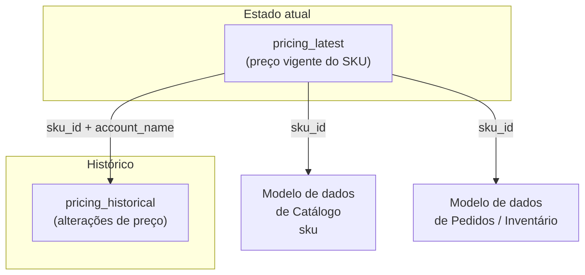

O conjunto de dados de preços contém informações históricas de preços para cada SKU da loja de um seller, permitindo a análise dos valores de markup e das tendências mensais de preços.  

Neste artigo você encontra as seguintes informações:

- [Tipos de tabelas e relacionamentos](#tipos-de-tabelas-e-relacionamentos)
- [Características dos dados](#caracteristicas-dos-dados)
- [Tabela pricing_latest](#tabela-pricing_latest)
- [Tabela pricing_historical](#tabela-pricing_historical)
- [Análise com dados de preços](#analise-com-dados-de-precos)
- [Correlações com outros dados](#correlacoes-com-outros-dados)

## Tipos de tabelas e relacionamentos

O modelo de Preços é composto por dois tipos de tabela por SKU:

- **Tabela de estado atual:** `pricing_latest` guarda o preço vigente de cada SKU (`listPrice`, `costPrice`, `basePrice`, `markup`).
- **Tabela histórica:** `pricing_historical` registra cada alteração de preço ao longo do tempo, incluindo `author_id` e a data da mudança.
- A chave de ligação entre as tabelas (e com Catálogo) é `sku_id`, combinada com `account_name`.

O diagrama abaixo mostra como as tabelas se conectam:



### Exemplos de utilização

Veja abaixo dois fluxos distintos de utilização dos dados:

- Fluxo 1: consultar o preço atual de um SKU.

    ```mermaid
    %%{init: {'flowchart': {'htmlLabels': true, 'useMaxWidth': false, 'wrappingWidth': 220, 'padding': 14}}}%%
    flowchart TD
        L["pricing_latest<br/>sku_id: 1001<br/>basePrice: 199<br/>markup: 0.4"]
        S["Catálogo sku<br/>sku_id: 1001<br/>Tênis Air Max"]

        L -->|"sku_id"| S
    ```

    Neste diagrama, `pricing_latest` traz o preço vigente do SKU e o `sku_id` permite enriquecer a análise com os dados do produto no Catálogo.

- Fluxo 2: analisar evolução de preço e impacto em vendas.

    ```mermaid
    %%{init: {'flowchart': {'htmlLabels': true, 'useMaxWidth': false, 'wrappingWidth': 220, 'padding': 14}}}%%
    flowchart LR
        H1["pricing_historical<br/>basePrice: 229"]
        H2["pricing_historical<br/>basePrice: 199"]
        L["pricing_latest<br/>basePrice: 199"]
        O["Pedidos<br/>orders_items"]

        H1 --> H2 --> L
        L -->|"sku_id"| O
    ```

    Neste diagrama, `pricing_historical` mostra a sequência de alterações até o preço atual e a correlação com Pedidos ajuda a medir o efeito da mudança de preço nas vendas.

## Características dos dados

| **Característica** | **Descrição** |
|:------:|:--------:|
| Característica | Descrição |
|------|--------|
| Origem do dado | Módulo de preços. |
| Disponibilidade | VTEX Admin e APIs de preços. É importante ressaltar que os dados disponibilizados pela API podem não estar estruturados exatamente como neste conjunto de dados do Data Pipeline. |
| Histórico | O histórico de dados começa em agosto de 2023. Para clientes que já usam a plataforma VTEX, os dados são retidos por dois anos a partir de 2024.|
| Menor intervalo de atualização possível | Uma hora. | 

## Tabela pricing_latest  

A tabela `pricing_latest` contém dados dos preços atuais dos produtos da loja. Veja a seguir os campos que compõem essa tabela.

| Nome da Coluna  | Tipo de Coluna 	| Descrição da Coluna  |
|--------|--------|-----------|
| account_name | character varying(255) 	| Nome da conta relacionada ao item. |
| last_date | date 	| Data e hora da última alteração no preço. |
| sku_id | character varying(255) | Identificador do SKU. |
| batch_id  | character varying(255) 	| Identificador usado quando os dados são carregados na tabela para controle de qualidade da ingestão de dados. |
| listPrice | double precision | Preço de lista do SKU. |
| costPrice | double precision | Preço de custo do SKU. |
| markup  | double precision 	| Markup do SKU. |
| basePrice| double precision | Preço-base do SKU. |
| fixedPrices| super | Preço fixo.|

## Tabela pricing_historical

A tabela `pricing_historical` apresenta registro histórico dos preços da sua loja. Veja abaixo seguir os campos que compõem essa tabela.  

| Nome da coluna  | Tipo de coluna  | Descrição da coluna |
|--------|---------|----------|
| account_name | character varying(255) | Nome da conta relacionada ao item. |
| date | date  | Data e hora da última alteração no preço. |
| sku_id | character varying(255) 	| Identificador do SKU. |
| author_id | character varying(255) 	| Identificação do usuário que fez a alteração de preço. |
| batch_id | character varying(255) | Identificador usado quando os dados são carregados na tabela para controle de qualidade da ingestão de dados. |
| id | character varying(255) | ID da alteração de preço. |
| listPrice | double precision | Preço de lista do SKU. |
| costPrice | double precision	| Preço de custo do SKU. |
| markup | double precision| Markup do SKU. |
| basePrice | double precision | Preço-base do SKU.|
| fixedPrices | super | Preço fixo.  |

## Análise com dados de preços

Os dados de preços podem ser empregados nas seguintes análises:  

- __Preço atual do SKU:__ avalie o preço atual para um SKU específico ou para toda uma gama de produtos.  
- __Histórico de preços do SKU:__ analise o histórico de preços para um SKU específico ou para toda uma gama de produtos.  
- __Preço do SKU por conta:__ para lojas com múltiplas contas VTEX, estes dados ajudam a comparar preços em várias lojas.  

## Correlações com outros dados  

O conjunto de dados de preços possui correlações com os seguintes conjuntos do ecossistema de dados da VTEX:  

- **Interação com dados de pedidos:** analisar dados de pedidos conjuntamente fornece insights valiosos sobre vendas de um produto em função do preço, permitindo uma análise de elasticidade.  
- **Relação com o inventário:** a integração com dados de inventário capacita você a avaliar com precisão o valor total de seus ativos.  
- **Impacto da taxa de conversão:** ao analisar dados de navegação e funil de conversão, você pode entender o impacto do preço nas taxas de conversão.  

### Conheça outros Conjuntos de dados

- [Inventário](/pt/docs/tutorials/inventario-data-pipeline-beta)  
- [Navegação](/pt/docs/tutorials/navegacao-data-pipeline-beta)   
- [Pagamentos](/pt/docs/tutorials/pagamentos-data-pipeline-beta)  
- [Pedidos](/pt/docs/tutorials/pedidos-data-pipeline-beta) 
- [Promoção](/pt/docs/tutorials/promocoes-data-pipeline-beta)
- [Vale-presente](/pt/docs/tutorials/vale-presente-data-pipeline)
- [Logs do Bridge](/pt/docs/tutorials/logs-do-bridge-data-pipeline)
