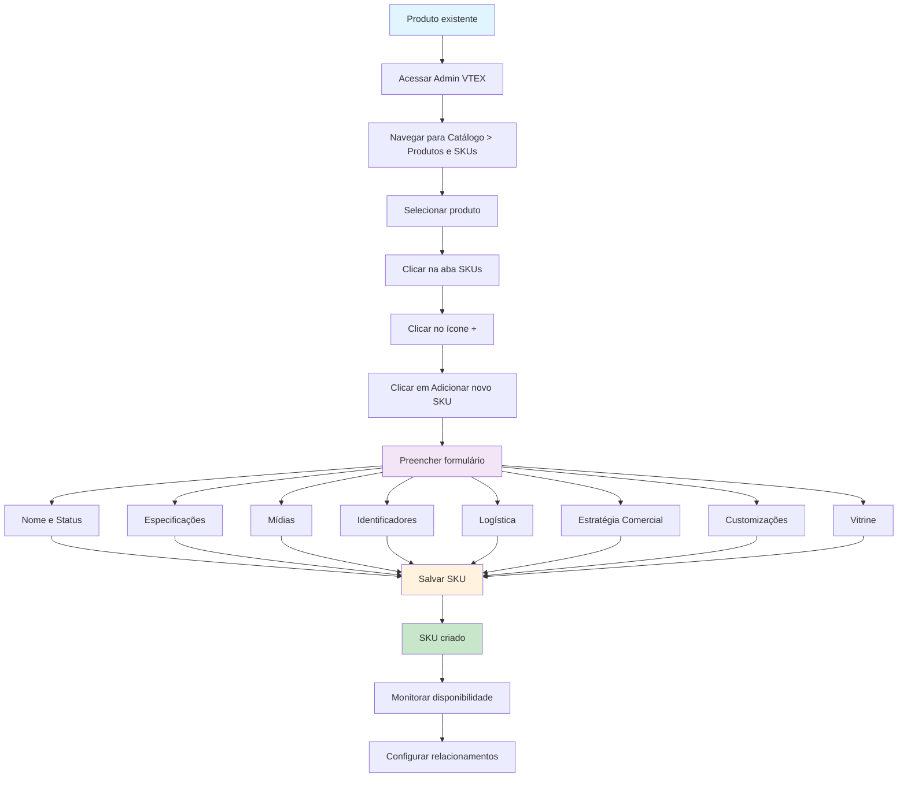

# Como criar um novo SKU no catálogo VTEX

Este guia completo orienta você através do processo de criação de um novo SKU (Stock Keeping Unit) no catálogo da VTEX. Um SKU representa uma variação específica de um produto, como diferentes tamanhos, cores, ou configurações.

## Visão geral do processo

## Pré-requisitos

Antes de criar um SKU, você precisa ter:

- **Produto existente**: Todo SKU deve estar vinculado a um produto
- **Acesso ao Admin VTEX**: Permissões para gerenciar o catálogo
- **Informações do produto**: Especificações, imagens, e dados logísticos

## Processo passo a passo

### 1. Acessar o gerenciamento de catálogo

1. Faça login no **Admin VTEX**
2. Navegue até **Catálogo > Produtos e SKUs**
3. Ou digite "Produtos e SKUs" na barra de busca no topo da página

### 2. Selecionar o produto

1. Clique na linha do produto desejado
2. Clique na aba **SKUs**
3. Clique no ícone **+** para abrir as opções de adicionar SKUs
4. Clique em **"Adicionar novo SKU"**

> **Dica**: Você também pode duplicar um SKU existente clicando no **ícone menu do SKU > Duplicar > Salvar**

### 3. Preencher o formulário do SKU

O formulário está dividido em 8 seções principais. Campos marcados com * são obrigatórios.

#### Nome e Status

- **Nome***: Identificação do SKU (máximo 200 caracteres)
  - Exemplo: Para o produto "Geladeira", o nome do SKU pode ser "110 volts"
- **Ativo**: Habilite o toggle para ativar o SKU

#### Especificações

- Preencha as especificações específicas do produto (ex: voltagem, cor, tamanho)
- **Importante**: Cada SKU deve ter uma combinação única de valores
- Não é possível criar combinações duplicadas

> **Exemplo de conflito**: Se o SKU A tem "cor preta + tamanho P", o SKU B não pode ter a mesma combinação

#### Mídias

##### Imagens
- **Limites**: 5.000 x 5.000 pixels máx, 4MB máx, 600 x 600 pixels mín
- **Formatos aceitos**: JPG, PNG, GIF, ICO, SVG, WEBP
- **Requisito**: Pelo menos 1 imagem é obrigatória para ativar o SKU

**Como adicionar imagens:**
1. Clique em **"Adicionar"**
2. Escolha entre:
   - **"Selecionar arquivos"**: Upload de imagens locais
   - **"Adicionar links"**: Adicionar por URL

##### Vídeos
- **Limite**: Até 6 vídeos por SKU
- **Plataformas aceitas**: Apenas YouTube e Vimeo
- **Formatos de URL aceitos**:
  - Vimeo: `https://vimeo.com/{VIDEO_ID}`
  - YouTube: `https://youtu.be/{VIDEO_ID}` ou `https://www.youtube.com/watch?v={VIDEO_ID}`

#### Identificadores

- **Código de referência**: Código único para gestão do catálogo
- **EAN/UPC**: Código de barras internacional (13 dígitos EAN, 12 UPC)
- **Código do fabricante**: Código fornecido pelo fabricante

#### Logística

##### Modal (opcional)
- Configuração para entregas especializadas
- Requer condições especiais como refrigeração

##### Peso e dimensões para frete
- **Peso do pacote**: Valor absoluto do peso
- **Largura, Altura, Comprimento do pacote**: Dimensões para cálculo de frete

##### Peso e dimensões reais
- Dimensões reais do produto (exibidas na PDP)
- Preencher apenas com números, sem unidades

##### Medidas de estoque
- **Unidade de medida**: Para contagem de itens
- **Multiplicador de unidade**: Valor pelo qual o SKU será multiplicado no carrinho

#### Estratégia Comercial

- **Condição comercial**: Promoções e condições de pagamento
- **Data de pré-venda**: Data prevista para disponibilização
- **Gerar crédito em vale-presente**: Ativar para gerar gift card
- **Valor fidelidade**: Crédito por unidade comprada

#### Customizações

- **Anexos**: Opções customizáveis (ex: nomes personalizados)
- **Serviços**: Serviços adicionais para o SKU

> Anexos e serviços devem ser configurados previamente

#### Vitrine

Configure relacionamentos para cross-selling e up-selling:

- **Acessórios**: Itens complementares
- **Sugestões**: Sugestões de compra
- **Produtos similares**: Alternativas
- **Mostrar junto**: Itens para compra conjunta

**Como configurar:**
1. Clique no ícone **+** na seção Vitrine
2. Escolha o tipo de relacionamento
3. Digite o ID do SKU desejado
4. Clique em **"Aplicar"**

### 4. Salvar o SKU

- Clique em **"Salvar"** para criar o SKU

## Limitações importantes

- **Máximo 50 SKUs por produto**
- **SKUs não podem ser excluídos individualmente** (apenas desativados)
- **Exclusão em massa** disponível apenas via Full Cleanup

## Acompanhamento após criação

### Status de disponibilidade
- Monitore através de ícones coloridos
- Passe o mouse sobre os ícones para ver significados

### Opções pós-criação
- **Converter em Kit**: Ação permanente e irreversível
- **Replicar imagens**: Copiar para outros SKUs do mesmo produto
- **Editar metadados**: Modificar informações das imagens

## Solução de problemas

### SKU não aparece no site
Verifique se:
- Pelo menos 1 imagem foi enviada
- Todos os campos obrigatórios estão preenchidos
- Condições comerciais estão configuradas
- Configurações de estoque estão corretas

### Erro de combinação duplicada
- Verifique se não existe outro SKU com a mesma combinação de especificações
- Considere inativar SKUs conflitantes

## Artigos relacionados

- [Produtos e SKUs](https://help.vtex.com/pt/tutorial/produtos-e-skus--2ig7TmROlirWirZjFWZ3By)
- [Adicionar ou editar produto](https://help.vtex.com/pt/tutorial/adicionar-ou-editar-produto--29IkdEu6GofCFlltsZh2H8)
- [Cadastrar especificações ou campos de SKU](https://help.vtex.com/pt/tutorial/cadastrar-especificacoes-ou-campos-de-sku--tutorials_119)
- [Boas práticas para o uso de imagens no Catálogo](https://help.vtex.com/pt/tutorial/boas-praticas-para-o-uso-de-imagens-no-catalogo--738K2yfq5U86kUI2k4AQIk)
- [Por que o produto não aparece no site?](https://help.vtex.com/pt/faq/por-que-o-produto-nao-aparece-no-site--frequentlyAskedQuestions_382)

## Dicas de sucesso

1. **Planeje as especificações**: Defina claramente as variações antes de criar os SKUs
2. **Use imagens de qualidade**: Siga as boas práticas para melhor performance
3. **Configure logística adequadamente**: Dimensões corretas evitam problemas de frete
4. **Monitore a disponibilidade**: Acompanhe regularmente o status dos SKUs
5. **Teste antes de ativar**: Verifique se todas as configurações estão corretas

---

**Precisa de ajuda?** Entre em contato com o [Suporte VTEX](https://support.vtex.com/hc/pt-br/requests) para solicitar aumento do limite de SKUs ou resolver problemas específicos.
