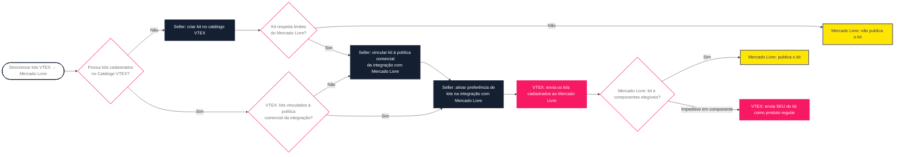

A funcionalidade de Kits permite que sellers VTEX sincronizem seus kits cadastrados no catálogo VTEX diretamente com o Mercado Livre, garantindo a publicação destes no marketplace. Com essa sincronização o seller pode acompanhar o processamento pelo Admin VTEX.

Para sincronizar os kits do catálogo VTEX com a conta no Mercado Livre, o seller deve atender aos seguintes requisitos:

- A integração com o Mercado Livre configurada.
- Kits préviamente cadastrados no Catálogo VTEX.
- Kits para sincronização devem estar vinculados à Política comercial utilizada na integração com o Mercado Livre.
- Cada kit pode conter no máximo 6 componentes e cada componente do kit pode ter no máximo 10 unidades.

O processo de sincronização de kits segue o fluxo abaixo:

## Inventário e Preço

As regras de inventário e de precificação de um kit no Mercado Livre serão as mesmas utilizadas para os kits cadastrados no catálogo da VTEX.

O inventário do kit é o inventário de seus componentes, não sendo possível inserir um inventário apenas no kit. Para gerenciar esta informação, acesse **Catálogo > Inventário > Gerenciamento de inventário.**

O preço do kit é atualizado automaticamente após alterar o valor unitário de um dos componentes. O preço final será a soma dos valores dos componentes.

Também é possível alterar somente o preço final do kit direto pelo sistema de preços sem atualizar os componentes. Dessa forma, o valor do componente será usado apenas para ratear o valor de venda entre os componentes, determinando o preço de cada componente naquele pedido específico.

## Ativando a sincronização1. Ativar a sincronização de Kits

Após cadastrar os kits no catálogo VTEX seguindo o tutorial [Cadastrar kit](https://help.vtex.com/pt/docs/tutorials/cadastrar-kit) e vinculá-los à Política comercial da integração com o Mercado Livre, o seller deve seguir os passos abaixo para ativar a sincronização:

1. No Admin VTEX, vá a **Marketplace > Conexões > Mercado Livre > Preferências** ou acesse **Preferências** na barra de busca.
2. Na seção **Kits no Mercado Livre,** ative o toggle <label class="toggle-switch">.
3. Clique no botão `Ativar sincronização`.
4. Acompanhe a sincronização dos kits em **Marketplace > Conexões > Produtos**.

