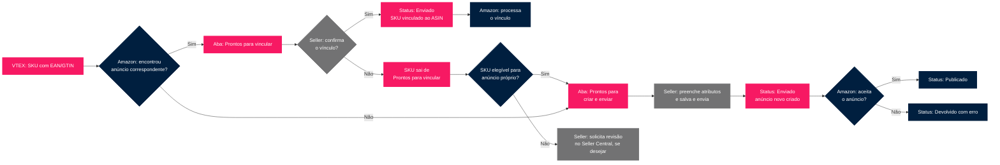

A **Publicação de produtos** é o ponto único do Admin VTEX para disponibilizar os produtos do seu catálogo na Amazon. A partir dela, é possível tanto vincular SKUs a anúncios que já existem na Amazon quanto criar anúncios novos.

Ao finalizar a [integração com a Amazon](/pt/docs/tracks/configurar-a-integracao-da-amazon), é necessário disponibilizar os produtos da loja para serem anunciados no marketplace. Todo SKU enviado para a Amazon passa, primeiro, por um processo de vínculo: a Amazon tenta unificar o anúncio com outros já existentes do mesmo produto através do [EAN](https://sellercentral.amazon.com.br/learn/courses?ref_=su_course_accordion&moduleId=71d0b122-4e43-4547-a05a-04517e8f41a2&courseId=959bc7cb-2866-499c-b24a-8d3f6def1306&modLanguage=Portuguese&videoPlayer=youtube) ou GTIN cadastrado na VTEX (equivalente ao [ASIN](https://associados.amazon.com.br/resource-center/asin-amazon?ac-ms-src=rc-home-card) na Amazon). O resultado desse processo determina em qual das duas abas o SKU aparece.

> ℹ️ Todos os produtos precisam ter [Estoque](/pt/docs/tutorials/estoque) e [Preço](/pt/tracks/precos-101--6f8pwCns3PJHqMvQSugNfP) configurados antes de serem enviados ao marketplace. Também é necessário configurar o [campo EAN](/pt/docs/tutorials/adicionar-ou-editar-produto) dos produtos que você deseja enviar para a Amazon. Para mais detalhes, consulte o tutorial [Envio de produtos à Amazon](/pt/docs/tracks/envio-de-produtos-para-amazon).

A página **Publicação de produtos** organiza os SKUs em duas abas, de acordo com o resultado da busca da Amazon no catálogo do marketplace. Assim, o seller identifica quais produtos devem ser vinculados com um anúncio existente e quais devem ser cadastrados como um novo anúnico. No Admin VTEX, clique em **Marketplace > Amazon > Publicação de produtos**, ou digite **Publicação de produtos** na barra de busca no topo da página.

Veja abaixo o fluxo de publicação na Amazon:

Cada SKU aparece em apenas uma das abas, a definição de onde ele estará depende do resultado da busca pelo produto no catálogo da Amazon. Após a publicação confirmada, o SKU passa a ter status **Enviado** dentro da própria aba em que estava.

## Produtos prontos para vincular

Nessa aba, o seller revisa e confirma ou recusa as sugestões de vínculo entre os SKUs da VTEX e os anúncios já existentes na Amazon. O contador ao lado do nome da aba mostra a quantidade de SKUs aguardando revisão.

Na listagem, é possível usar o campo **Buscar SKU ou produto** para pesquisar por nome do SKU ou da oferta no catálogo VTEX, e o filtro **Status** para refinar pela situação atual da sugestão de vínculo.

O EAN cadastrado na VTEX é utilizado para fazer a equivalência com os ASINs correspondentes na Amazon. A correspondência entre EAN e ASIN precisa ser confirmada pelo seller para que os anúncios sejam vinculados corretamente.

### Apresentação dos produtos

Cada linha da tabela compara o SKU da VTEX com a sugestão de vínculo da Amazon e indica o status atual da publicação. Conheça abaixo as colunas e os status possíveis:

| Coluna | Descrição |
| --- | --- |
| **SKU VTEX** | Imagem, nome e ID do SKU do produto cadastrado na VTEX. |
| **Sugestão de vínculo do marketplace** | Imagem, nome e ASIN sugerido pela Amazon para vínculo com o SKU. |
| **Status** | Situação atual da sugestão de vínculo. |

Os status possíveis são:

- **Revisão pendente:** a sugestão de vínculo aguarda a revisão do seller.
- **Enviado:** o vínculo foi confirmado e enviado à Amazon.
- **Restrito:** a Amazon aplicou uma restrição de publicação a esse ASIN. Veja a seção [Restrições de publicação](#restricoes-de-publicacao).
- **Retornado com erro:** a Amazon retornou um erro para esse envio.

### Detalhes da sugestão

Ao clicar em uma linha da tabela, o seller é direcionado à página **Detalhes da sugestão**, que exibe a comparação lado a lado entre o SKU VTEX e o anúncio sugerido pela Amazon:

- **SKU VTEX:** card com imagem, nome, ID do SKU e os atributos identificador (EAN) e marca do produto cadastrado na VTEX. O botão `Ver SKU no catálogo` leva à página do produto no catálogo VTEX.
- **Produto para vincular:** card com imagem, nome, ASIN e os atributos identificador e marca do anúncio sugerido. O botão `Ver produto` abre o anúncio correspondente no site da Amazon.
- **Outras sugestões de vínculos:** painel lateral com outras sugestões de ASIN para o mesmo SKU, quando existirem.

Quando a Amazon não retorna nenhuma outra opção de anúncio para vincular ao SKU, o painel Outras sugestões de vínculos exibe a seguinte mensagem: **Nenhuma outra sugestão disponível. A Amazon não retornou outras opções para este SKU.**

### Confirmando um vínculo

Para confirmar a sugestão de vínculo exibida siga os passos a seguir:

1. Clique no SKU desejado.
2. Confira as informações do SKU VTEX e do produto sugerido pela Amazon.
3. Clique em `Confirmar e publicar`, no canto superior direito.
4. No modal de confirmação, clique em `Enviar` para confirmar ou em `Cancelar` para voltar sem enviar.

Após a confirmação, o SKU passa para o status **Enviado**. Como o processamento na Amazon é assíncrono, o retorno de sucesso ou falha pode ocorrer depois. Acompanhe o resultado no status do SKU e em [**Status dos anúncios**](/pt/docs/tutorials/status-dos-anuncios).

### Recusando uma sugestão

Caso a sugestão de vínculo não esteja correta, o seller pode recusá-la pelo botão `Recusar sugestão`, no canto superior direito. Ao clicar, duas opções são exibidas:

- **Apenas recusar:** recusa a sugestão sem solicitar nova análise. O SKU é removido da listagem **Prontos para vincular**.
- **Recusar e solicitar revisão:** recusa a sugestão e orienta o seller a solicitar a revisão do vínculo diretamente no Amazon Seller Central. O SKU é removido da listagem até que a revisão seja feita na Amazon.

> ℹ️ Se o seller recusar o vínculo sugerido, mas o SKU for elegível para se tornar um anúncio próprio, o mesmo sai da aba **Prontos para vincular** e passa para a fila de **Prontos para criar e enviar**.

### Ações em massa

Na aba **Prontos para vincular**, também é possível confirmar várias sugestões de uma só vez. Para isso siga os passos abaixo:

1. Marque a caixa de seleção ao lado de cada SKU desejado, ou use a caixa de seleção no cabeçalho da tabela para marcar todos os itens da página.
2. Uma barra fixa é exibida na parte inferior da tela, mostrando quantos itens foram selecionados e o atalho para selecionar todos os SKUs da aba.
3. Clique em `Enviar` para prosseguir.
4. No modal de confirmação, clique em `Confirmar`.

Somente SKUs com status **Revisão pendente** serão processados e ao concluir, os SKUs processados passam para o status **Enviado**.

### Restrições de publicação

Em alguns casos, a Amazon aplica restrições à publicação de um anúncio. Esses SKUs aparecem na listagem com o status **Restrito** e, ao serem abertos, exibem um aviso específico no topo da página **Detalhes da sugestão**. Existem dois cenários possíveis:

#### Restrição que exige autorização

O seller pode publicar o anúncio, mas somente após solicitar aprovação à Amazon. Nesse caso, o aviso exibido é:

> ⚠️ Este produto tem uma restrição de publicação. Solicite autorização no Amazon Seller Central para continuar.

O botão `Solicitar autorização`, à direita do aviso, leva o seller à Amazon Seller Central para solicitar a liberação. Enquanto a autorização não é concedida, o botão `Confirmar e publicar` permanece desabilitado.

#### ASIN não elegível

O seller não é elegível para listar aquele ASIN. Essa inelegibilidade pode ocorrer por categoria, marca ou histórico de performance na Amazon, e não há ação disponível para contornar a restrição diretamente pela VTEX. Nesse caso, o aviso exibido é:

> Este anúncio não pode ser publicado. A Amazon marcou este ASIN como não elegível para publicação devido a restrições de categoria, marca ou performance.

O link `Saiba mais`, à direita do aviso, direciona para mais informações sobre elegibilidade de anúncios na Amazon e o botão `Confirmar e publicar` permanece desabilitado nesse cenário.

#### Imagens insuficientes

A Amazon exige ao menos 4 imagens para criar ou vincular um anúncio. Quando o anúncio sugerido não tem imagens suficientes, a página **Detalhes da sugestão** exibe um aviso e o botão `Confirmar e publicar` permanece desabilitado até que as imagens sejam adicionadas no [catálogo VTEX](/pt/docs/tutorials/adicionar-ou-editar-produto).

## Produtos prontos para criar e enviar

Nessa aba, o seller cadastra e envia SKUs que ainda não possuem correspondência na Amazon, criando um anúncio novo. O contador ao lado do nome da aba mostra a quantidade de SKUs disponíveis para cadastro.

Na listagem, cada SKU apresenta **nome do SKU**, **SKU ID**, **Categoria Amazon** e **Status**. É possível usar o campo **Buscar** para pesquisar por nome do SKU ou por SKU ID, e filtrar por **Categoria VTEX**, **Categoria Amazon**, **Marca** e **Status**. Os filtros podem ser utilizados individualmente ou combinados, de acordo com a estratégia de cada seller.

O cadastro dos produtos apresentados nesta aba é realizado manualmente, um a um, ou utilizando [templates](#template-de-cadastro-de-produtos) criados pelo seller.

### Status do cadastro

Cada SKU apresenta um status. Veja a seguir quais são e o que cada um representa:

- **Pronto para cadastro:** o SKU está disponível para o seller preencher os atributos e enviar à Amazon.
- **Cadastro incompleto:** os atributos foram preenchidos parcialmente.
- **Devolvido com erro:** o SKU foi enviado para a Amazon com alguma informação incorreta. Neste caso, a Amazon retorna o erro no SKU e o seller corrige e reenvia.
- **Enviado:** o SKU foi preenchido corretamente e enviado à Amazon.
- **Publicado:** o SKU foi enviado pelo seller e aceito pela Amazon. Estes já estão disponíveis no marketplace.

### Cadastrando um SKU

Para cadastrar um novo SKU, siga os passos abaixo:

1. No Admin VTEX, acesse **Marketplace > Amazon > Publicação de produtos** ou digite **Publicação de produtos** na barra de busca.
2. Selecione a aba **Prontos para criar e enviar**.
3. Selecione o SKU que deseja cadastrar.
4. Preencha os campos **Título**, **Descrição** e **Palavras-chave**. Se desejar, use as [sugestões por IA](#sugestoes-por-ia) disponíveis em cada campo.
5. Confira a **Categoria** aplicada automaticamente e complete o [preenchimento dos atributos](#preenchimento-de-atributos).
6. Clique no botão `Salvar e enviar` para validar o cadastro e enviar à Amazon, ou clique no botão `Finalizar depois` para armazenar os dados já cadastrados e finalizar posteriormente.

O botão `Salvar e enviar` permanece desabilitado até que todos os atributos necessários estejam preenchidos.

Ao finalizar o cadastro e enviar o SKU, ele entra em uma fila de processamento. O status muda para **Enviado**, aguardando a Amazon concluir o processamento. Quando aceito, o SKU tem seu status alterado para **Publicado**; se rejeitado, o status é alterado para **Devolvido com erro** para correção do seller.

> ℹ️ O envio dos produtos para a Amazon é assíncrono. O retorno de sucesso ou falha é apresentado apenas quando a Amazon finaliza o processamento de vínculo ou criação de anúncio. O resultado será apresentado no campo **Status** do SKU e também em [**Status dos anúncios**](/pt/docs/tutorials/status-dos-anuncios).

Ao salvar e enviar, as informações da categoria Amazon e dos atributos são replicadas para os SKUs deste produto que ainda não foram enviados. Se preferir, você pode desativar essa replicação pelo atalho `Desativar replicação`, exibido no banner informativo no topo da página de cadastro.

### Sugestões por IA

Na tela de cadastro, o seller pode usar o botão `Sugerir` nos campos **Título**, **Descrição** e **Palavras-chave** para gerar sugestões com assistência de Inteligência Artificial.

- O título enviado para a Amazon deve iniciar com o nome da marca. É possível visualizar e editar o título no campo correspondente.
- No mínimo 3 palavras-chave devem ser cadastradas no SKU.
- As sugestões de categoria são feitas com base no título e na descrição. Recomendamos selecionar uma das sugestões da Amazon, mas você pode selecionar uma categoria diferente a partir da árvore de categorias.

Ao clicar em `Sugerir` no campo **Descrição**, um card **Sugestão de descrição** é exibido com o texto gerado. O seller pode aplicar a sugestão, regenerá-la ou fechá-la.

> ℹ️ Verifique as informações geradas antes de aplicar.

### Preenchendo atributos

Ao abrir o formulário de cadastro, a IA sugere e aplicada automaticamente uma categoria para o produto. No canto inferior da tela um aviso aparecerá  para confirmar que a categoria foi sugerida po IA. Se a sugestão não fizer sentido, o seller pode desfazê-la clicando no botão `Desfazer`.

Com a categoria aplicada, os atributos correspondentes são carregados automaticamente no formulário. O seller precisa preencher todos os campos obrigatórios. O botão `Carregar mais atributos` só é habilitado quando os campos exibidos estiverem completos, e o botão `Salvar e enviar` fica disponível somente após o preenchimento de todos os atributos obrigatórios.

### Template de cadastro de produtos

Para otimizar o cadastro, o seller pode criar templates que serão utilizados para aplicar os valores dos atributos selecionados para todos os SKUs de uma mesma categoria Amazon.

#### Criar um template

1. No Admin VTEX, acesse **Marketplace > Amazon > Publicação de produtos**, ou digite **Publicação de produtos** na barra de busca.
2. Selecione a aba **Prontos para criar e enviar**.
3. Clique em um produto com o status **Enviado** ou **Publicado**.
4. Clique no botão `Criar template` e um modal aparecerá na tela.
5. Selecione os atributos desta categoria que você deseja aplicar para outros SKUs da mesma categoria.
6. Clique no botão `Confirmar`.

#### Gerenciar templates

Na página de gerenciamento de templates é possível filtrar os templates por categoria Amazon, excluir um template e editar um template.

##### Editar template

1. No Admin VTEX, acesse **Marketplace > Amazon > Publicação de produtos**, ou digite **Publicação de produtos** na barra de busca.
2. Selecione a aba **Prontos para criar e enviar**.
3. Clique no botão `Gerenciar templates`.
4. Selecione o template que deseja editar.
5. Faça as alterações necessárias.
6. Clique no botão `Salvar` para prosseguir com as alterações, ou `Descartar` para excluir as alterações realizadas.

Ao realizar a edição de um template, é possível adicionar novos atributos e excluir atributos do template já criado:

1. Na seção **Atributos**, clique no botão <i class="fas fa-pencil-alt" aria-hidden="true"></i>.
2. Selecione o checkbox dos atributos que deseja incluir ou remover.
3. Clique no botão `Confirmar`.

Quando alguma edição é feita no template, será apresentado no rodapé da página a opção de visualizar as alterações, como na imagem a seguir.

> ℹ️ Todas as alterações realizadas no template serão refletidas nos SKUs da categoria que ainda não foram enviados.

##### Deletar template

1. No Admin VTEX, acesse **Marketplace > Amazon > Publicação de produtos**, ou digite **Publicação de produtos** na barra de busca.
2. Selecione a aba **Prontos para criar e enviar**.
3. Clique no botão `Gerenciar templates`.
4. No template que deseja excluir, clique no botão <i class="far fa-trash-alt" aria-hidden="true"></i> `lixeira`.
5. No modal que aparecerá na tela, clique no botão `Concluir`.
