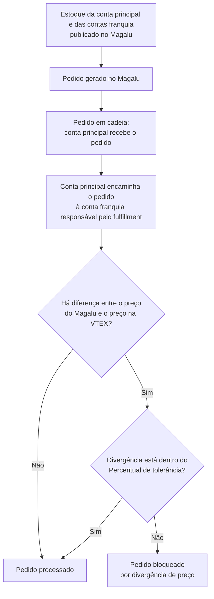

> ℹ️ Esta funcionalidade está em **open beta**, com monitoramento ativo. O comportamento de alguns fluxos pode mudar antes da disponibilidade geral. Em caso de dúvidas, entre em contato com [nosso Suporte](https://help.vtex.com/pt/support).

O **Ship-From-Store for Magalu** permite que lojistas com arquitetura de franquia na VTEX vendam no Magalu o estoque das [contas franquia](/pt/docs/tutorials/o-que-e-conta-franquia), e não apenas o estoque da conta principal. A funcionalidade aplica a estratégia de [Ship From Store](/pt/docs/tracks/configurar-ship-from-store) ao canal Magalu: o marketplace passa a receber a disponibilidade regionalizada das lojas e os pedidos podem ser roteados para a franquia responsável pelo fulfillment da compra.

Dessa forma, o Magalu pode oferecer entrega realizada por centros de distribuição ou por estoques de lojas físicas próximos ao cliente, levando ao marketplace as vantagens de uma arquitetura omnichannel e habilitando programas de logística rápida, como entrega no mesmo dia.

Essa capacidade usa o fluxo de [Multilevel Omnichannel Inventory (MOI)](/pt/docs/tutorials/multilevel-omnichannel-inventory) no canal Magalu. Ao operar o Ship-From-Store for Magalu, considere o seguinte:

- **Divisão de pedidos:** em pedidos em cadeia, o fulfillment pode ser distribuído entre mais de uma conta franquia. Quando o estoque vem de lojas diferentes, o pedido segue em mais de um pacote. Saiba mais em [Divisão de pedidos e divisão de entregas](/pt/docs/tutorials/divisao-de-pedidos-e-divisao-de-entregas).
- **Estoque compartilhado:** o Magalu recebe a disponibilidade publicada pelas contas franquia. Em operações com estoque compartilhado entre lojas, acompanhe o saldo enviado ao canal para que a quantidade anunciada corresponda ao que a rede consegue cumprir.
- **Listagem e fulfillment:** a publicação do SKU no Magalu depende de disponibilidade abrangente no Seller 1 da conta principal ou em uma [franquia abrangente](/pt/docs/tutorials/seller-abrangente). Depois que o comprador informa o CEP, o estoque regionalizado define a origem, o frete e o SLA do pedido.

Veja abaixo o fluxo dos pedidos gerados no marketplace:

> ⚠️ Em pedidos em cadeia, a [regra global de Divergência de valores](/pt/docs/tutorials/regra-de-divergencia-de-valores) não se aplica. A tolerância que vale para este fluxo é a do card da integração Magalu, no campo **Percentual de tolerância na divergência do valor do pedido**. Sem esse percentual configurado, pedidos promocionais ou com desconto aplicado pelo marketplace podem ser bloqueados antes do processamento.

## Configurar o Ship-From-Store for Magalu

A configuração é feita na conta principal. A loja precisa usar arquitetura de franquia, com a [integração Magalu](/pt/docs/tracks/magazine-luiza-marketplace) ativa e o estoque das contas franquia cadastrado e atualizado na VTEX.

Siga os passos abaixo para habilitar o estoque das contas franquia no Magalu.

### 1. Habilitar a política comercial do Magalu nas contas franquia

É necessário habilitar a [política comercial](/pt/docs/tutorials/como-funciona-uma-politica-comercial) do marketplace na configuração de cada franquia, na conta principal. Essa configuração autoriza a franquia a participar do Magalu com a política comercial já definida na conta principal. Catálogo, preço e escopo de estoque continuam sendo controlados pelas configurações existentes da VTEX.

1. No Admin VTEX, acesse **Marketplace > Sellers > Gerenciamento** ou digite **Gerenciamento** na barra de busca.
2. Clique na conta franquia que deve participar do canal Magalu.
3. Em **Acordos comerciais > Políticas comerciais de marketplace**, selecione a política comercial usada na integração com o Magalu.
4. Clique em `Salvar`.
5. Repita para cada conta franquia que deve vender nesse canal.

### 2. Configurar o card da integração Magalu

No card de configuração da loja da [integração Magalu](/pt/docs/tracks/magazine-luiza-marketplace), ative o estoque das franquias e defina a regra de divergência de preço do canal.

1. No Admin VTEX, acesse **Marketplace > Conexões > Marketplaces e Integrações** ou digite **Marketplaces e Integrações** na barra de busca.
2. Clique no marketplace **Magazine Luiza**.
3. No card de configuração da loja, preencha os campos descritos na tabela abaixo.
4. Clique em `Salvar`.

| Campo | O que faz |
| --- | --- |
| **Ativar estoque para entrega e cotação de frete para contas franquias** | Com a opção _Sim_ selecionada, o [Multilevel Omnichannel Inventory](/pt/docs/tutorials/multilevel-omnichannel-inventory) disponibiliza o estoque das contas franquia para venda e fulfillment no Magalu. |
| **Percentual de tolerância na divergência do valor do pedido** | Define a diferença máxima aceitável, em percentual, entre o preço do Magalu e o preço na VTEX. Essa regra é específica da integração Magalu e não usa a [regra global de Divergência de valores](/pt/docs/tutorials/regra-de-divergencia-de-valores). Pedidos acima da faixa não são integrados e podem ser acompanhados em **Marketplace > Conexões > Pedidos**. |
| **Estratégia de envio para cotação de frete** | Válida apenas com o estoque de franquias ativo. **Mais barato** prioriza o menor preço de frete. **Mais rápido** prioriza o menor prazo. |