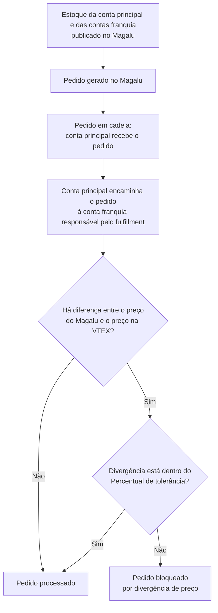

> ℹ️ Esta funcionalidade está em **open beta**, com monitoramento ativo. O comportamento de alguns fluxos podem mudar antes da disponibilidade geral. Em caso de dúvidas, entre em contato com [nosso Suporte](https://help.vtex.com/pt/support).

O **Inventário regionalizado no Magalu** permite que lojistas com arquitetura de franquia na VTEX vendam no Magalu o estoque das [contas franquia](/pt/docs/tutorials/o-que-e-conta-franquia), e não apenas o estoque da conta principal. Com isso, o Magalu passa a receber a disponibilidade regionalizada das lojas e os pedidos podem ser roteados para a franquia responsável pelo fulfillment da compra.

Ao habilitar o inventário regionalizado no Magalu, o estoque das contas franquia passa a ser considerado na publicação para o marketplace, deste modo os pedidos podem ser cumpridos pelas próprias franquias, podendo reduzir o prazo de fulfillment .
Com essa funcionalidade, a loja configura, por integração, a tolerância a divergência de preço, para que pedidos com diferença de valor não sejam bloqueados indevidamente.

Essa capacidade usa o fluxo de [Multilevel Omnichannel Inventory (MOI)](/pt/docs/tutorials/multilevel-omnichannel-inventory) no canal Magalu. Ao operar o inventário regionalizado, considere o seguinte:

- **Divisão de pedidos:** em pedidos em cadeia, o fulfillment pode ser distribuído entre mais de uma conta franquia. Quando o estoque vem de lojas diferentes, o pedido segue em mais de um pacote. Saiba mais em [Divisão de pedidos e divisão de entregas](/pt/docs/tutorials/divisao-de-pedidos-e-divisao-de-entregas).
- **Estoque compartilhado:** o Magalu recebe a disponibilidade publicada pelas contas franquia. Em operações com estoque compartilhado entre lojas, acompanhe o saldo enviado ao canal para que a quantidade anunciada corresponda ao que a rede consegue cumprir.

Veja abaixo o fluxo dos pedidos gerados no marketplace:

> ⚠️ Em pedidos em cadeia, a [regra global de Divergência de valores](/pt/docs/tutorials/regra-de-divergencia-de-valores) não se aplica. A tolerância que vale para este fluxo é a do card da integração Magalu. Sem esse percentual configurado, pedidos promocionais ou com desconto aplicado pelo marketplace podem ser bloqueados antes do processamento.

## Configurando inventário regionalizado

A configuração é feita no card da [integração Magalu](/pt/docs/tracks/magazine-luiza-marketplace), na conta principal. Para isso, a loja precisa usar arquitetura de franquia, com a integração ativa na conta principal e o estoque das contas franquia cadastrado e atualizado na VTEX.

Siga os passoa abaixo para ativar a integração e habilitar os estoques das contas franquia para o Magalu:

1. No Admin VTEX, acesse **Marketplace > Conexões > Marketplaces e Integrações** ou digite **Marketplaces e Integrações** na barra de busca.
2. Clique no marketplace **Magazine Luiza**.
3. No card de configuração da loja, preencha os campos descritos na tabela abaixo.
4. Clique em `Salvar`.

| Campo | O que faz |
| --- | --- |
| **Ativar estoque para entrega e cotação de frete para contas franquias** | Com a opção _Sim_ selecionada, o [Multilevel Omnichannel Inventory](/pt/docs/tutorials/multilevel-omnichannel-inventory) disponibiliza o estoque das contas franquia para venda e fulfillment no Magalu. |
| **Percentual de tolerância na divergência do valor do pedido** | Define a diferença máxima aceitável, em percentual, entre o preço do Magalu e o preço na VTEX. Pedidos acima da faixa não são integrados e podem ser acompanhados em **Marketplace > Conexões > Pedidos**. |
| **Estratégia de envio para cotação de frete** | Válida apenas com o estoque de franquias ativo. **Mais barato** prioriza o menor preço de frete. **Mais rápido** prioriza o menor prazo. |

## Saiba mais

- [Multilevel Omnichannel Inventory](/pt/docs/tutorials/multilevel-omnichannel-inventory)
- [Configurar integração com o Magazine Luiza](/pt/docs/tracks/magazine-luiza-marketplace)
- [Regra de Divergência de valores](/pt/docs/tutorials/regra-de-divergencia-de-valores)
- [O que é conta franquia?](/pt/docs/tutorials/o-que-e-conta-franquia)
