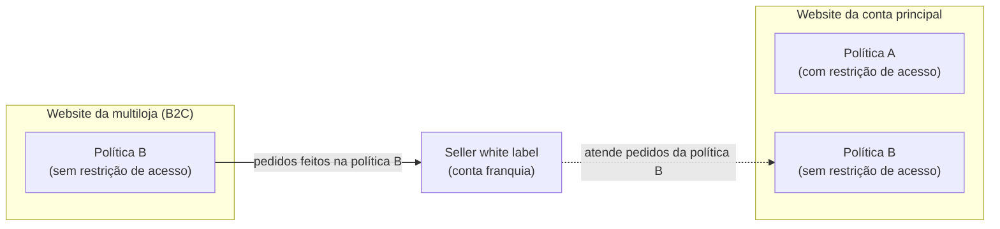
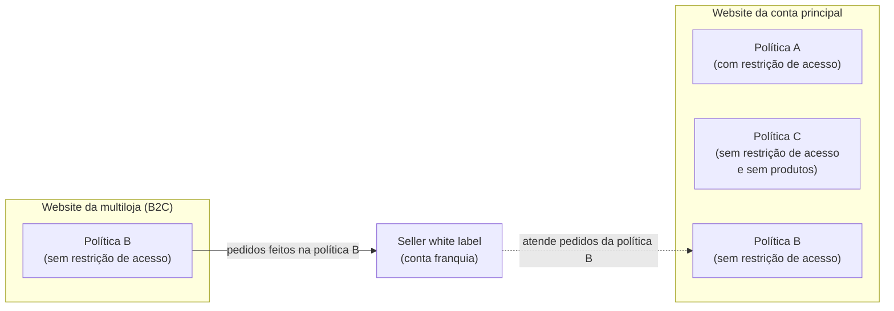
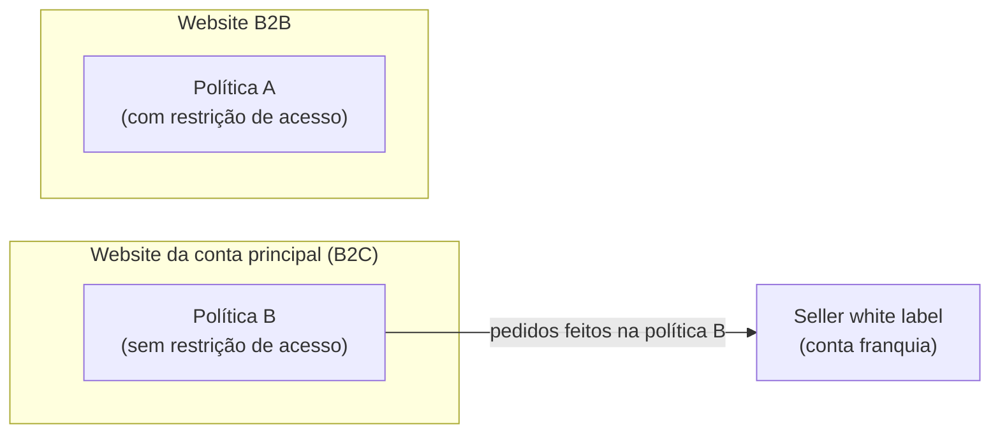

Quando um [seller white label](/pt/docs/tutorials/seller-white-label), como uma [conta-franquia](/pt/docs/tutorials/o-que-e-conta-franquia), realiza o fulfillment de pedidos da sua loja, a política comercial atendida por esse seller precisa estar elegível no [binding](/pt/docs/tutorials/como-funciona-a-relacao-entre-websites-e-politicas-comerciais#regra-de-elegibilidade) da **conta principal**, à qual o seller white label está vinculado. Estar elegível no binding significa que a política comercial está marcada na configuração do binding do website da conta principal, o que permite que esse website renderize as informações dessa política. Essa regra vale mesmo que o seller white label entregue apenas os pedidos de outro website, como o de uma [multiloja](/pt/docs/tutorials/gerenciando-uma-multiloja).

Se a política comercial da conta principal possuir restrição de acesso, como em operações B2B, essa regra se combina com a [exceção à regra de prioridade](/pt/docs/tutorials/como-funciona-a-relacao-entre-websites-e-politicas-comerciais#excecao-a-regra-de-prioridade). Ao tornar a política do seller white label elegível no binding da conta principal, usuários não logados passam a ver o website da conta principal com as informações dessa política, que não possui restrição de acesso.

Este artigo apresenta um exemplo desse cenário e duas alternativas para evitar essa exibição.

## Exemplo

Vamos supor uma loja com a seguinte arquitetura:

- **Website da conta principal:** política A (com restrição de acesso). Apenas a política A está elegível no binding desse website, e ela tem estoque próprio.
- **Website da multiloja:** política B (sem restrição de acesso). Apenas a política B está elegível no binding desse website. O catálogo é compartilhado com a conta principal. A política B não possui restrição de acesso porque a multiloja é B2C e precisa estar acessível a usuários não logados.
- **Seller white label:** conta-franquia que realiza o fulfillment apenas dos pedidos feitos na política B.

O diagrama a seguir ilustra essa arquitetura. A política B aparece também no binding da conta principal, pois é necessário que ela esteja elegível ali para que o seller white label atenda os pedidos:

Para que o seller white label entregue os pedidos da multiloja, a política B precisa estar elegível também no binding da conta principal. A ordenação das políticas comerciais está configurada da seguinte forma:

1. Política A (com restrição de acesso).
2. Política B (sem restrição de acesso).

Pela regra de prioridade, o website da conta principal renderizaria a política A, que está no topo da ordenação. No entanto, como a política A possui restrição de acesso e a política B, que está abaixo dela, não possui, entra em vigor a exceção à regra de prioridade. Assim, usuários não logados, que não atendem às condições de acesso da política A, veem o website da conta principal com as informações da política B (sem restrição de acesso).

Esse comportamento ocorre porque a política B precisou ser tornada elegível no binding da conta principal para que o seller white label realize o fulfillment dos pedidos da multiloja. Como resultado, o website da conta principal, que deveria ter acesso restrito, exibe para usuários não logados informações que não eram destinadas a ele.

Existem duas alternativas para esse cenário:
1. [Criar uma política comercial sem produtos](#criar-uma-política-comercial-sem-produtos)
2. [Inverter as políticas comerciais dos websites](#inverter-as-políticas-comerciais-dos-websites)

## Criar uma política comercial sem produtos

Para que usuários não logados não vejam as informações da política B no website da conta principal, siga os passos a seguir:

1. Crie uma nova política comercial C, sem restrição de acesso.
2. Torne a política C elegível no binding da conta principal.
3. Em seu Admin VTEX, acesse **Configurações da loja > Canais > Políticas Comerciais**.
4. Na coluna **Posição**, posicione a política C acima da política B.
5. Não disponibilize produtos para a política C.

Com essa configuração, a ordenação das políticas comerciais fica da seguinte forma:

1. Política A (com restrição de acesso).
2. Política C (sem restrição de acesso e sem produtos).
3. Política B (sem restrição de acesso).

O diagrama a seguir ilustra essa configuração. A política C fica elegível no binding da conta principal, entre a política A e a política B, e não possui produtos:

Dessa forma, usuários não logados acessam o website da conta principal sem produtos, pois a política C (sem restrição de acesso) é renderizada. Após o login, usuários que atendem às condições de restrição de acesso veem os produtos com as informações da política A (com restrição de acesso).

### Inverter as políticas comerciais dos websites

> ⚠️ Essa alternativa altera a função das políticas comerciais da loja. Antes de aplicá-la, revise todas as configurações vinculadas a cada política, como preços, promoções, disponibilidade de produtos, políticas de envio, condições de pagamento, regras de restrição de acesso e integrações. Também pode ser necessário ajustar os domínios de cada website.

Configure o binding da conta principal com a política comercial **sem restrição de acesso** (B2C) e o binding do outro website com a política **com restrição de acesso** (B2B). Assim, o website da conta principal sempre renderiza a política sem restrição, que é a mesma atendida pelo seller white label, e o website B2B renderiza apenas a política com restrição.

Com essa configuração, cada website tem apenas uma política comercial elegível no binding, e a ordenação deixa de influenciar a renderização:

- **Website da conta principal:** política B (sem restrição de acesso).
- **Website B2B:** política A (com restrição de acesso).

O diagrama a seguir ilustra essa configuração:

