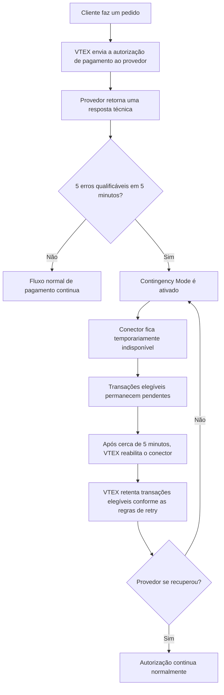

O **Contingency Mode** (anteriormente conhecido como **Mode-off**) é um recurso de resiliência do VTEX Payments que ajuda a proteger transações elegíveis durante instabilidades temporárias em provedores de pagamento.

Este artigo explica:

- [Como o **Contingency Mode** é ativado](#como-o-contingency-mode-funciona)
- [O que acontece com as transações afetadas enquanto ele está ativo](#impacto-nas-transações)
- [Quais métodos e fluxos de pagamento podem ser afetados](#métodos-de-pagamento-afetados)
- [Como funcionam a recuperação e as retentativas de transações](#recuperação-e-comportamento-de-retentativas)
- [Como os lojistas podem identificar o **Contingency Mode**](#como-identificar-o-contingency-mode)
- [O que os lojistas devem fazer durante um cenário de instabilidade no provedor](#o-que-fazer-quando-o-contingency-mode-está-ativo)

> ℹ️ Os lojistas não precisam configurar nem ativar o **Contingency Mode** manualmente. A VTEX gerencia automaticamente a ativação, a recuperação e as retentativas de transações.

## Como o Contingency Mode funciona

O **Contingency Mode** funciona como um circuit breaker automático para conectores de pagamento. Quando a VTEX detecta falhas técnicas recorrentes em um conector, o sistema pausa temporariamente as tentativas de autorização elegíveis para esse conector e mantém as transações afetadas pendentes para uma retentativa posterior.

Essa proteção se aplica ao conector afetado, não à loja como um todo. Outros provedores de pagamento ou métodos de pagamento que não foram afetados pela instabilidade podem continuar operando normalmente.

### Ativação

O **Contingency Mode** é ativado quando a VTEX detecta 5 erros técnicos qualificáveis em 5 minutos para o mesmo conector.

Erros técnicos qualificáveis podem incluir:

- Timeouts de requisição.
- Falhas de conexão.
- Requisições canceladas por instabilidade técnica.
- Respostas HTTP `408` de timeout.
- Erros HTTP `5xx` do provedor, como `500`, `502`, `503` ou `504`.

> ℹ️ Respostas de negócio não ativam o **Contingency Mode**. Por exemplo, saldo insuficiente, cartão inválido, cartão expirado e pagamento não autorizado fazem parte do fluxo normal de autorização e não são considerados instabilidade do conector.

### Comportamento durante a ativação

Quando o **Contingency Mode** está ativo:

- A VTEX marca o conector afetado como temporariamente indisponível.
- Novas requisições de autorização elegíveis não são enviadas ao provedor.
- As transações afetadas permanecem pendentes, geralmente com um status relacionado à autorização ou ao processamento.
- A VTEX agenda as transações para uma retentativa posterior.
- Os lojistas podem ver uma indicação de **Contingency Mode** nos detalhes da transação ou nos logs de pagamento.

Esse comportamento ajuda a preservar transações elegíveis enquanto o provedor se recupera, em vez de enviar novas requisições repetidamente para uma integração instável.

O diagrama a seguir mostra o fluxo esperado:

## Impacto nas transações

O **Contingency Mode** não cancela pedidos por si só. As transações afetadas pelo **Contingency Mode** são adiadas para retentativa.

> ℹ️ O **Contingency Mode** não substitui as regras normais de expiração e cancelamento de pagamento. Se o pagamento não puder ser autorizado antes do prazo aplicável, o pedido ainda poderá ser cancelado conforme o fluxo normal do pedido.

Os clientes podem ver o pagamento como em processamento ou pendente enquanto a VTEX aguarda a retentativa da autorização. Os lojistas devem evitar pedir que os clientes façam um novo pedido imediatamente, a menos que o pedido original já tenha sido cancelado ou que o método de pagamento exija uma nova ação do cliente.

## Métodos de pagamento afetados

O **Contingency Mode** se aplica a fluxos de pagamento que podem ser processados de forma assíncrona e retentados com segurança após uma instabilidade temporária no provedor.

Métodos ou fluxos de pagamento que exigem uma resposta online imediata, redirecionamento do cliente ou uma nova ação do cliente podem não ser adiados e retentados da mesma forma. Nesses casos, a transação segue o comportamento normal desse método de pagamento.

> ℹ️ Se você não tiver certeza se um método de pagamento específico é elegível para o **Contingency Mode**, entre em contato com o Suporte VTEX ou com seu provedor de pagamento.

## Recuperação e comportamento de retentativas

A recuperação é automática. Após aproximadamente 5 minutos desde o último erro qualificável, a VTEX reabilita o conector e retoma as tentativas normais de autorização.

Quando as transações adiadas são retentadas:

- Se o conector tiver se recuperado, a VTEX envia a requisição de autorização ao provedor.
- Se a instabilidade for detectada novamente, a VTEX pode ativar o **Contingency Mode** outra vez e adiar transações elegíveis para uma nova retentativa.

Com o comportamento aprimorado do **Contingency Mode**, a VTEX pode retentar transações elegíveis adiadas mais perto do período de recuperação do conector. Como o conector é reabilitado automaticamente após aproximadamente 5 minutos, a estratégia de retentativa foi desenhada para reduzir o intervalo entre a recuperação do provedor e a próxima tentativa de autorização, em vez de aguardar o intervalo fixo longo usado anteriormente em todos os casos.

Para os lojistas, a expectativa mais importante é que a recuperação do **Contingency Mode** seja medida em minutos: a VTEX verifica a recuperação do conector após cerca de 5 minutos, e as retentativas de transações elegíveis são agendadas assim que as regras de retry daquele fluxo de pagamento permitirem.

O tempo entre retentativas de processamento da transação também pode variar conforme as informações de pagamento enviadas pelo provedor e o tempo de cancelamento do pagamento. Quando o tempo de cancelamento do pagamento (`delayToCancel`) é menor que 1 dia, as retentativas geralmente são realizadas a cada 1 hora. Quando o tempo de cancelamento é igual ou maior que 1 dia, as retentativas geralmente são realizadas a cada 4 horas. Para mais informações, acesse [Create Payment endpoint](https://developers.vtex.com/docs/api-reference/payment-provider-protocol?endpoint=post-/payments).

> ℹ️ Para pagamentos com [PIX](https://help.vtex.com/pt/docs/tutorials/configurar-pix-como-meio-de-pagamento), ou quando o tempo de cancelamento do pagamento é configurado entre 5 minutos e 1 hora, as chamadas de retry geralmente ocorrem a cada 5 minutos.

> ℹ️ O tempo de retry pode variar dependendo do método de pagamento, da configuração da conta e das condições operacionais. A VTEX gerencia esse processo automaticamente.

## Como identificar o Contingency Mode

Os lojistas podem notar o **Contingency Mode** quando há instabilidade em um provedor de pagamento afetando um conector específico.

Indicadores comuns incluem:

- Um número incomum de pagamentos pendentes de autorização ou processamento para o mesmo provedor.
- Logs de transação indicando **Contingency Mode** para o conector afetado.
- Uma redução temporária no volume de pagamentos aprovados para um método de pagamento ou provedor específico.

Os provedores de pagamento também podem observar mais indicadores de instabilidade na integração, como timeouts ou erros de servidor.

## O que fazer quando o Contingency Mode está ativo

Na maioria dos casos, nenhuma ação é necessária por parte do lojista. A VTEX protege automaticamente o fluxo de transações, reabilita o conector e retenta as transações elegíveis.

Ações recomendadas:

1. Monitore as transações afetadas no Admin VTEX.
2. Verifique se o problema está concentrado em um provedor ou método de pagamento específico.
3. Entre em contato com o provedor de pagamento se a instabilidade persistir ou se ele precisar investigar a integração.
4. Entre em contato com o Suporte VTEX se as transações permanecerem pendentes por mais tempo que o esperado ou se os clientes relatarem problemas recorrentes de pagamento.

> ⚠️ Evite cancelar ou recriar pedidos manualmente, a menos que haja uma razão comercial clara para isso, como solicitação do cliente, expiração do pedido ou confirmação de que o pagamento não pode ser concluído.

## Orientação para provedores de pagamento

Os provedores de pagamento devem investigar e resolver a instabilidade que causou as falhas técnicas recorrentes.

Verificações comuns incluem:

- Disponibilidade dos endpoints de autorização.
- Tempo de resposta e comportamento de timeout.
- Erros HTTP `5xx`.
- Conectividade de rede.
- Deploys recentes ou mudanças de infraestrutura.

Depois que o provedor se estabiliza, a VTEX retoma automaticamente as tentativas de autorização para transações elegíveis.