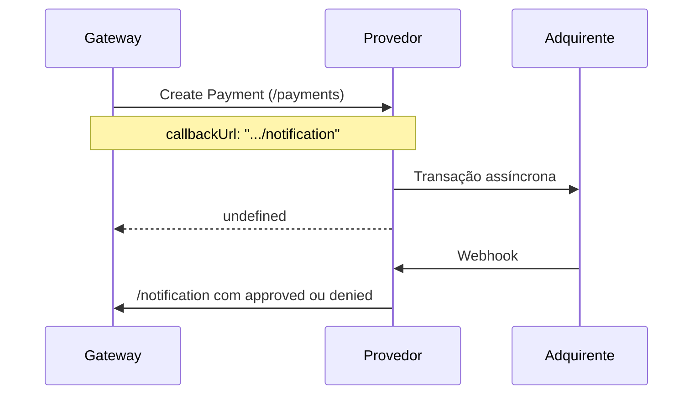
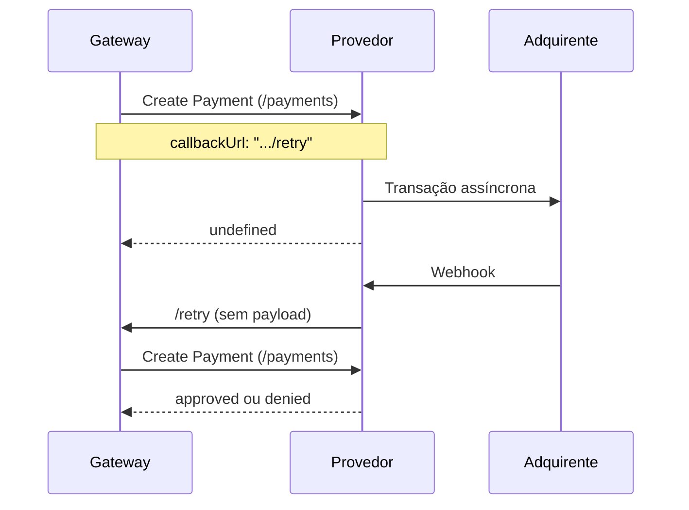

O Payment Provider Protocol (PPP) é o protocolo de integração entre a VTEX e outras empresas que processam pagamentos.

Por meio dele, a VTEX oferece um contrato público disponível para todos os provedores que desejam se integrar à nossa plataforma. Assim, os provedores obtêm maior autonomia em relação à integração.

O protocolo conta com os seguintes recursos:

- Processo de homologação on-line.
- Suporte de pré-autorização (captura de 2 passos).
- Mecanismo de tentativa de autorização de pagamento.
- Suporte a fluxo de redirecionamento de pagamento (3P).
- Suporte ao protocolo OAuth para autenticação.

O funcionamento do protocolo é detalhado na seção [Fluxo do protocolo de pagamento](/pt/docs/tutorials/payment-provider-protocol#fluxo-do-protocolo-de-pagamento), e os endpoints estão descritos na [referência da API do Payment Provider Protocol](https://developers.vtex.com/docs/api-reference/payment-provider-protocol).

## Conceitos
__Provedor:__ sistema de pagamento, gateway ou empresa que processa pagamentos.

__Payment Provider Protocol:__ protocolo de integração desenvolvido pela VTEX.

__Conector:__ nome do provedor parceiro de integração com a VTEX.

__OAuth:__ protocolo de autorização para APIs web projetado para permitir que aplicativos do cliente acessem um recurso protegido em nome de um usuário.

__Adquirente:__ empresa especializada em processar pagamentos. É responsável por repassar os valores cobrados do cliente pelo banco emissor para a conta da sua loja.

## Pré-requisitos para implementação
### Assinatura de um contrato de parceria comercial para Serviços Financeiros

Para implementação, publicação e atualização de um conector de pagamentos na VTEX, é necessária a assinatura de um contrato de parceria específico para serviços financeiros que cubra as especificidades do tema e as regulações dentro da plataforma. Se você ainda não tem um contrato de parceria, mas tem interesse em se tornar um provedor de pagamento, entre em contato com o nosso time pelo [site](https://vtex.com/br-pt/partner).

### Ter acesso a um ambiente VTEX

Para publicar um conector, é necessário ter um ambiente VTEX, que só é disponibilizado com a assinatura do contrato de parceria para serviços financeiros. Esse ambiente permite publicar, homologar e atualizar o conector, além de dar acesso ao nosso suporte para o desenvolvimento e a manutenção.

Se o parceiro for um SI (Service Implementer, ou implementador de serviços) que desenvolve integrações para clientes ou outros provedores de pagamento, a conta VTEX utilizada deve ser a do principal fornecedor do meio de pagamento, e não a da agência contratada.

### Requisitos de métodos de pagamento
#### Provedores de pagamentos com cartões de crédito, débito ou cobranded (soluções transparentes)

Para se tornar um provedor VTEX integrado, é necessário utilizar uma das seguintes soluções:

- A infraestrutura onde o conector será construído precisa ter o certificado PCI-DSS assinado por um QSA (Qualified Security Assessor). Mais informações no [Conselho de Normas de Segurança do PCI](https://www.pcisecuritystandards.org/).
- Caso não possua o certificado, implementar o provedor utilizando o [Secure Proxy](https://developers.vtex.com/docs/guides/payments-integration-secure-proxy).

Se o provedor for certificado ou já iniciou o processo de certificação, é possível entrar em contato com a equipe de negócios da VTEX para começar a integração.

O provedor deve encaminhar à VTEX o [AOC](https://www.pcisecuritystandards.org/document_library) (Attestation of Compliance for Onsite Assessments – Service Provider Version) totalmente preenchido, observando os seguintes pontos:

- __Nome da empresa__: o campo “URL” (Parte 1a.) deve ser o mesmo da empresa que está solicitando o procedimento de integração. Caso seja preenchido com outro nome (exemplo: empresa adquirida por outra), será necessário encaminhar a documentação extra que comprove a relação entre as empresas, e que a URL de serviço do provedor foi avaliada pelo PCI DSS.
- __Assinatura__: documento assinado pelo representante da empresa e pelo QSA.
- __Data de expiração__: o AOC é válido por 1 ano após a data de assinatura. Um AOC emitido a mais
de 11 meses não deve ser encaminhado à VTEX, ou seja, com tempo inferior a 30 dias para a data de
expiração.

> ⚠️ Sempre que for necessário atualizar um conector que processe pagamentos com cartões de crédito, débito ou cobranded, será obrigatório realizar novamente o processo de [homologação](https://developers.vtex.com/docs/guides/payments-integration-payment-provider-homologation) (abertura de ticket e envio do AOC), exceto quando o conector atender simultaneamente a todas as [condições de dispensa da homologação](https://developers.vtex.com/docs/guides/payments-integration-payment-provider-homologation#when-is-payment-provider-homologation-not-required).

> ❗ Os documentos SAQ (Self-Assessment Questionnaire) e AOC (Attestation of Compliance for Onsite Assessments – Merchants Version) não são aceitos no processo de integração da VTEX.

#### Provedores de boleto, promissória ou cartões de loja com bandeira própria (Private Label ou cartões em geral, mas que envolvam soluções com redirect)

Para provedores de boletos, promissórias ou cartões de loja com bandeira própria (private label), além de outros cartões processados em soluções com redirecionamento, a VTEX não solicita a comprovação de certificação PCI DSS. Basta entrar em contato com a equipe de negócios da VTEX para começar a sua integração.

## Primeiros passos
A seguir, veja o passo a passo da integração de pagamentos com a VTEX.

### 1. Implementar o protocolo
Antes de configurar o ambiente VTEX, o provedor deve implementar o serviço back-end (API) que recebe e processa os pagamentos. Os endpoints que esse serviço deve atender estão descritos no guia [Implementing a payment provider](https://developers.vtex.com/docs/guides/payments-integration-implementing-a-payment-provider).

### 2. Casos de uso específicos
Há casos em que conectores podem ser construídos para atender a uma solução específica, como os descritos a seguir:

- [Payment Provider Framework (PPF)](https://developers.vtex.com/docs/guides/payments-integration-payment-provider-framework): solução para implementação de conectores através do VTEX IO a partir de um boilerplate, que já vem com grande parte do trabalho feito, incluindo os endpoints do protocolo. A utilização do VTEX IO também acelera o processo de desenvolvimento e testes na loja.
- [Payment Provider Protocol aplicado a pagamentos com POS - VTEX Sales App](https://developers.vtex.com/docs/guides/payments-integration-ppp-applied-to-pos): aplicação do PPP para pagamentos com cartões de crédito e débito em lojas físicas, utilizando um terminal de pagamento (POS). O fluxo do pagamento se inicia com uma compra feita no [VTEX Sales App](https://help.vtex.com/pt/docs/tracks/o-que-e-o-vtex-sales-app), que então se comunica com o POS, onde o cliente insere o cartão.

### 3. Homologação do Payment Provider
Depois de receber os dados de acesso e implementar o back-end, o provedor deve instalar o app Payment Provider Test Suite, disponível na [VTEX App Store](https://apps.vtex.com/vtex-payment-provider-test-suite/p), para acessar a ferramenta de testes.


> ⚠️ Para passar no processo de homologação, é necessário implementar uma lógica específica para lidar com os requisitos do teste. Nas requisições enviadas ao Test Suite, utilize o header extra `X-VTEX-API-Is-TestSuite = true` para identificá-las e mascarar qualquer cenário exigido.<br>Toda comunicação com servidores, seja durante o processo de homologação ou em produção, deve ocorrer via HTTPS na porta 443, com suporte a TLS 1.2.

Após a instalação, acesse o app no Admin VTEX em **Apps > Payment Provider Test Suite**. Se o app não aparecer no menu, utilize o endereço `https://{accountName}.myvtex.com/admin/test-suite/payment-provider`, substituindo `{accountName}` pelo nome da conta da sua loja.

O app exibe um formulário com três seções: __Informações de serviço__, __Meios de pagamento__ e __Casos de teste__. Preencha os campos de acordo com as instruções a seguir.

#### Informações de serviço

* **URL de serviço:** defina a URL do seu serviço de provedor. Essa URL será o endereço base do protocolo e deve seguir o formato determinado por ele. Por exemplo, se a URL do serviço for `https://example.com/`, a URL completa para o endpoint `/payments` será `https://example.com/payments`.
* **Testar com chave e token de aplicação:** o botão Testar com chave e token de aplicação permite que você escolha entre configurar os valores desses campos ou não, o que pode facilitar os testes durante a etapa de desenvolvimento. Se não habilitar essa opção, as credenciais serão enviadas nos headers como uma string vazia.

> ℹ️ O gateway armazena as credenciais das lojas configuradas na afiliação e as envia nos headers `X-VTEX-API-AppKey` e `X-VTEX-API-AppToken`. A exceção são as integrações desenvolvidas com VTEX IO, para as quais os headers são enviados como `x-provider-api-appKey` e `x-provider-api-appToken`. Se você está desenvolvendo com o [Payment Provider Framework (IO)](https://developers.vtex.com/docs/guides/payments-integration-payment-provider-framework), isso é configurado pela opção `usesProviderHeadersName`, descrita nas [opções configuráveis do Payment Provider Framework](https://developers.vtex.com/docs/guides/payments-integration-payment-provider-framework#available-configurable-options).

#### Meio de pagamento

Após preencher o campo URL de serviço, o Test Suite irá validar o endpoint [List Payment Provider Manifest](https://developers.vtex.com/docs/api-reference/payment-provider-protocol#get-/manifest) e verificar os meios de pagamento declarados, que aparecem como opções nesse campo. Selecione os meios de pagamento nos quais você deseja realizar os testes.

#### Casos de teste

Nessa seção, você deve selecionar os casos que deseja testar. Se você está testando um método de cartão de crédito, a sua integração deve passar obrigatoriamente nos casos Fluxo aprovado, Fluxo negado, Fluxo de cancelamento, Fluxo aprovado assíncrono e Fluxo negado assíncrono. Para um método de pagamento com [redirecionamento](https://developers.vtex.com/docs/guides/payments-integration-purchase-flows#redirect), apenas o Fluxo de redirecionamento é necessário.


### 4. Testes

Quando você clicar no botão `Executar teste`, o Test Suite irá chamar a **URL de serviço** fornecida e executar os casos de teste selecionados. Todos os testes começam com uma requisição [Create Payment](https://developers.vtex.com/docs/api-reference/payment-provider-protocol#post-/payments) para `{ServiceURL}/payments` e se dividem em dois grupos, de acordo com a forma como o provedor informa o status final do pagamento.

Nos testes síncronos, o provedor informa o status final na própria resposta à requisição Create Payment:

* **Fluxo aprovado:** a resposta deve conter o status `approved`. Em seguida, o Test Suite envia uma requisição [Settle Payment](https://developers.vtex.com/docs/api-reference/payment-provider-protocol#post-/payments/-paymentId-/settlements) para `{ServiceURL}/payments/{paymentId}/settlements`, esperando uma resposta com o campo `settleId` preenchido, e uma requisição [Refund Payment](https://developers.vtex.com/docs/api-reference/payment-provider-protocol#post-/payments/-paymentId-/refunds) para `{ServiceURL}/payments/{paymentId}/refunds`, esperando uma resposta com o campo `refundId` preenchido.
* **Fluxo negado:** a resposta deve conter o status `denied`.
* **Fluxo de cancelamento:** a resposta deve conter o status `approved`. Em seguida, o Test Suite envia uma requisição [Cancel Payment](https://developers.vtex.com/docs/api-reference/payment-provider-protocol#post-/payments/-paymentId-/cancellations) para `{ServiceURL}/payments/{paymentId}/cancellations`, esperando uma resposta com o status `canceled`.

Nos testes assíncronos, o provedor responde à requisição Create Payment com o status `undefined` e, após 15 segundos, envia o status final em uma resposta no mesmo formato, por meio de um `POST` na URL do campo `callbackUrl`:

| Teste | Resposta à requisição Create Payment | Status enviado à `callbackUrl` |
| ----- | ------------------------------------ | ------------------------------ |
| Fluxo aprovado assíncrono | `undefined` | `approved` |
| Fluxo negado assíncrono | `undefined` | `denied` |
| Fluxo de boleto | `undefined`, com o campo `bankIssueInvoiceUrl` preenchido com a URL do boleto | `approved` |
| Fluxo de redirecionamento | `undefined`, com o campo `redirectUrl` preenchido com a URL usada para redirecionar o cliente | `approved` |

Com a integração em produção, a chamada à `callbackUrl` deve ser autenticada com as [credenciais VTEX](#credenciais-vtex) do parceiro. Mais detalhes sobre o fluxo de callback podem ser encontrados na seção [Autorização de pagamento](#autorizacao-de-pagamento).

Para identificar como responder corretamente a cada um dos testes com cartão de crédito, utilize os seguintes números de cartão:

| Número do cartão | Status da resposta                         |
| ---------------- | ------------------------------------------ |
| 4444333322221111 | `approved`                                   |
| 4444333322221112 | `denied`                                     |
| 4222222222222224 | `undefined`, `callbackUrl` com status `approved` |
| 4222222222222225 | `undefined`, `callbackUrl` com status `denied`   |

### 5. Resultados
Após executar os testes, o sistema irá mostrar o Relatório de teste, onde você pode ver os resultados detalhados de cada caso de teste e identificar o que deve ser ajustado caso ocorra algum erro.


Para ver as mensagens transmitidas entre o Test Suite e a implementação do seu provedor de pagamento, clique no botão Inspect Log do caso de teste desejado. Um modal irá se abrir para mostrar a lista de mensagens transmitidas e o payload de cada requisição e resposta. O botão no canto superior direito da seção de código facilita a cópia do código para a área de transferência.


Se algum caso de teste falhar, ajuste o conector e execute os testes novamente. Quando todos os casos passarem, [abra um ticket para o Suporte VTEX](/pt/docs/tutorials/abrir-chamados-para-o-suporte-vtex) informando que a integração foi concluída, já que a VTEX só reconhece a implementação após a abertura desse ticket. Se o conector processar pagamentos com cartões de crédito, débito ou cobranded, anexe também o AOC ao ticket. As informações que o ticket deve conter estão listadas no guia [Payment provider homologation](https://developers.vtex.com/docs/guides/payments-integration-payment-provider-homologation#request-homologation), e a equipe de pagamentos conclui a homologação em até 30 dias após o envio do contrato de parceria para serviços financeiros.

## Fluxo do protocolo de pagamento
Esta seção explica o fluxo de pagamento integrado em detalhes. Tudo começa com a solicitação de um novo pagamento, após a criação de um novo pedido. A VTEX cria uma nova representação do pagamento e avança para o processamento dos pagamentos, como ilustrado na imagem a seguir, que também mostra as responsabilidades do seu provedor.


> ℹ️ O período padrão de 7 dias para novas tentativas de pagamento assíncronas só é aplicado quando o usuário não especifica um valor no campo `delayToCancel` do endpoint [Create Payment](https://developers.vtex.com/docs/api-reference/payment-provider-protocol#post-/payments) ou ao enviar o callbackURL.

> ⚠️ O valor máximo permitido para o campo `delayToCancel` é de 30 dias (2592000 segundos). Entretanto, em pagamentos realizados por meio do Pix, os valores devem ser configurados obrigatoriamente entre 15 e 60 minutos (900 e 3600 segundos).

### Autorização de pagamento
Nesse ponto, a VTEX chama o endpoint `/payments` e envia um payload com os dados de pagamento para o seu provedor. O provedor deve processar esses dados e enviar de volta a resposta, que deve conter um dos valores de status: `approved`, `denied` ou `undefined`.

O status `undefined` representa o estado em que o provedor não pôde terminar de processar o pagamento, seja devido a uma longa execução de processamento, seja devido a algum processamento assíncrono.

Em ambos os casos, quando o processamento termina e o provedor tem um status final (`approved` ou `denied`), ele deve chamar a `callbackUrl` enviada no body da requisição `/payments`. Existem dois fluxos possíveis com o uso da `callbackUrl`, dependendo se a sua integração é hospedada na infraestrutura do parceiro ou no VTEX IO:

- __Sem VTEX IO:__ a `callbackUrl` contém um endpoint de callback para que o provedor notifique o gateway com o status atualizado.
- __Com VTEX IO:__ a `callbackUrl` contém um endpoint de retentativa (__retry__). Quando o provedor usa esse endpoint para chamar o gateway, ocorre uma nova requisição Create Payment (`/payments`) do gateway para o provedor, e então o gateway recebe o status de pagamento atualizado na resposta dessa requisição.

O fluxo completo com status `undefined` e uso de notificação pode ser visto a seguir:



1. A autorização do pagamento é iniciada quando o gateway chama o endpoint Create Payment (`/payments`) do provedor. No body da requisição, o campo `callbackUrl` contém a URL para fazer a notificação.
2. O pagamento ocorre de forma assíncrona, ou seja, não gera o status definitivo no momento em que a transação é iniciada. Então o gateway recebe a resposta com status `undefined` e aguarda a conclusão do processamento do pagamento para, por fim, atualizá-lo com o status definitivo (`approved` ou `denied`).
3. Quando o pagamento é processado, a adquirente aciona um webhook ao provedor com o novo status.
4. Ao receber a chamada do webhook, o provedor chama o endpoint de notificação e entrega o status atualizado para o gateway.

O fluxo completo com status `undefined` e uso do __retry__ pode ser visto a seguir:



1. A autorização do pagamento é iniciada quando o gateway chama o endpoint Create Payment (`/payments`) do provedor. No body da requisição, o campo `callbackUrl` contém a URL do endpoint __retry__.
2. O pagamento ocorre de forma assíncrona, ou seja, não gera o status definitivo no momento em que a transação é iniciada. Então o gateway recebe a resposta com status `undefined` e aguarda a conclusão do processamento do pagamento para, por fim, atualizá-lo com o status definitivo (`approved` ou `denied`).
3. Quando o pagamento é processado, a adquirente aciona um webhook ao provedor com o novo status.
4. Ao receber a chamada do webhook, o provedor chama o endpoint __retry__ do gateway, que não exige nenhum payload, para que o gateway chame novamente o endpoint `/payments`.
5. O gateway chama novamente o endpoint `/payments` e recebe a resposta do provedor com o novo status (`approved` ou `denied`).

## Callback URL

O campo `callbackUrl` contém uma URL que o provedor de pagamento usa para fazer um callback e informar ao nosso gateway o status final do pagamento: `approved` ou `denied`.

Essa URL tem alguns parâmetros de consulta, incluindo o `X-VTEX-signature`. Esse parâmetro é obrigatório e contém um token de assinatura de no máximo 32 caracteres, que identifica, como medida de segurança, que a requisição foi gerada pela VTEX. Veja a seguir um exemplo de callback URL com o token de assinatura:

```
https://gatewayqa.vtexpayments.com.br/api/pvt/payment-provider/transactions/8FB0F111111122222333344449984ACB/payments/A2A9A25B11111111222222333327883C/callback?accountName=teampaymentsintegrations&X-VTEX-signature=R123456789aBcDeFGHij1234567890tk
```

Na [página de Transações do Admin](/pt/docs/tutorials/como-visualizar-detalhes-do-pedido), o token de assinatura aparece mascarado por questões de segurança, como neste exemplo: `X-VTEX-signature=Rj******tk`.

O exemplo a seguir mostra um payload encaminhado junto à callback URL:

```json
{"paymentId":"8B3BA2F4352545A8B1C5A215F356A01C","status":"approved","authorizationId":"184520","nsu":"21705348","tid":"21705348","acquirer":"pagarme","code":"0000","message":"Transação aprovada com sucesso","delayToAutoSettle":1200, "delayToAutoSettleAfterAntifraud":1200, "delayToCancel":86400,"cardBrand":"Mastercard","firstDigits":"534696","lastDigits":"6921","maxValue":16.6}
```

> ℹ️ Os valores dos parâmetros enviados no payload do callback substituem os valores originais informados na chamada do [Create Payment](https://developers.vtex.com/docs/api-reference/payment-provider-protocol#post-/payments).

> ⚠️ Caso os parâmetros de tempo de espera (*delayToAutoSettle* e *delayToAutoSettleAfterAntifraud*) não sejam enviados com a callback URL, os valores serão automaticamente configurados para 24 horas.

Ao fazer a solicitação de callback, recomendamos que os provedores de pagamento utilizem a callback URL exatamente como recebida, o que garante que todos os parâmetros estejam incluídos. Essa solicitação deve ser autenticada como descrito na [seção de credenciais VTEX](/pt/docs/tutorials/payment-provider-protocol#credenciais-vtex).

> ❗ Além da callback URL, se o status for `undefined`, a VTEX tentará novamente chamar o endpoint da autorização de pagamento. Se o status retornado nessas chamadas permanecer como `undefined`, as chamadas continuarão por até 7 dias. Por isso, é importante que seu provedor esteja pronto para receber a mesma autorização de pagamento várias vezes e, se a transação já tiver sido criada, responder com o status dela nas chamadas seguintes.

Uma vez que o pagamento foi processado pelo seu provedor, de forma direta ou assíncrona, movemos a transação de pagamento dentro da VTEX para o status *autorizado* ou *cancelado*, de acordo com o status da resposta do processamento.

Para mais detalhes sobre a requisição de autorização, consulte o endpoint [Create Payment](https://developers.vtex.com/docs/api-reference/payment-provider-protocol#post-/payments).

### Reembolso/Cancelamento
Após a primeira chamada à autorização de pagamento, a loja pode cancelar o pedido a qualquer instante. No momento do cancelamento, podem ocorrer as seguintes situações:

1. __Transação de pagamento já foi liquidada__: o pedido de cancelamento então resultará em uma chamada de reembolso ao endpoint `/payments/{id}/refunds` do provedor, onde `{id}` significa o ID do pagamento na VTEX. 
2. __Transação de pagamento ainda não foi liquidada__: chamaremos o endpoint `/payments/{id}/cancellations` do provedor, onde `{id}` é o ID do pagamento na VTEX. Caso haja alguma dificuldade no processamento do cancelamento automático, um e-mail será encaminhado ao lojista para que ele efetue o cancelamento manualmente.

O Payment Provider Protocol também permite reembolsos parciais. Por exemplo, se após a finalização de uma compra no valor de R$ 1.000,00, for necessário reembolsar o cliente no valor de R$ 300,00, dois cenários são possíveis:

1. __Pagamento já foi liquidado__: será feito um reembolso parcial no valor de R$ 300,00 ao cliente. O valor restante (R$ 700,00) permanece à disposição do lojista.
2. __Pagamento ainda não foi liquidado__: será efetuado um cancelamento de liquidação no valor de R$ 300,00 e uma aprovação de liquidação parcial no valor de R$ 700,00 para o lojista.

Para mais detalhes, consulte os endpoints [Cancel Payment](https://developers.vtex.com/docs/api-reference/payment-provider-protocol#post-/payments/-paymentId-/cancellations) e [Refund Payment](https://developers.vtex.com/docs/api-reference/payment-provider-protocol#post-/payments/-paymentId-/refunds).

### Liquidação
Se a transação de pagamento for autorizada no gateway da VTEX, ela poderá receber solicitações de liquidação. Quando recebemos um pedido de liquidação, chamamos o endpoint `/payments/{id}/settlements` do provedor, onde `{id}` é o ID do pagamento na VTEX.

Quando o provedor recebe um pedido de liquidação, ele deve liquidar o pagamento e responder com informações de liquidação. Se essa chamada falhar, fazemos algumas retentativas, por até 1 dia.

> ❗ Seu provedor deve estar preparado para receber a mesma chamada de liquidação várias vezes e, se o pagamento já tiver sido liquidado, enviar a mesma resposta de liquidação nas chamadas seguintes.

Se a chamada de liquidação funcionar bem, movemos a transação de pagamento para o status *Finalizado*, e o fluxo termina com sucesso.

Para mais detalhes, consulte o endpoint [Settle Payment](https://developers.vtex.com/docs/api-reference/payment-provider-protocol#post-/payments/-paymentId-/settlements).

## Credenciais VTEX
Ao chamar a `callbackUrl`, você deve enviar os headers de autenticação `X-VTEX-API-AppKey` e `X-VTEX-API-AppToken` com uma chave e um token de API da sua conta VTEX de parceiro. Essas credenciais são únicas para sua conta e não devem ser confundidas com as credenciais da loja que o gateway envia ao provedor.

Para gerar as credenciais, acesse **Configurações da conta > Chaves de API** no Admin VTEX e siga as instruções do artigo [API authentication using API keys](https://developers.vtex.com/docs/guides/api-authentication-using-api-keys).
