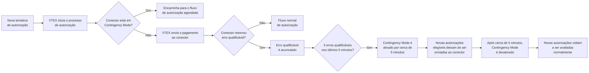
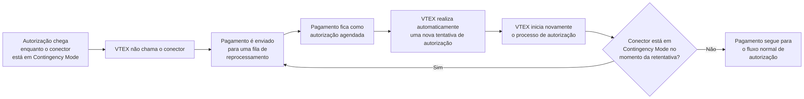

O **Contingency Mode** (anteriormente conhecido como **Mode-off**) é um recurso de resiliência do VTEX Payments que ajuda a proteger transações elegíveis durante instabilidades temporárias em provedores de pagamento.

Este artigo explica:

- [Como o **Contingency Mode** funciona](#como-o-contingency-mode-funciona)
- [O impacto nas transações](#impacto-nas-transações)
- [Quais meios e fluxos de pagamento podem ser afetados](#meios-de-pagamento-afetados)
- [Como funcionam a recuperação do conector e as retentativas](#recuperação-e-comportamento-de-retentativas)
- [Como identificar o **Contingency Mode**](#como-identificar-o-contingency-mode)
- [O que fazer quando o **Contingency Mode** está ativo](#o-que-fazer-quando-o-contingency-mode-está-ativo)
- [Orientações para provedores de pagamento](#orientação-para-provedores-de-pagamento)

> ℹ️ Os lojistas não precisam configurar nem ativar o **Contingency Mode** manualmente. A VTEX gerencia automaticamente a ativação, a recuperação e as retentativas de transações.

## Como o Contingency Mode funciona

O **Contingency Mode** é um mecanismo de proteção automática para conectores de pagamento. Quando a VTEX identifica falhas técnicas recorrentes em um conector, o sistema ativa esse modo para reduzir o impacto da instabilidade no processamento de pagamentos.

Durante esse período:

- Novas autorizações elegíveis deixam de ser enviadas temporariamente ao provedor.
- Novas transações elegíveis podem ser adiadas para processamento posterior.
- Transações já adiadas seguem um fluxo independente de retentativas agendadas.

Essa proteção se aplica ao conector afetado, não à loja como um todo. Outros provedores de pagamento ou meios de pagamento que não foram afetados pela instabilidade podem continuar operando normalmente.

O ciclo de ativação e recuperação do **Contingency Mode** é separado do ciclo de retentativa das transações adiadas. Isso significa que um conector já pode ter saído de **Contingency Mode** enquanto determinadas transações ainda aguardam a próxima janela de retentativa configurada.

### Ativação

O **Contingency Mode** é ativado quando a VTEX detecta 5 erros técnicos qualificáveis em 5 minutos para o mesmo conector.

Erros técnicos qualificáveis podem incluir:

- Timeouts de requisição.
- Falhas de conexão.
- Requisições canceladas por instabilidade técnica.
- Respostas HTTP `408` de timeout.
- Erros HTTP `5xx` do provedor, como `500`, `502`, `503` ou `504`.

> ℹ️ Retornos esperados do processo de autorização não ativam o **Contingency Mode**. Por exemplo, saldo insuficiente, cartão inválido, cartão expirado e pagamento não autorizado fazem parte do fluxo normal de autorização e não são considerados instabilidade do conector.

### Ciclo do Contingency Mode

Quando o **Contingency Mode** está ativo:

- A VTEX marca o conector afetado como temporariamente indisponível.
- Novas requisições de autorização elegíveis não são enviadas ao provedor.
- Novas transações elegíveis podem ser adiadas para uma retentativa posterior.
- O conector permanece temporariamente indisponível até o término do período automático de recuperação.
- Os lojistas podem ver uma indicação de **Contingency Mode** nos detalhes da transação ou nos logs de pagamento.

Esse comportamento ajuda a evitar novas chamadas a um conector instável enquanto o provedor se recupera.

O diagrama a seguir mostra o ciclo de ativação e recuperação do **Contingency Mode** para novas autorizações:

## Impacto nas transações

O **Contingency Mode** não cancela pedidos por si só. As transações afetadas pelo **Contingency Mode** podem ser adiadas para uma retentativa automática posterior.

> ℹ️ O **Contingency Mode** não substitui as regras normais de expiração e cancelamento de pagamento. Se o pagamento não puder ser autorizado antes do prazo aplicável, o pedido ainda poderá ser cancelado conforme o fluxo normal do pedido.

Os clientes podem ver o pagamento como em processamento ou pendente enquanto a VTEX aguarda a próxima retentativa da autorização.

Os lojistas devem evitar pedir aos clientes que façam um novo pedido imediatamente, a menos que o pedido original já tenha sido cancelado ou que o meio de pagamento exija uma nova ação do cliente.

## Meios de pagamento afetados

O **Contingency Mode** aplica-se a fluxos de pagamento que podem ser processados de forma assíncrona e retentados com segurança após uma instabilidade temporária no provedor.

Meios ou fluxos de pagamento que exigem uma resposta online imediata, redirecionamento do cliente ou uma nova ação do cliente podem não ser adiados e retentados da mesma forma. Nesses casos, a transação segue o comportamento padrão desse meios de pagamento.

> ℹ️ Se você não tiver certeza de que um meio de pagamento específico é elegível para o **Contingency Mode**, entre em contato com o [Suporte VTEX](https://supporticket.vtex.com/support) ou com seu provedor de pagamento.

## Recuperação e comportamento de retentativas

A recuperação do conector é automática. Após aproximadamente 5 minutos desde o último erro qualificável, a VTEX remove o conector do **Contingency Mode** e novas autorizações elegíveis podem voltar a ser enviadas normalmente ao provedor.

A saída do **Contingency Mode** afeta apenas novas tentativas de autorização. Transações previamente adiadas seguem seu próprio fluxo de retentativa agendada.

### Retentativa de transações adiadas

Transações adiadas durante o **Contingency Mode** não são necessariamente retentadas imediatamente após a recuperação do conector.

Essas transações seguem um fluxo independente de retentativa baseado:

- Nas regras de retry do meio de pagamento.
- No tempo de cancelamento do pagamento (`delayToCancel`).
- Nas informações retornadas pelo provedor.
- Em outras condições operacionais do fluxo de pagamento.

O diagrama a seguir mostra o comportamento das autorizações agendadas:

O período de recuperação do **Contingency Mode** e o intervalo de retentativa das transações são processos independentes. Assim:

- O conector pode sair do **Contingency Mode** após aproximadamente 5 minutos.
- As transações adiadas podem continuar aguardando a próxima janela de retentativa configurada para aquele fluxo de pagamento.

Esse comportamento evita novas chamadas imediatas a conectores ainda instáveis, ao mesmo tempo em que preserva as transações elegíveis para reprocessamento automático posterior.

O intervalo entre retentativas pode variar conforme:

- O meio de pagamento.
- As informações retornadas pelo provedor.
- O tempo de cancelamento do pagamento (`delayToCancel`).
- As condições operacionais do fluxo de pagamento.

Esses fatores determinam por quanto tempo a transação ainda pode ser reprocessada e qual intervalo deve ser respeitado entre uma tentativa e outra. Por isso, o tempo até a próxima retentativa não é fixo para todos os pagamentos e pode variar conforme a configuração e o contexto de cada transação.

Em geral:

Quando `delayToCancel` é menor que 1 dia, as retentativas geralmente ocorrem a cada 1 hora.
Quando `delayToCancel` é igual ou maior que 1 dia, as retentativas geralmente ocorrem a cada 4 horas.

Para mais informações, consulte o [Create Payment](https://developers.vtex.com/docs/api-reference/payment-provider-protocol?endpoint=post-/payments) endpoint.

> ℹ️ Embora pagamentos via [PIX](https://help.vtex.com/pt/docs/tutorials/configurar-pix-como-meio-de-pagamento) não sejam afetados pelo **Contingency Mode**, ou seja, não haja bloqueio de transações realizadas por esse meio, outros problemas podem interromper o processamento do pagamento. Nesses casos, quando o campo `delayToCancel` está configurado entre 5 minutos e 1 hora, as tentativas de retry geralmente ocorrem a cada 5 minutos.

> ⚠️ O tempo de retry pode variar conforme o meio de pagamento, as configurações da conta e as condições operacionais. A VTEX gerencia esse processo automaticamente para que as retentativas ocorram no menor intervalo possível, reduzindo o tempo de processamento da fila de transações pendentes.

## Como identificar o Contingency Mode

Os lojistas podem notar o **Contingency Mode** quando há instabilidade em um provedor de pagamento que afeta um conector específico.

Indicadores comuns incluem:

- Um número incomum de pagamentos pendentes de autorização ou processamento para o mesmo provedor.
- Logs de transação indicando **Contingency Mode** no conector afetado.
- Uma redução temporária no volume de pagamentos aprovados para um meio de pagamento ou provedor específico.
- Autorizações elegíveis sendo adiadas para retentiva posterior.

Os provedores de pagamento também podem observar mais indicadores de instabilidade na integração, como:

- Timeouts.
- Falhas de conexão.
- Erros HTTP `5xx`.

## O que fazer quando o Contingency Mode está ativo

Na maioria dos casos, nenhuma ação é necessária por parte do lojista. A VTEX protege automaticamente o fluxo de transações, reabilita o conector quando a instabilidade diminui e processa as transações elegíveis conforme as regras automáticas de retentativa.

Ações recomendadas:

1. Monitore as transações afetadas no Admin VTEX.
2. Verifique se o problema está concentrado em um provedor ou meio de pagamento específico.
3. Entre em contato com o provedor de pagamento se a instabilidade persistir ou se ele precisar investigar a integração.
4. Entre em contato com o [Suporte VTEX](https://supporticket.vtex.com/support) se as transações permanecerem pendentes por mais tempo do que o esperado ou se os clientes relatarem problemas recorrentes de pagamento.

> ⚠️ Evite cancelar ou recriar pedidos manualmente, a menos que haja uma razão comercial clara para isso, como solicitação do cliente, expiração do pedido ou confirmação de que o pagamento não pode ser concluído.

## Orientação para provedores de pagamento

Os provedores de pagamento devem investigar e resolver a instabilidade que causou as falhas técnicas recorrentes.

Verificações comuns incluem:

- Disponibilidade dos endpoints de autorização.
- Tempo de resposta e comportamento de timeout.
- Erros HTTP `5xx`.
- Conectividade de rede.
- Deploys recentes ou mudanças na infraestrutura.

Depois que o provedor se estabilizar, a VTEX remove automaticamente o conector do **Contingency Mode** e novas autorizações elegíveis podem voltar a ser enviadas normalmente.

> ℹ️ Transações previamente adiadas continuam seguindo suas regras configuradas de retentativa.
