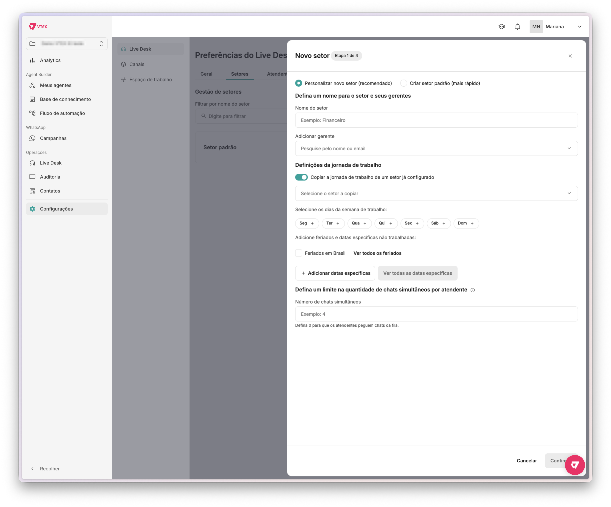
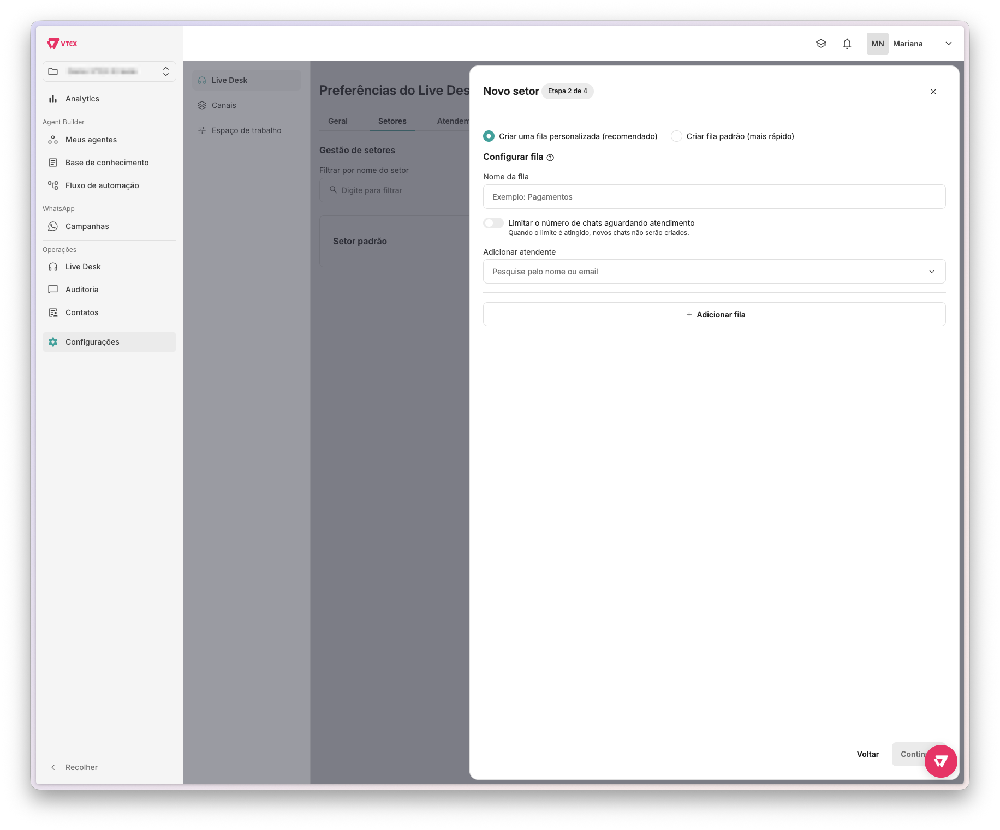
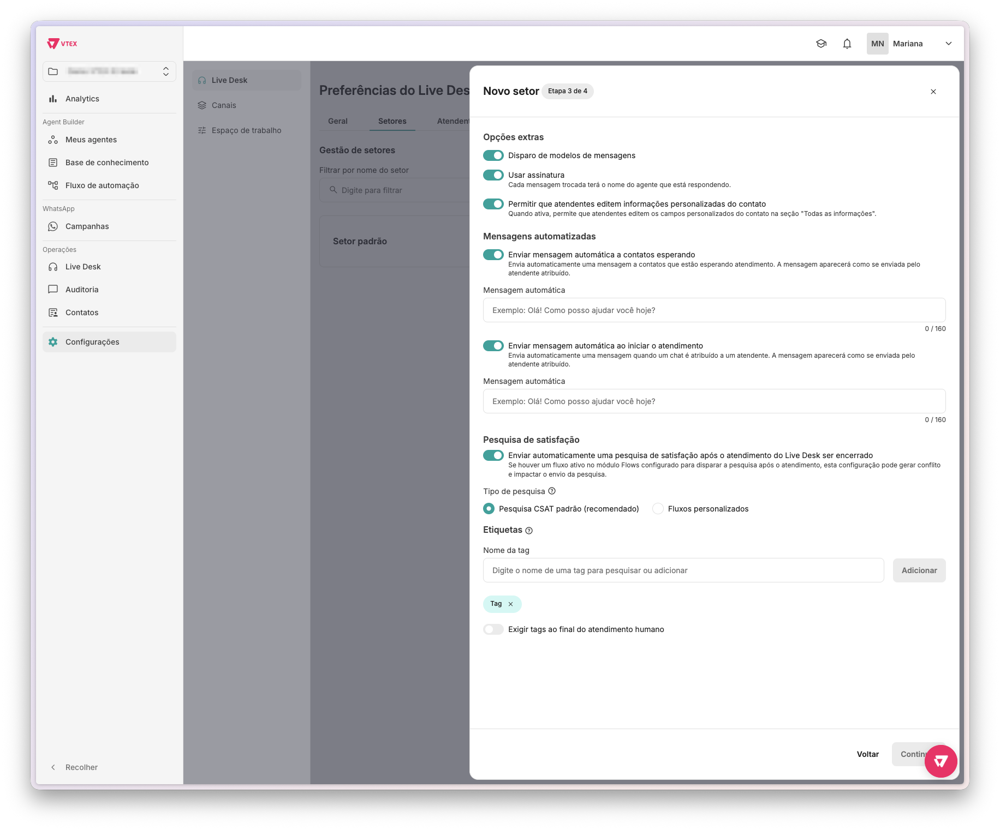
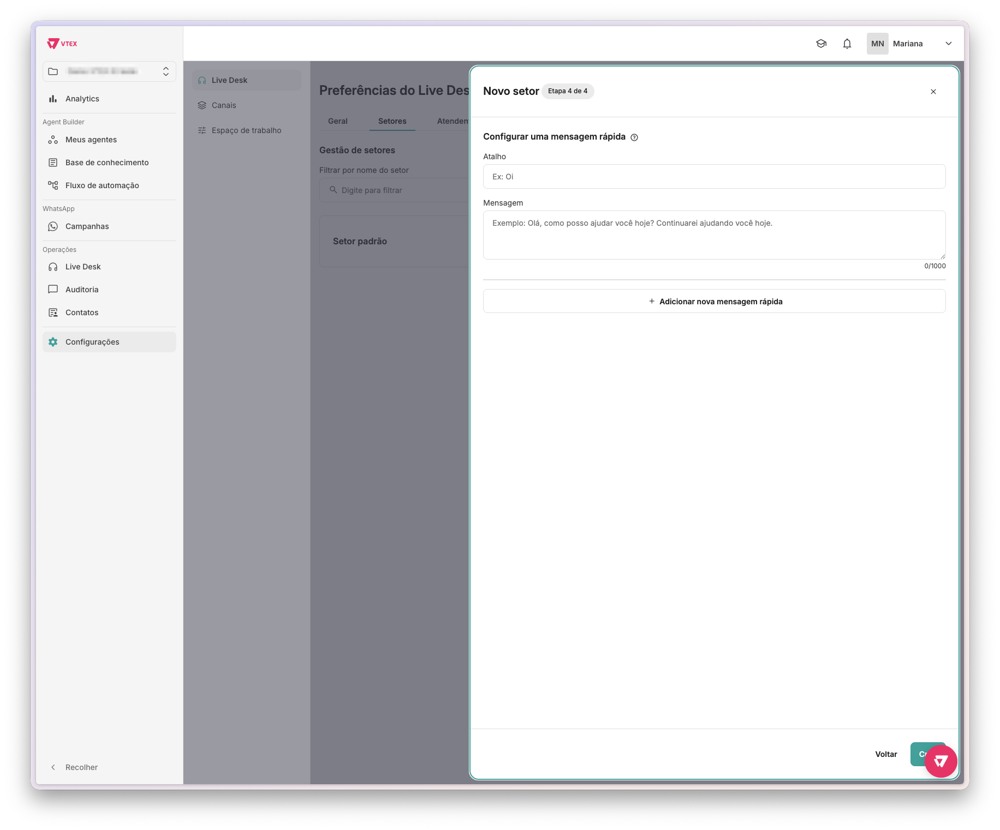

A página **Preferências do Live Desk** permite configurar o comportamento do atendimento humano da sua operação no VTEX CX Platform. Nela, você define as regras de transferência e finalização de chats, organiza os setores de atendimento e gerencia os atendentes da sua equipe. O gerente de atendimento poderá realizar alterações no setor que gerencia, tais como horário de funcionamento, adicionar ou remover agentes, criar novas filas, remover e adicionar tags.

> ⚠️ Para configurar o Live Desk, você precisa ser um administrador da organização ou moderador do projeto. Apenas um administrador ou moderador pode configurar o Live Desk.

Para acessar a página de preferências do Live Desk, acesse **Configurações > Live Desk** dentro do projeto.

A página está dividida em três abas:

- [Geral](#geral)
  - [Definições](#definições)
  - [Pausas personalizadas](#pausas-personalizadas)
- [Setores](#setores)
  - [Criar um novo setor](#criar-um-novo-setor)
- [Atendentes](#atendentes)

## Geral

A aba **Geral** reúne as configurações que determinam como os chats são distribuídos, transferidos e finalizados na sua operação.

### Definições

A seção **Definições** contém preferências gerais do atendimento humano da sua loja. Para ativar ou desativar uma definição, clique no botão de alternância ao lado dela.

| Definição | Descrição |
| --- | --- |
| **Permitir que agentes de IA transfiram conversas para atendimento humano** | Permite que um agente de IA encaminhe a conversa para um atendente humano. Ao ativar essa opção, descreva no campo de texto os cenários ou critérios que requerem transferência para atendimento humano, em até 1000 caracteres. |
| **Permitir interações apenas para atendentes online** | Impede que atendentes offline ou em pausa respondam a chats em andamento. |
| **Transferir chats em massa para outra fila ou atendente** | Permite transferir vários chats de uma vez para outra fila ou para outro atendente. |
| **Bloquear transferência de chats para atendentes offline** | Impede a transferência de chats para atendentes que estão offline. |
| **Finalizar chats em massa** | Permite encerrar vários chats de uma vez. |
| **Bloquear a finalização de chats que estão na fila** | Impede a finalização de chats que estão aguardando atendimento. |
| **Assumir chats em massa** | Permite que o atendente assuma vários chats de uma vez. |
| **Permite que atendentes escolham de quais filas recebem chats** | Permite que os atendentes escolham as filas que vão atender. Quando ativado, o recurso fica visível apenas para atendentes no módulo **Live Desk** dentro de **Operações**. |
| **Exibir o contador com o número de chats esperando atendimento humano** | Mostra a quantidade de chats aguardando atendimento humano. |
| **Mostrar setor do chat na lista de conversas** | Exibe o setor de cada atendimento na lista de conversas. Quando ativada, uma tag com o setor do chat será exibida ao lado do nome do contato. |

### Pausas personalizadas

As pausas personalizadas são status que os atendentes podem usar para indicar que estão temporariamente indisponíveis, como em um horário de almoço. Você pode adicionar até 10 status diferentes.

Para criar uma pausa personalizada, digite um nome para a pausa no campo de **Novo status** (por exemplo, Descanso) e clique em `Adicionar`. A pausa personalizada aparecerá logo abaixo.

Para excluir uma pausa personalizada, clique em cima do nome da pausa personalizada e, em seguida, em `Excluir`.

Nessa aba, você também pode ativar a opção **Exibir temporizador de status em pausas personalizadas do atendente** para mostrar há quanto tempo o atendente está em pausa.

## Setores

A aba **Setores** permite criar e gerenciar os setores de atendimento da sua operação, como suporte, vendas ou financeiro. Cada setor agrupa filas e atendentes responsáveis por um tipo de demanda.

Na seção **Gestão de setores**, você pode:

- Buscar um setor pelo nome no campo **Filtrar por nome do setor**.
- Ordenar a lista de setores por ordem alfabética, mais recente ou mais antigo.
- Editar ou excluir um setor clicando no menu `⋮` no card do setor.
- Criar um novo setor.

### Criar um novo setor

Para criar um setor, siga o passo a passo a seguir:

1. Clique em `<i class="fas fa-plus" aria-hidden="true"></i> Novo setor`.
2. Preencha as informações de cada etapa do assistente de configuração, descritas nas seções a seguir.
3. Ao concluir as quatro etapas, clique em `Criar`.

#### Etapa 1: Configurar setor e jornada de trabalho

Na primeira etapa, escolha entre as seguintes opções:

- **Personalizar novo setor (recomendado):** Configura todos os detalhes do setor manualmente.
- **Criar setor padrão (mais rápido):** Cria um setor com configurações predefinidas.

Se optar por **Personalizar novo setor**, preencha os campos abaixo.

Em **Defina um nome para o setor e seus gerentes**:

- **Nome do setor:** insira um nome para identificar o setor, como Financeiro ou Suporte.
- **Adicionar gerente:** pesquise e selecione os responsáveis pelo setor pelo nome ou email.

Em **Definições da jornada de trabalho**, configure os dias e horários de funcionamento do setor:

- Ative **Copiar a jornada de trabalho de um setor já configurado** para reutilizar as configurações de outro setor existente. Depois, escolha o setor que você quer copiar.
- Selecione os dias da semana em que o setor estará ativo clicando em cada dia.
  - Escolha até dois intervalos de horário para cada dia.
- Ative **Feriados em Brasil** para incluir automaticamente os feriados nacionais.
  - Clique em `Ver todos os feriados` para consultar a lista completa. Para desconsiderar um feriado, desative o botão referente ao feriado.
- Clique em `+ Adicionar datas específicas` para incluir datas em que o setor não funcionará, como recessos ou feriados corporativos.

Em **Defina um limite na quantidade de chats simultâneos por atendente**, insira o número máximo de chats que cada atendente pode receber ao mesmo tempo. Esse limite pode ser excedido quando o atendente escolhe chats manualmente ou recebe transferência de chats. Insira `0` para que os atendentes busquem chats diretamente da fila, sem distribuição automática.

> ⚠️ O limite de um atendente prevalece em relação ao limite da equipe ou do setor. Por exemplo, se a equipe tem um limite de 20 chats, mas um atendente tem um limite de 25 chats, esse atendente poderá realizar até 25 atendimentos.

Ao preencher os campos, clique em `Continuar`.

#### Etapa 2: Configurar fila

Na segunda etapa, configure a fila de atendimento do setor. Escolha entre as seguintes opções:

- **Criar uma fila personalizada (recomendado):** Define os detalhes da fila manualmente.
- **Criar fila padrão (mais rápido):** Cria uma fila com configurações predefinidas.

Se optar por **Criar uma fila personalizada**, preencha os campos a seguir:

- **Nome da fila:** Insira um nome para a fila, como Pagamentos ou Trocas.
- **Limitar o número de chats aguardando atendimento:** Ative esta opção para definir um teto para a fila. Quando o limite for atingido, novos chats não serão criados.
- **Adicionar atendente:** Pesquise e selecione os atendentes para a fila.

Para adicionar mais de uma fila ao setor, clique em `+ Adicionar fila` e repita o preenchimento.

Ao preencher os campos, clique em `Continuar`.

#### Etapa 3: Configurar opções e mensagens

Na terceira etapa, configure as opções de atendimento, mensagens automáticas e etiquetas do setor.

Em **Opções extras**, ative ou desative as configurações conforme a necessidade da sua operação:

| Opção | Descrição |
| --- | --- |
| **Disparo de modelos de mensagens** | Permite que atendentes enviem modelos de mensagens preconfigurados durante o atendimento. |
| **Usar assinatura** | Adiciona automaticamente o nome do agente em cada mensagem enviada. |
| **Permitir que atendentes editem informações personalizadas do contato** | Permite que atendentes editem campos personalizados do contato na seção **Todas as informações**. |

Em **Mensagens automatizadas**, configure o envio automático de mensagens para os contatos:

| Opção | Descrição |
| --- | --- |
| **Enviar mensagem automática a contatos esperando** | Envia uma mensagem automática para contatos que aguardam atendimento na fila. A mensagem aparece como se enviada pelo atendente atribuído. |
| **Enviar mensagem automática ao iniciar o atendimento** | Envia uma mensagem automática quando o chat é atribuído a um atendente. A mensagem aparece como se enviada pelo atendente atribuído. |

Em **Pesquisa de satisfação**, ative **Enviar automaticamente uma pesquisa de satisfação após o atendimento do Live Desk ser encerrado** para coletar feedback dos clientes ao fim de cada atendimento. Escolha entre as opções disponíveis:

- **Pesquisa CSAT padrão (recomendado)**
- **Fluxos personalizados**

> ⚠️ Para garantir resultados precisos, o fluxo selecionado precisa usar uma escala de 1 a 5.

Em **Etiquetas**, configure as tags do setor:

- No campo **Nome da tag**, pesquise uma tag existente ou digite um novo nome para criá-la. Clique em `Adicionar` para incluí-la no setor.
- Ative **Exigir tag ao final do atendimento humano** para tornar obrigatório o uso de pelo menos uma tag ao encerrar um atendimento.

Ao preencher os campos, clique em `Continuar`.

#### Etapa 4: Configurar mensagem rápida (opcional)

Na quarta e última etapa, configure mensagens rápidas para o setor. As mensagens rápidas são atalhos que permitem aos atendentes enviar respostas padronizadas com mais agilidade durante o atendimento.

Para adicionar uma mensagem rápida em **Configurar uma mensagem rápida**, preencha os campos abaixo:

- **Atalho:** insira a palavra ou expressão que ativará a mensagem. Por exemplo: "Oi".
- **Mensagem:** insira o texto que será enviado ao acionar o atalho. Por exemplo: "Olá, como posso ajudar você hoje?". Este campo aceita até 1.000 caracteres.

Para adicionar mais mensagens rápidas, clique em `+ Adicionar nova mensagem rápida` e repita o preenchimento.

> ℹ️ Esta etapa é opcional. Você pode pular a configuração de mensagens rápidas e fazê-la depois nas configurações do setor.

## Atendentes

A aba **Atendentes** permite visualizar e gerenciar os atendentes da sua operação.

A seção **Gestão de Atendentes** lista os atendentes cadastrados. Para cada atendente, são exibidos o nome, o email, o setor ao qual pertence e o número máximo de chats simultâneos que pode atender.

Você pode encontrar um atendente específico usando os seguintes filtros:

- **Filtrar por status**: Exibe os atendentes de acordo com o status atual, como online ou offline.
- **Filtrar por atendentes**: Exibe um ou mais atendentes específicos.
- **Filtrar por setores**: Exibe os atendentes de um setor.
- **Filtrar por filas**: Exibe os atendentes de uma fila.

Nessa aba, você também pode realizar algumas ações para os atendentes:

- Alterar setores e filas de atendentes.
- Definir limite de chats simultâneos de atendentes.

Para aplicar uma ação a um ou mais atendentes específicos, marque a caixa de seleção ao lado do nome de cada um.

Para aplicar uma ação a todos os atendentes da lista, marque a caixa de seleção **Selecionar todos os atendentes**.
