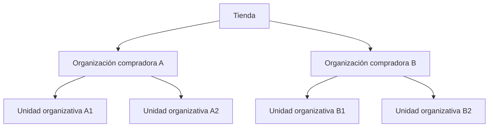
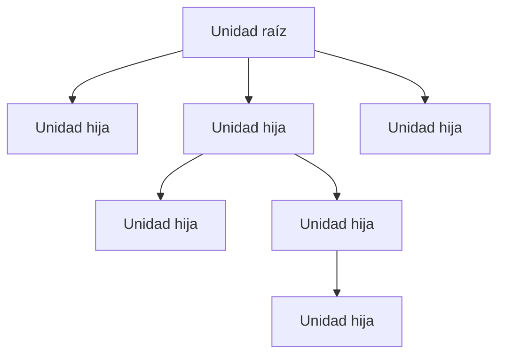

> ⚠️ Esta funcionalidad está disponible solo para tiendas que usan B2B Buyer Portal, y por el momento, únicamente para cuentas seleccionadas.

En operaciones B2B, el comprador es una empresa y no un consumidor individual. Cada empresa está representada por una organización compradora que mantiene una relación comercial con la tienda.

Las empresas generalmente tienen varias sucursales, departamentos, centros de costo y flujos internos de aprobación. Cada una de estas áreas puede tener autonomía de compra, presupuesto propio o reglas financieras específicas. Las unidades organizativas representan esta estructura dentro de una tienda VTEX con operaciones B2B.

## Estructura de organizaciones compradoras

Una tienda VTEX con operaciones B2B puede incluir varias organizaciones compradoras. Cada organización:

- Tiene su propio contrato.
- Opera de forma independiente de las demás organizaciones.
- Puede tener varias subdivisiones internas (unidades organizativas).

Las unidades organizativas se utilizan para definir la estructura interna de una única organización compradora.

La jerarquía de la operación sigue el modelo a continuación:

Una unidad organizativa es una subdivisión jerárquica dentro de una organización compradora concreta. Esta estructura define cómo se aplican las reglas comerciales y accesos.

En lugar de crear múltiples cuentas o múltiples organizaciones compradoras para representar departamentos internos de la misma empresa, es posible organizar su jerarquía internamente mediante unidades organizativas y aplicar reglas distintas para cada departamento, manteniendo una única organización compradora.

## Estructura jerárquica de las unidades organizativas

La estructura de las unidades organizativas sigue un modelo de árbol. Cada organización compradora tiene una **unidad raíz**, que representa la organización como un todo. A partir de la unidad raíz pueden crearse **unidades hijas**, que representan subdivisiones como sucursales, departamentos o centros de costo.

La unidad raíz es el nivel más alto de la jerarquía. Las unidades hijas pueden existir en múltiples niveles, reflejando la estructura real de la empresa. Existen reglas generales definidas en el [contrato](#contrato), pero cada unidad puede tener [reglas específicas](#configuracion-por-unidad-organizativa), respetando su posición en la jerarquía.

## Contrato

Cada organización compradora tiene su propio contrato B2B. Este contrato está asociado a la **unidad raíz** de la organización.

Las unidades hijas heredan las condiciones comerciales definidas en el contrato. Esto significa que precios, políticas y acuerdos comerciales negociados con la empresa se aplican a toda la estructura. Después de aplicar esta herencia puede definirse la [configuración por unidad](#configuracion-por-unidad-organizativa), lo que permite la segmentación interna sin necesidad de múltiples contratos o cuentas separadas.

Para más información sobre configuración y gestión de contratos consulta:

- [Contratos B2B](https://help.vtex.com/docs/tutorials/contratos-b2b-es)

## Configuración por unidad organizativa

Aunque comparten el mismo contrato, cada unidad puede operar con reglas propias. Algunos de los ajustes que pueden variar según la unidad organizativa son:

- Surtido de productos disponibles
- Medios y condiciones de pago
- Direcciones de envío y facturación
- Campos personalizables en el checkout
- Reglas de aprobación de pedidos

Esta segmentación permite alinear la operación de la tienda con las políticas internas de la empresa compradora.

Para más información, consulta:

- [Políticas de compra](https://help.vtex.com/es/docs/tutorials/politicas-de-compras)
- [Información general de presupuestos](https://help.vtex.com/es/docs/tutorials/presupuestos-informacion-general)
- [Campos personalizables en el checkout](https://help.vtex.com/es/docs/tutorials/campos-personalizables-del-checkout)

## Usuarios de unidades organizativas

La unidad a la que está vinculado el usuario define su operación dentro de la plataforma. Al iniciar sesión en la tienda, la plataforma identifica la unidad organizativa del usuario y aplica automáticamente las reglas configuradas para dicha unidad.

## Roles y permisos del storefront

El ámbito de actuación de un usuario miembro de una unidad organizativa en una tienda B2B viene determinado por la combinación de dos elementos:

- **Unidades organizativas**, que determinan el grupo al que pertenece el usuario.
- **Roles del storefront**, que definen el papel del usuario en la organización reuniendo determinados permisos para realizar acciones en el storefront.

Más información en [Miembros de la organización compradora](https://help.vtex.com/es/docs/tutorials/miembros-de-la-organizacion-compradora).

## Experiencia de compra

Las unidades organizativas garantizan que la experiencia de navegación refleje la estructura organizativa de la empresa compradora.

Cada departamento de la empresa funciona con:

- Reglas comerciales adecuadas
- Roles compatibles con su papel
- Gobernanza y autonomía

De esta forma, la plataforma permite que una única empresa B2B opere con múltiples estructuras internas, manteniendo consistencia contractual y control operativo.
